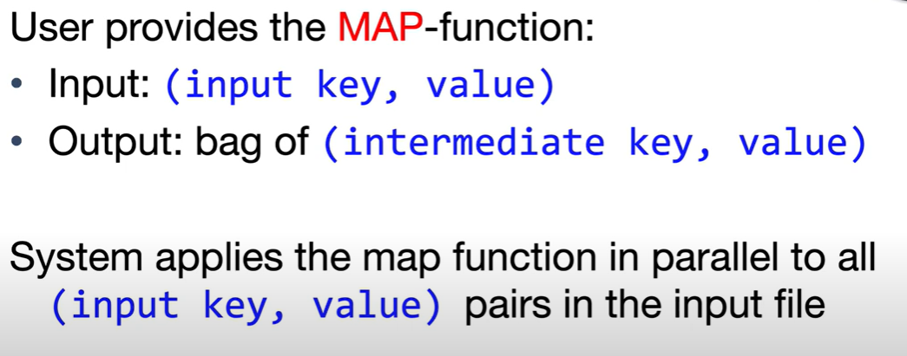
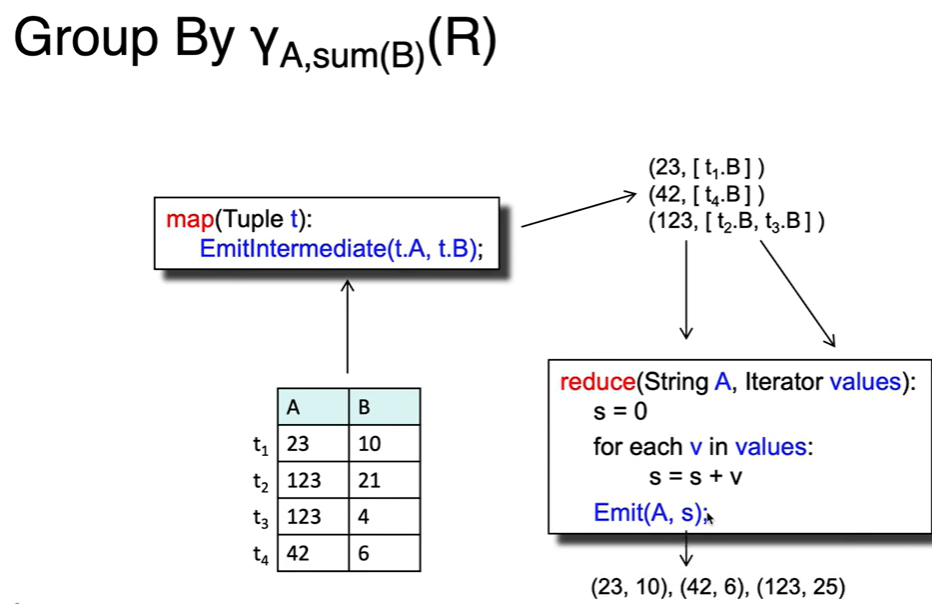

# CS186-L21: MapReduce and Spark


## Motivation
only scaling up relational databases is challenging :s

## MapReduce Data and Programming Model
Target


### Map phase

map function will not keep the state of the intermediate results, so it can be parallelized easily

### Reduce phase

for example, wanna count the number of occurrences of each word in the input data, we can use the reduce function to sum up the values of the same key


## Implementation of MapReduce
### fault tolerance
by writing intermediate results to disk...
- mappers can write their output to local disk
- reducers can read the output of mappers from local disk and combine them, if the reduce task is restarted, the reduce task is restarted on another server

### implementation

how to handle the stragglers?


## Implementing Relational Operators





## Introduction to Spark
why MR sucks?
- hard to write more complex queries
- slow for writing all intermediate results to disk


## Programming in Spark
collections in spark


```java
JavaSparkContext s = SparkSession.builder().appName("MyApp").getOrCreate();
JavaRDD<String> lines = s.read().textFile("input.txt");
JavaRDD<String> errors = lines.filter(line -> line.contains("error")); // lazy
errors.collect() // eager
```

similar steps in spark and MR


### Persistence

API in Java


## Spark 2.0
has DataFrame API :astonished:

and have Datasets API :astonished:


like DATA100 python!
