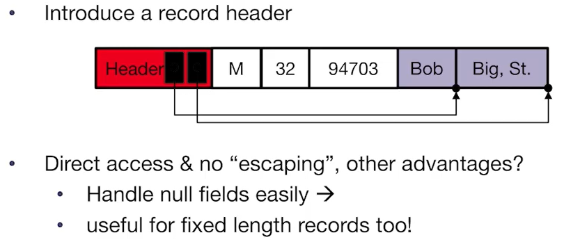

# CS186-L3: Disk, Buffers, Files I

## big picture
sql client -> DBMS -> database :nerd_face:
### DBMS
- parsing & optimization
  - 执行SQL语句时，DBMS需要解析SQL语句，并将其转换为执行计划。优化器会根据统计信息、查询模式、索引等因素，选择最优的执行计划。
- relational operators
  - 处理数据流 or 关系运算符？
- files and index management
- buffer management
- disk space management

事实上纵向还有两个模块：concurrency control和recovery。

省流：从RAM & DISK获取数据非常慢， 相对于CPU

### Disk
注意`sector`, `disk head`， 其中后者似乎只能单次读写

### access time

## flash SSD
注意：

read很快，随着数据变大，可以预测

write很慢，slower for random，写入放大

## disk space management
### block level storage

**block**: unit of transfer for disk read/write (64~128KB in 2018)

**page**: a common synonym for block, in some contexts, it means in RAM

### implementation
- talk to hardware directly :thinking:
- use file system (FS) :grinning:
  - always remember: ***next*** is fast

## files and representation

important! :sunglasses:
- tables stored in files
  - consist of pages
    - pages contain a collection of records

### DB files

- unordered heap files
  - DLL是一种简单的实现heap file的方案，但是insert效率不高 :disappointed:
  - better: a page directory  注意header page is SLL

## layout of a page
- page header
  - nums of records
  - free space
  - maybe a next/last pointer
  - bitmaps, slot table (what is that? :thinking:)

注意，是否records定长以及是否有free space决定了page layout
### fixed-length packed records
now take a look at a fixed length records, packed page:

### fixed-length unpacked records
same as before, but with unpacked records:

### variable-length records
records can have different lengths :exploding_head:

- header -> footer
- footer has a slot directory (read from right to left, has a `pointer` to the start of the free space)
- slot directory save slot, each slot has a `pointer` to the start of the record and the `length` of the record
  - growing slot directory, 前后夹击
  - 

## layout of records
- each record has a fixed type
- system catalog stores the SCHEMA
  - no need to store the type of records
  - catalog just a table

注意，以下讨论在字段（field）级别，不是record级别。
### fixed-length records
类比数组，注意null存在就是空着，不是很compact
### variable-length records
- 冗余配置按照定长处理 （padding）
- 类比CSV，每行记录不同长度，用分隔符分隔
- a record header way 

