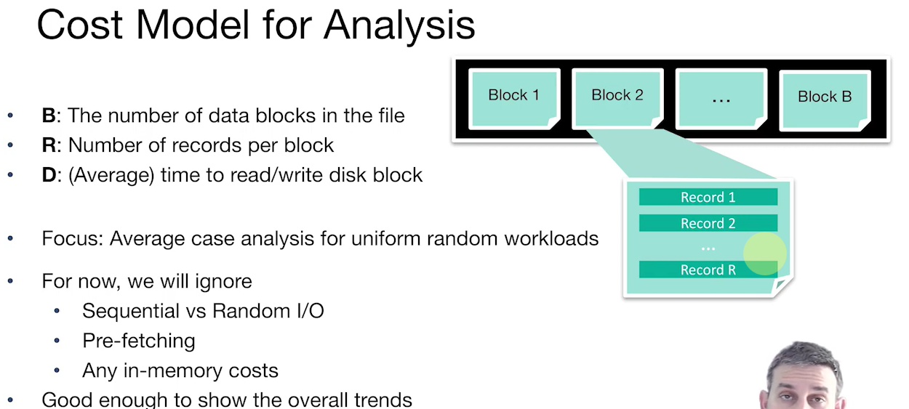
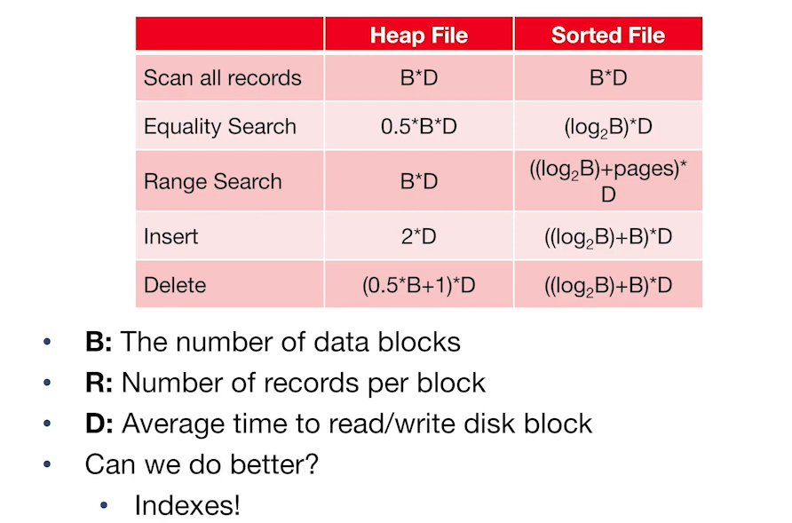

# CS186-L4: Disks, Buffers, Files II

## cost model and analysis
基本量化指标定义

基本假设
- **single record** insert and delete
- equality selection - **exactly one match**
- for heap files:
  - insert always **appends**  
- for sorted files:
  - **packed**: files compacted after deletions
  - sorted according to search key

以下是计算时间，类似渐进记法，但是***有细节*** :sunglasses:

side note:
- $\times D$ 是简化了每次“操作”的时间，“操作”指的是“读”与“写”
- 考虑随机变量 *操作次数* $N$ 及其 $\mathbb{E}(N)$
- `Equality Search`对于sorted files: 

$$
\begin{equation}
\begin{aligned}
  \mathbb{E}(N) &= \sum_{i=1}^{log_2B} i \times \frac{2^{i-1}}{B} \notag\\
    &= log_2B - \frac{B-1}{B}\\
    &\approx log_2B
\end{aligned}
\end{equation}
$$

- `Range Search`借鉴`Equality Search`的思想，对于heap files，*always go through to find all*；对于sorted files，二分查找下界然后 *scan right*
- `Insert`对于heap files: 假设知道free space，一个读，一个写；对于sorted files: 假设中间插入，读写各占 $B/2$
- `Delete`同样借鉴`Equality Search`的思想，对于heap files， $+1$ 是删除（“写”）；对于sorted files， 过程和`Insert`一样

**time-stamp: 01h13min26s**
