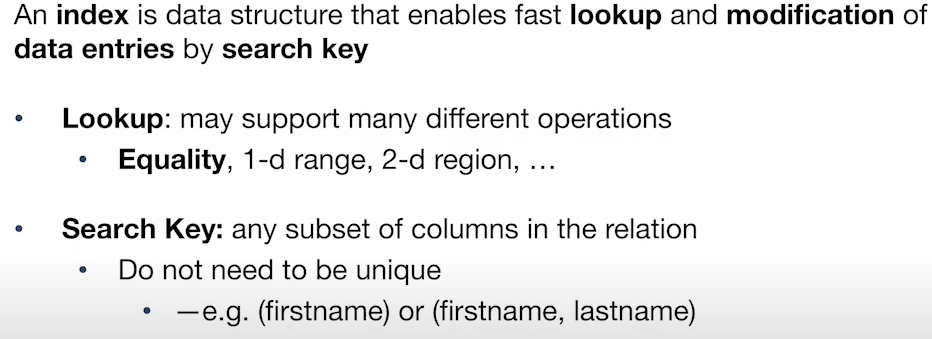
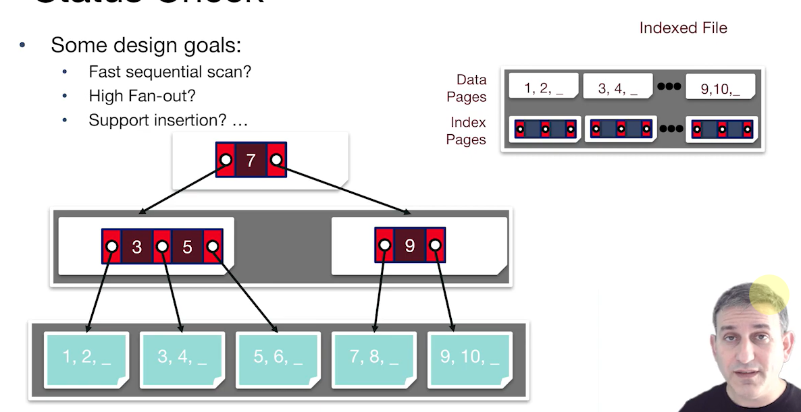
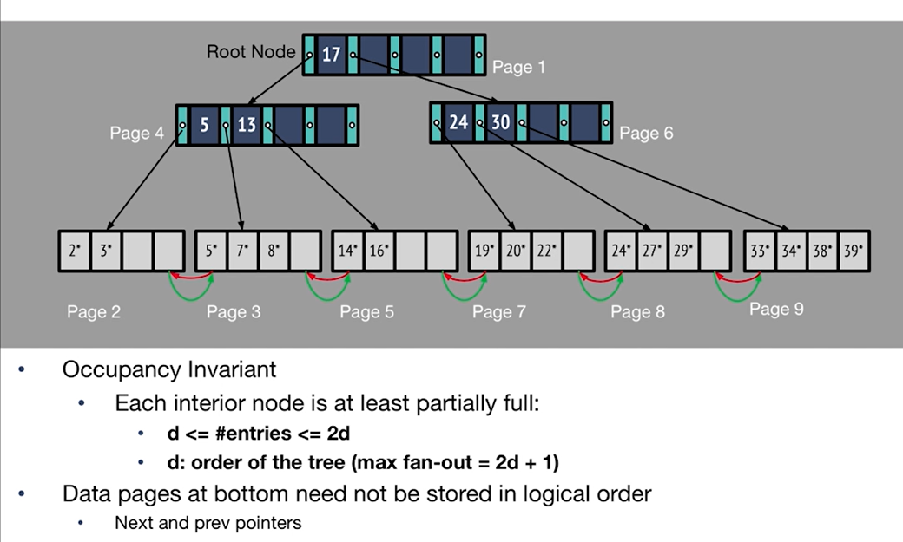
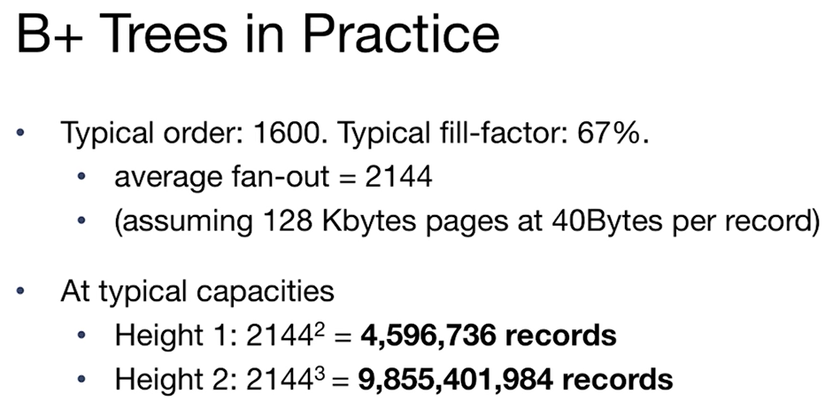
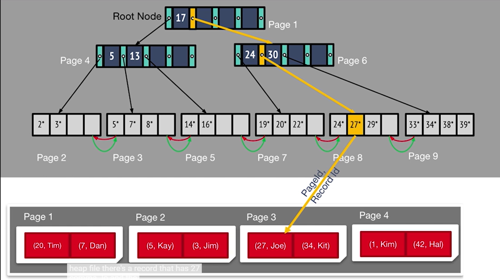
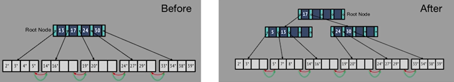
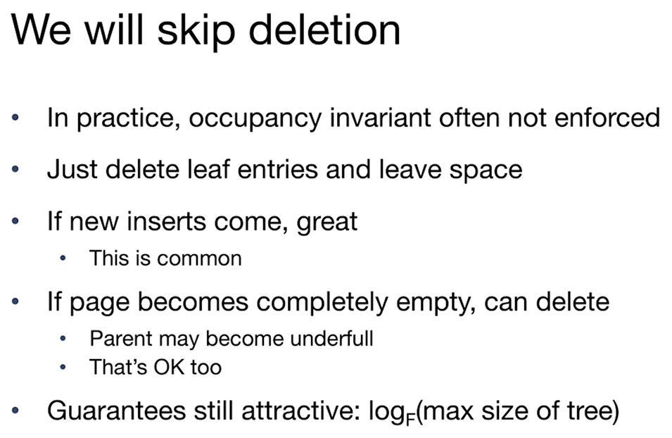
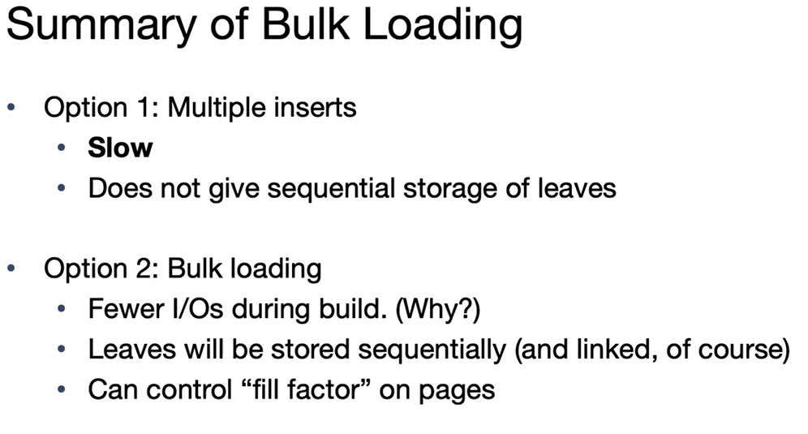

# CS186-L5: B+ Trees

## Index
竟然是一种数据结构？

## search and insertion in ISAM
indexed sequential access method

注意建立了许多索引，沿用BST的思想，但是insert的时候会出现overflow pages （IBM in 1960s）

## B+ Tree
和B Tree的区别在于：B+只有叶子存放数据，而B Tree的中间节点也存放数据。

几乎和上面一样，但是多了
- dynamic tree index
  - always balanced
  - support efficient insertions and deletions
    - grows at root not leaves

注意:
- 占有率：几乎半满，除了root
- 底部DLL
- $max\ fan\ out = 2d + 1$

工业实际情况 :thinking:

## B+ Tree Operations
### search, 同上

### insert
  - 没有overflow，直接插入
  - 满了，分裂成两个节点，中间节点存放 *中间key*（过程中可能是右边最小的那个key），左右节点存放左右key
    - 递归向上分裂，直到根节点
    - 叶子 $\xrightarrow{copy}$ 父节点 ，父节点 $\xrightarrow{push}$ 新父节点

### delete
:wink:

### bulk loading 批量加载
精髓在于先排序，后构建

**time-stamp: 01h09min02s**
