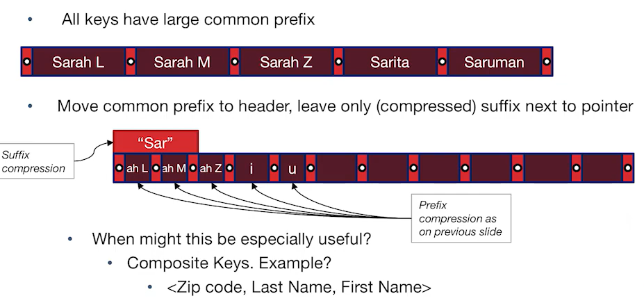
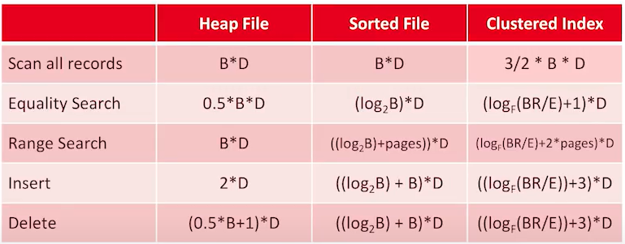

# CS186-L6: Indices & B+ Tree Refinements

## General Notes
issues to consider in any index structure (not just in B+ tree)
- query support: what class of queries can be supported?
- choice of search key
  - affects how we write the query
- data entry storage
  - affect performance of the index
- variable-length keys tricks
  - affect performance of the index
- cost model for Index vs Heap vs Sorted File

## query support
### Indexes
- basic selection
\<key>\<op>\<constant> 诸如=，BETWEEN，>，<，>=，<=
- more selection

维度灾难:astonished:

但是这节课我们只是关注1-d range search, equality， B+ tree

## Search Key and Ordering

注意lexicographic!

以下给出了一个定义`Composite Keys`，多列，前等，尾唯一range

注意对`Lexicographic Range`的强调

## Data Entry Storage
### intro
- the representation of data?
  - itself or pointers to it?
- how data is stored?
  - clustered or unclustered?

### representation
#### alt. 1
index entry: (key, value)

#### alt. 2
index entry: (key, recordID), remember recordID is......

#### alt. 3
index entry: (key, list of recordIDs)

### clustered vs unclustered index

clustered is more efficient for IOs :thinking:, range search and supports "compression" :thinking:

## Variable-length keys tricks
- 重新定义 Occupancy Invariant （当不是用整数来index时候）

- get more index entries to shorten the tree (avoiding long-time IOs)
  - prefix key compression (only in leaf level :thinking:, slightly change the order of keys?)
    -  
  - suffix key compression
    - 

## B+ Tree Costs
这里引入新的假设：
- store by ref (see in alt. 2)
- clustered index with 2/3 full heap file pages
  - *clustered* -> heapfile is initially sorted
  - fanout is larger ~ $O(Ref)$
  - assume static index

符号表达如下：
- $ B $ : num of *full* data blocks (why full? recall previous lecture) 
- $ R $ : num of records per blocks
- $ D $ : Average time to r/w disk block
- $ F $ : avg internal node fanout
- $ E $ : avg num of data entries per leaf

side note: 
1. `Scan all records`: $3/2$来自与占有率2/3， $\frac{2}{3}B' = B \Rightarrow B' = \frac{3}{2}B \Rightarrow B'D = \frac{3}{2}B D$
2. `Equality Search`: $1 \Rightarrow 2$ !! 来自于从page中读取slot从而获得具体的index并且读取数值, $log_F(BR/E)$ 是搜索page
3. `Range Search`: 应该是 $(log_F(BR/E)+1+3*pages)*D$
4. `Insert`&`Delete`: 应该是 $(log_F(BR/E)+4)*D$, index 1，读取数值 1，改变数值 1，改变index 1

big-O notation: :smile_cat:

## Summary

**time-stamp: 01h42m07s**
