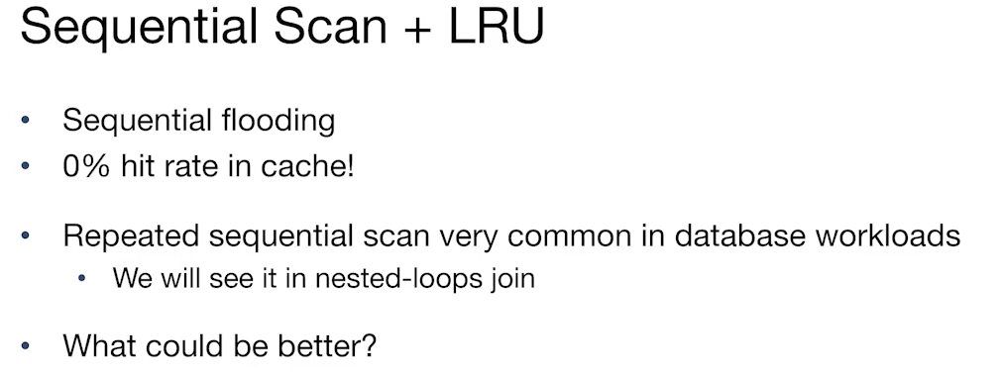

# CS186-L7: Buffer Management

## intro

### 可能需要处理的问题

1. dirty pages
2. pages replacement

### state of buffer management

## Page replacement terminology
- a page in "use" : **Page pin count**
- if full. which should be replaced: **page replacement policy**

request请求发出来，转接到buffer manager......

## Page replacement policies
### LRU (Least Recently Used)
- 最近最少使用使用的是 *时间*
- pin count == 0!
- Priority heap data structure can help! like $O(logN)$

### CLOCK
一种近似LRU的算法，旨在不需要维护每个页面的访问时间戳，从而减少了额外的开销。

- Clock policy将缓冲区中的页面视为一个循环列表，使用一个“时钟指针”来跟踪当前考虑替换的页面。每个页面都有一个“引用位”（ref bit），用于指示该页面是否被最近访问过。

- 工作流程
    - 初始化：当缓冲区管理器启动时，时钟指针指向第一个未固定（unpinned）的页面，并将该页面的引用位设置为1，当页面被读入时。
    - 页面替换：
        - 当需要替换页面时，缓冲区管理器从时钟指针开始，遍历缓冲区中的页面。
        - 对于每个页面，如果该页面的引用位为1，则将其引用位重置为0，并将时钟指针移动到下一个页面。
        - 如果找到一个引用位为0的页面，则可以将其替换。此时，如果该页面是“脏页”（dirty page），则需要将其写回磁盘，然后读取新的页面并将其引用位设置为1。

### LRU-Clock bad behavior
Sequential Flooding!

### MRU (Most Recently Used)
General case: SeqScan + MRU
$B$ buffers
$N>B$ pages in file

#### Improvements for sequential scan: prefetch

#### hybrid?
- LRU wins for *random access*
- MRU wins for *repeated sequential scan*

Two General Approaches: :thinking:

## System perspective

## summary

