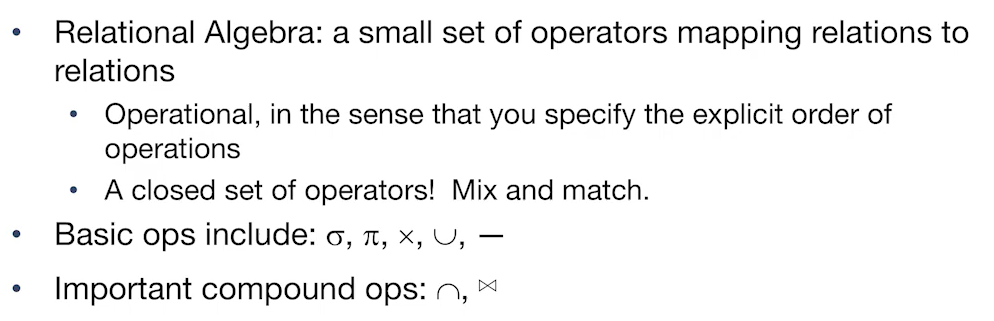

# CS186-L8: Relational Algebra

## Relational Algebra Intro
Relational algebra :dizzy_face:
- algebra on sets ---> mean no duplicates!
- operational description of transformations

Relational Calculus :dizzy_face:
- basic of SQL

以上两者被证明等价并且使得SQL能够被编译--long story......

## Relational Algebra Operators
### Unary Operators
- Selection (σ) : select rows that satisfy a condition
  - 
- Projection (π) : select specific columns
  - 
  - 如果结果是multiset, 去重! 虽然real system不会自动去重
- Rename (ρ) : rename a column
  - 
- Union (∪) : tuples in either r1 or r2
  - two input relations, must be compatible (same number of columns or "fields", and have same data types corresponding to the same field)
  - UNION in SQL
- Difference (−) : tuples in r1, but not in r2
  - same with union, both input relations must be compatible
  - EXCEPT in SQL
- Cross Product (×) : cartesian product of two relations
  - how many rows in the result? $|R_1|*|R_2|$
  - none duplicate tuples

### Compound Operators
- Join (⋈ / $⋈_\theta$) : join two relations on common attributes
  - 
  - avoid cross product as we can! 
  - natural join
- Intersection (∩) : tuples that appear in both r1 and r2
  -  $S_1 \cap S_2 = S_1 - (S_1 - S_2)$

### Grouping and Aggregation Operators
- Group By / Aggregation Operators($\gamma$)
  - $\gamma_{age, AVG(rating)}$ (Sailors)
  - with selection (HAVING)
    - $\gamma_{age, AVG(rating), COUNT(*)>2}$(Sailors)

## Summary

