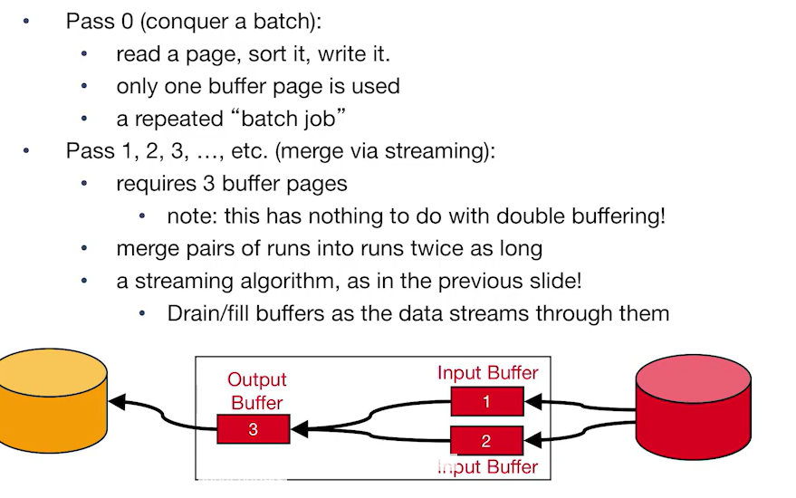
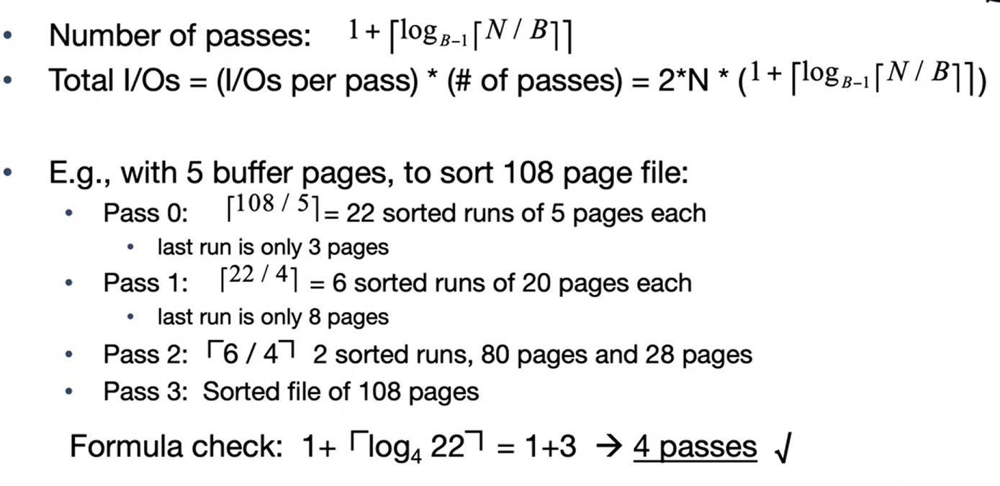

# CS186-L9: Sorting and Hashing

## Why Sort?
- Rendezvous 为了“集合”  
  - eliminating duplicates (DISTINCT)
  - Grouping for summarization (GROUP BY)
  - Upcoming sort-merge join algorithms
- Ordering
  - sometimes output must be in a specific order
  - First step in bulk loading Tree indexes
- Problem: sort 100GB of data with 1GB of RAM
  - *why not virtual memory?* -- random IO access, too slow :cry:

## Out-of-Core Algorithms
core == RAM back in the day
### Single Streaming data passing through the memory

MapReduce's "Map" :sunglasses:
### Better: Double Buffering

#### 1. **主要线程处理 I/O 缓冲区中的数据**
   - **主线程**负责在一个I/O缓冲区对（即输入缓冲区和输出缓冲区）上运行f(x)函数。
   - 主线程完成计算后准备处理新的缓冲区数据时，会进行缓冲区的交换（Swap）。

#### 2. **第二个 I/O 线程并行处理未使用的 I/O 缓冲区**
   - **第二个I/O线程**并行操作，用于清空已满的输出缓冲区并填充新的输入缓冲区。
   - 这种并行性能够提高系统性能，因为I/O操作通常较为耗时，而通过并行处理可以减少主线程的等待时间，从而更高效地利用CPU资源。

#### 3. **为什么并行处理是可行的？**
   - **原因**：通常情况下，I/O操作比较慢，因此需要占用单独的线程来处理，以避免阻塞主线程。
   - **主题**：I/O处理通常需要独立的线程来管理，以提高整体处理效率。

#### 4. **图解说明**
   - 图中显示了双缓冲机制下的处理流程：输入缓冲区和输出缓冲区成对出现，其中一对缓冲区在主线程中处理，而另一对缓冲区在I/O线程中处理。当主线程处理完当前缓冲区对时，两个线程会进行缓冲区交换。

#### 总结
相比单缓冲的单次流式处理，双缓冲通过并行处理I/O操作，可以显著提高处理效率，尤其是在I/O操作较慢的情况下。主线程可以专注于计算，而不必等待I/O操作完成，进一步提升了系统的并行性和性能。

- double buffering applies to all streams!
  - assume that you have RAM buffers to spare!

## Sorting and Hashing
### Formal Specs
- a file $F$:
  - a multiset of records $R$
  - consuming $N$ blocks of storage
- two "scratch" disks
  - each with >> $N$ blocks of free storage
- a fixed amount of space in RAM
  - memory capacity equivalent to $B$ blocks of disk

As for sorting:
- produce an output file $F_S$
  - with content $R$ stored in order by a given sorting criterion

As for hashing:
- produce an output file $F_H$
  - with content $R$, *arranged on disk so that no 2 records that have the same hash value are separated by a record with a different hash value*
  - i.e., *consecutively* stored on disk

### Sorting
#### Strawman Algorithm
注意左侧是没有sort的，右侧是sort之后的。

#### General External Merge Sort
基于RAM远远不够存放所有要排序的数据来讨论

side note: 
- *PASS*意味着从所有的数据流disk流向另一个disk，可以认为是IO；*RUN*指的是 a sequence of sorted pages. [see](https://cs186berkeley.net/notes/note8/)
- length = $B$，最后一个是变长的block
- $B$ pages/blocks ---> $B-1$ merge (有一个buffer是为了写入)

事实上很像一个Tree，分而治之然后不断合并中间结果

### Hashing
#### ideal Divide and Conquer
通过 $2N$ pass将数据根据 $h_p$ 产生的哈希值分割成 $N$ 个block

对于每个分好大类别的block，重新hash从而实现相同内容的record连续存储， $2N$ pass

所以cost约为 $4N$ pass

#### recursive partitioning for External Hashing
当divide时出现某个block的record数目太多时
- check不同种类的hash数量，基于新的 $h_{r_1}$ 生成hash
- 如果数量为一，停止分割，写入磁盘
- 如果数量大于一，继续分割，直到数量小于等于 $B$

## hash and sort duality
hash: divide-conquer
sort: conquer-merge
- cost around $4N$ pass
- 对于一次完成容量为 $X$ 的任务，buffer 要求约为 $\sqrt{X}$

## parallel sorting and hashing
parallel hashing: 多了一个 $h_n$ 然后快了

parallel sorting: 多了一个 range

如何保证各个计算机工作量大致相同？===> 快速估计数据集的分布

## Summary

Hashing pros:
- for *duplicate elimination*, scales with # of values
  - delete dups in the first pass
  - VS. sort scales with # of items
- easy to *shuffle in parallel*

Sorting pros:
- if need to be sorted
- Not sensitive to duplicates or "bad" hash functions (eg. many dups in data)

