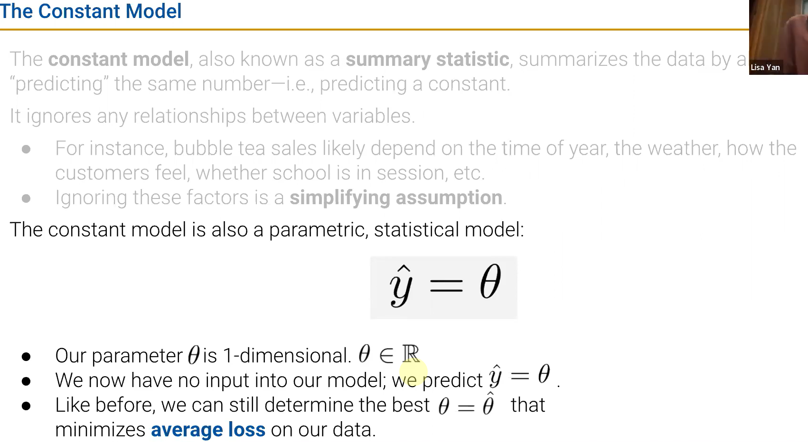
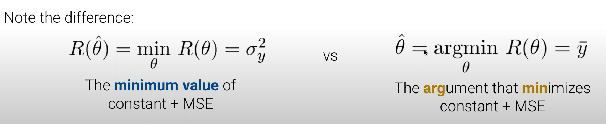
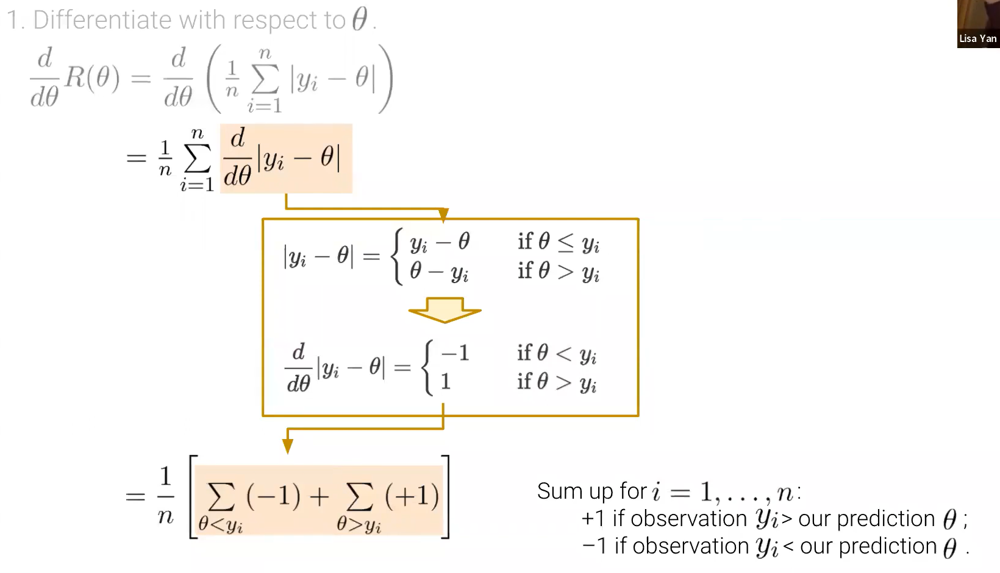
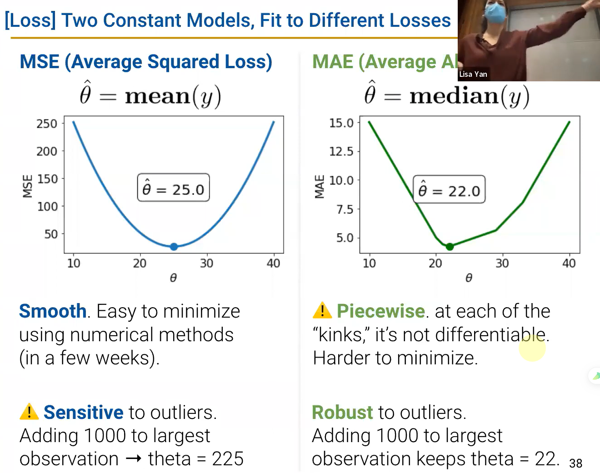
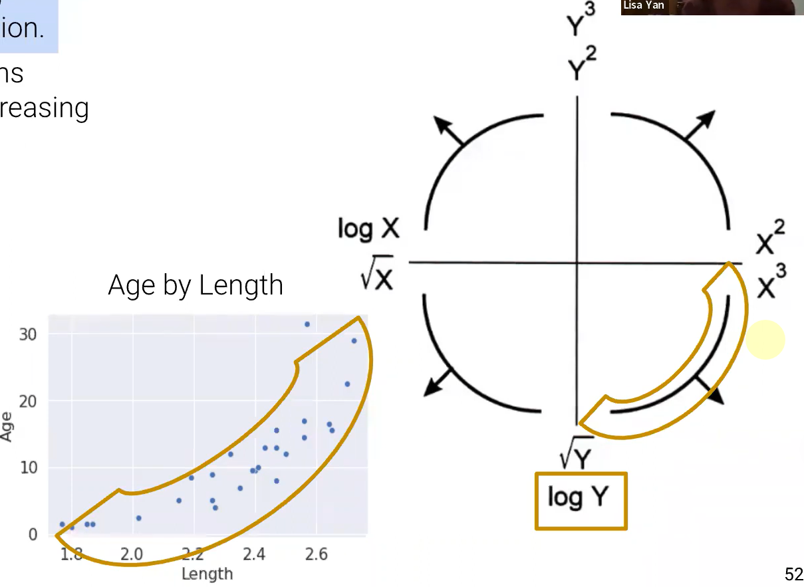
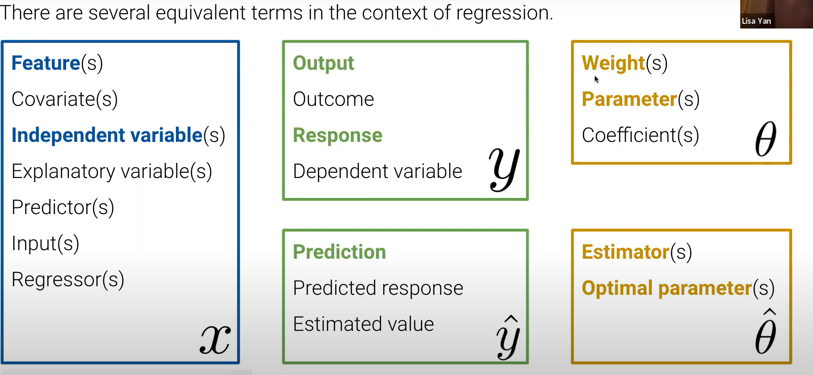

# DATA100-L10: Constant Model, Loss, and Transformations

# constant model + MSE

微积分是求最优化的一种方法

两种记法

# constant model + MAE
绝对值求导新视角

$$
\sum_{\theta <y_i} 1=\sum_{\theta >y_i} 1
$$
是计数！==>中位数

loss的敏感性问题

# revisiting SLR evaluation
画图before modeling！！！
# transformations to fit linear model
经验之谈

# introducing notation for multiple linear regression

