# DATA100-L11: Ordinary Least Squares

## linear in theta
linear combination of parameters $\theta$
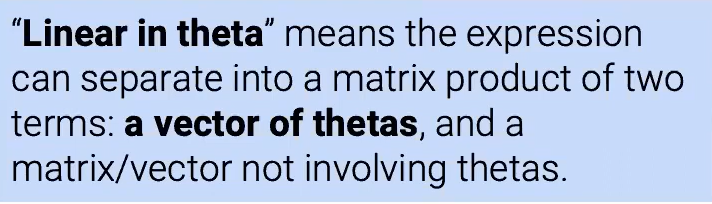
## define multiple linear regression
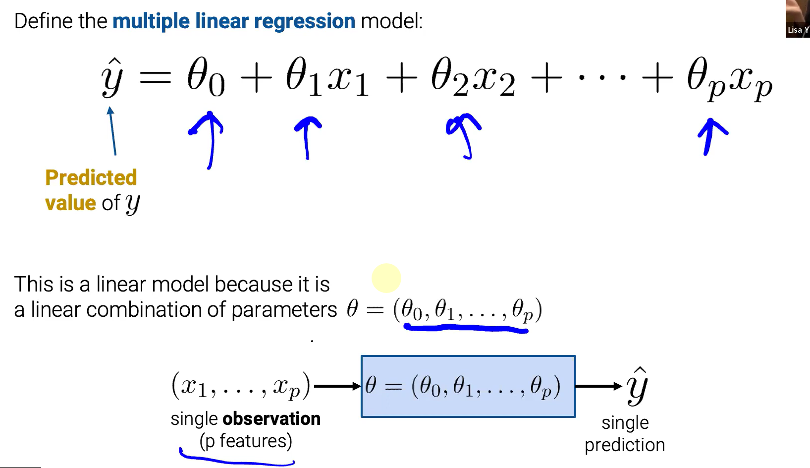

# OLS problem formulation
ordinary least squares (OLS) 

用线性代数重写之
$$
\mathbb{\hat{Y}} = \mathbb{X}\theta
$$

## multiple linear regression model
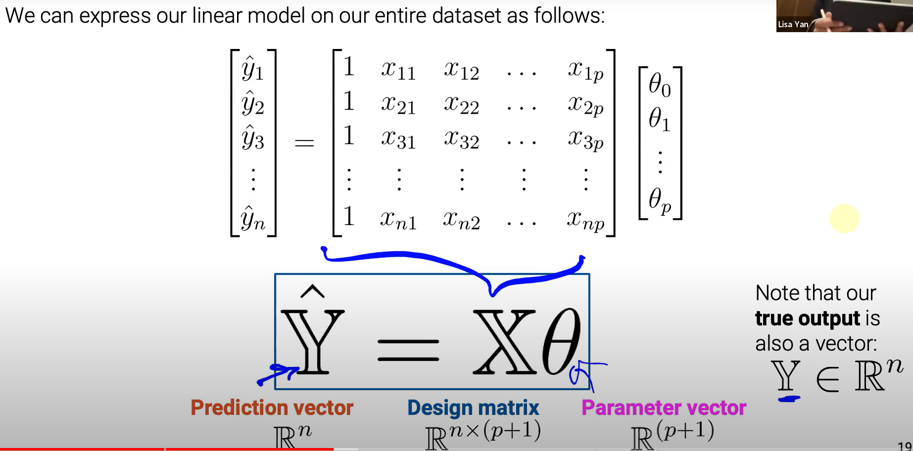
## MSE
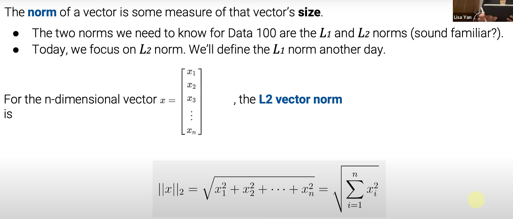
$$
R(\theta) = \frac{1}{n}||\mathbb{Y}-\hat{\mathbb{Y}}||_2^2
$$
# geometric derivation
## lin alg review: orthogonality, span
$$
span(\mathbb{A})是一个由列向量组成的space
$$
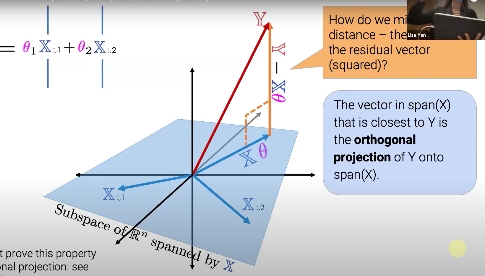
正交
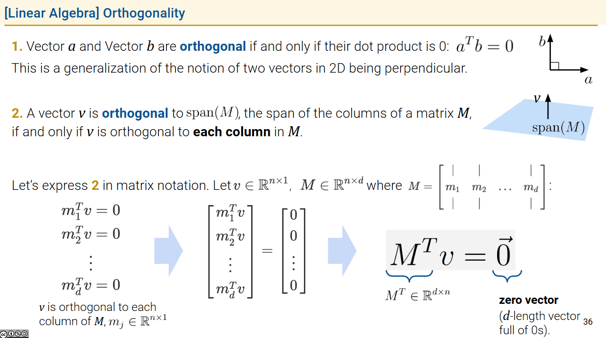

## least squares estimate proof
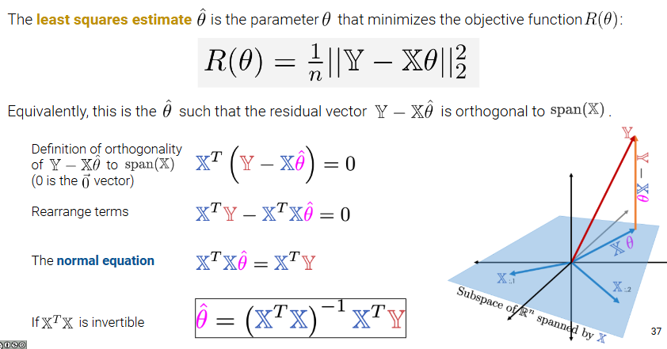
# performance: residuals, multiple R-squared
lec11.ipynb

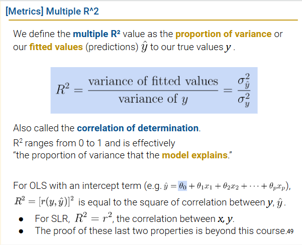
$$
R^2∈[0,1]
$$
越大拟合效果越好
# OLS properties
## residuals
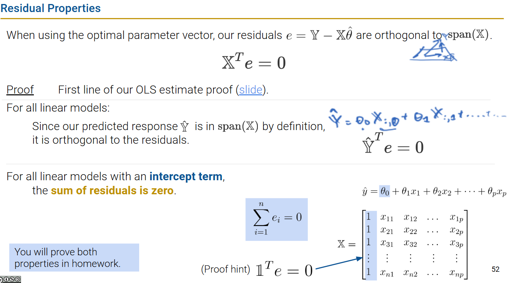
## the bias/intercept term
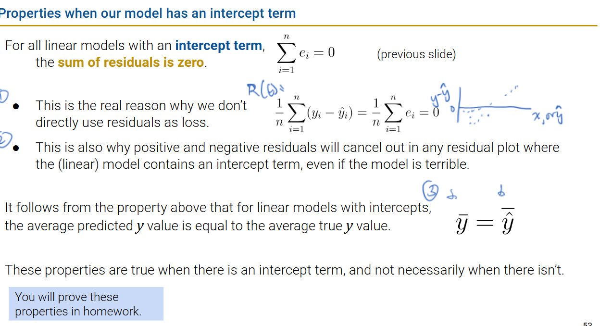
## existence of a unique solution
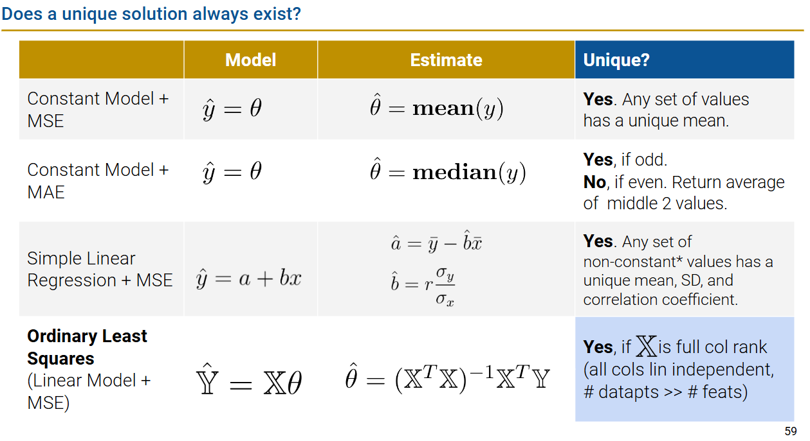
