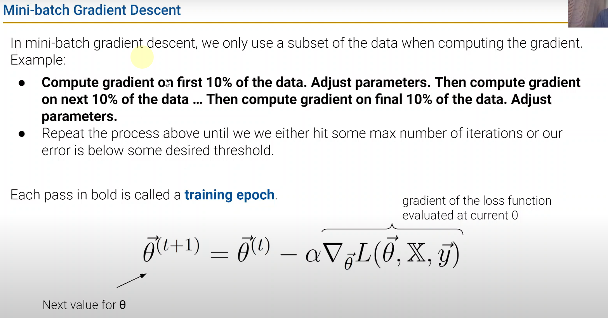
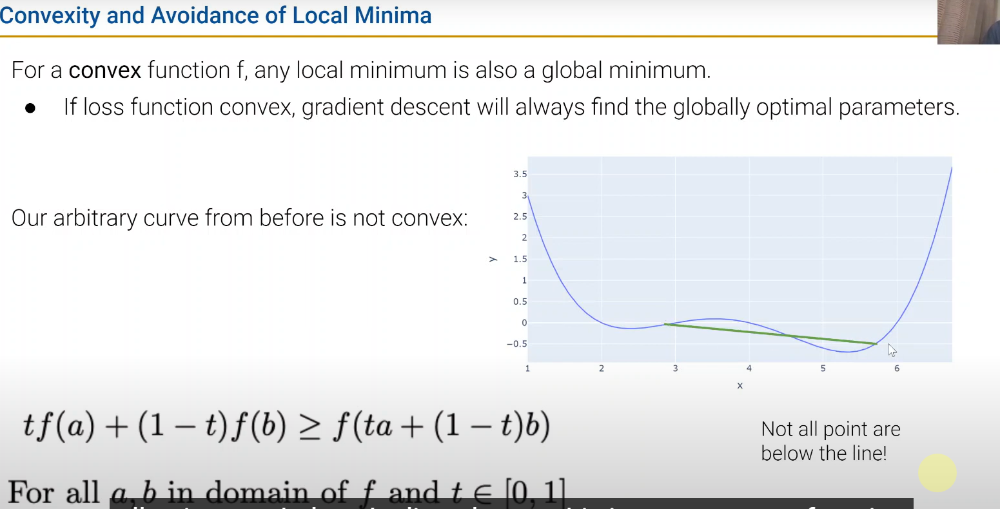
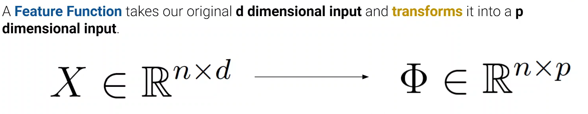
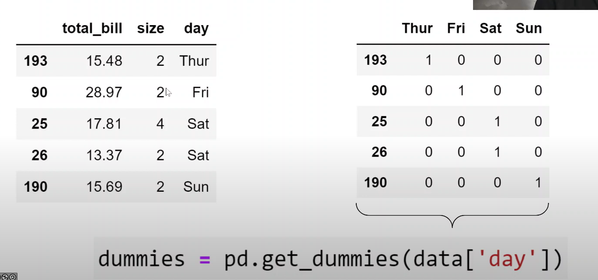
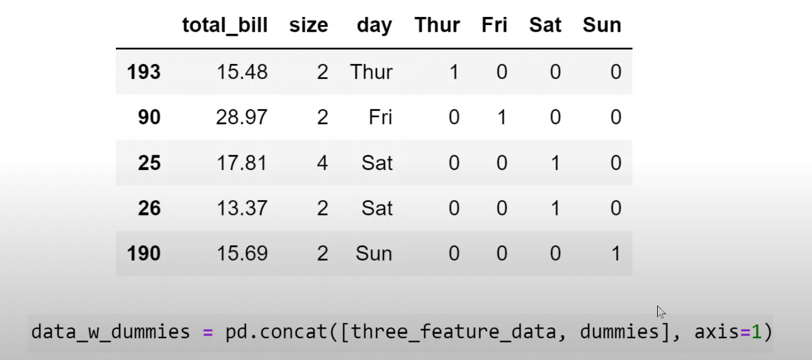
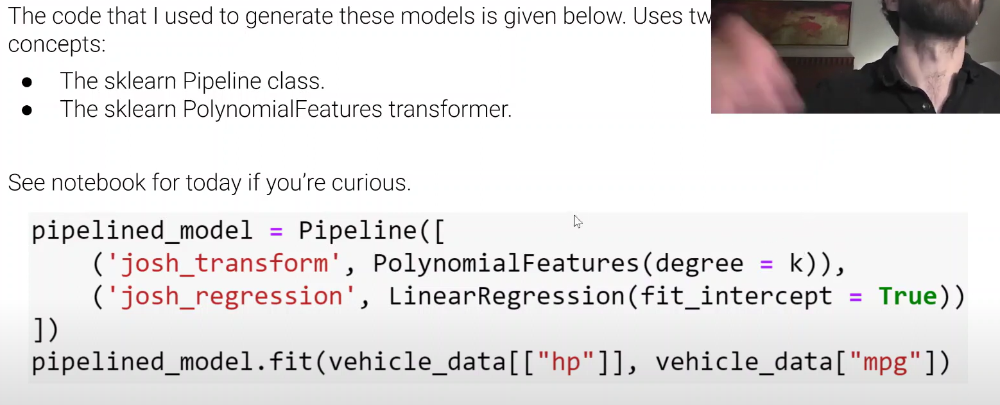

# DATA100-L13: Gradient Descent, Feature Engineering

$\downarrow{shuffle}$
SGD: Stochastic Gradient Descent(but size == 1)
## convexity (凹凸性)

# feature engineering
在于怎么使用transforming
## feature function 

see website code
### non-numeric features
one-hot encoding

### concat

## high order polynomials

## detect overfitting
- collect more data
- more see next lecture
