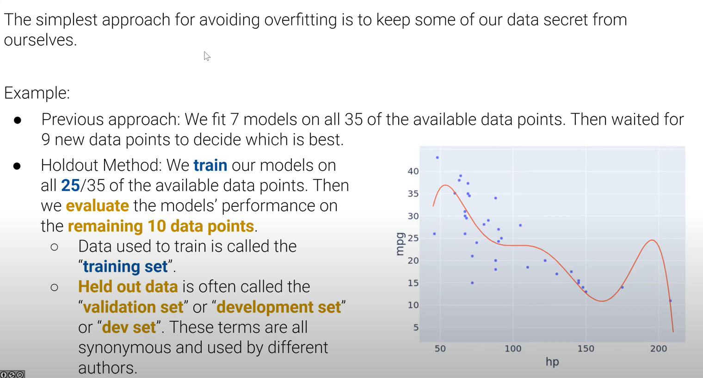
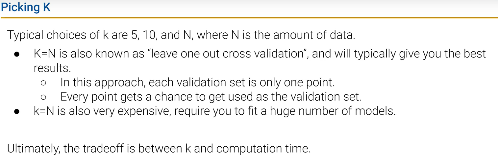
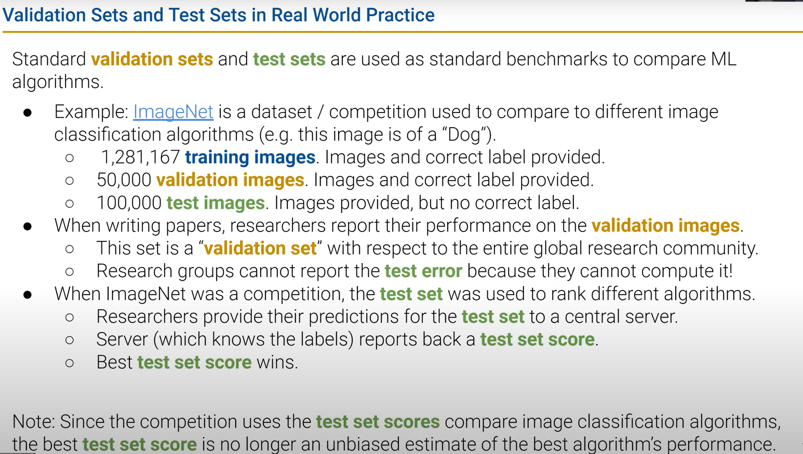
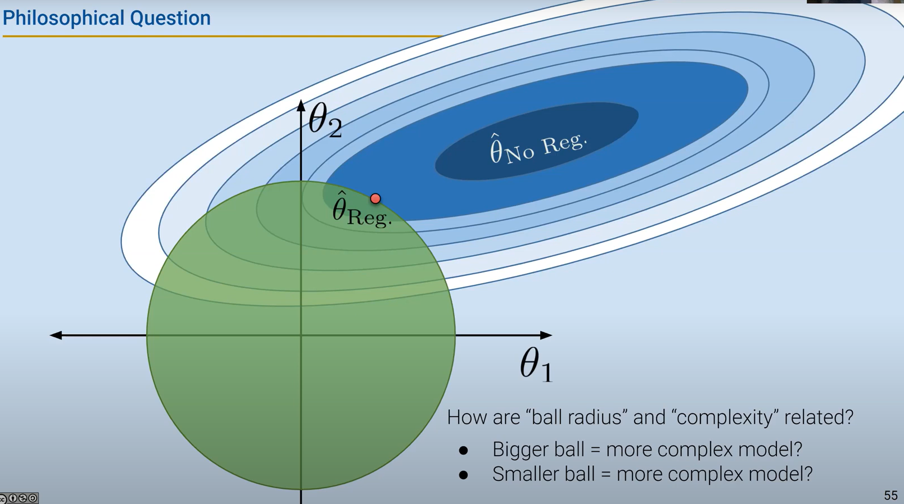
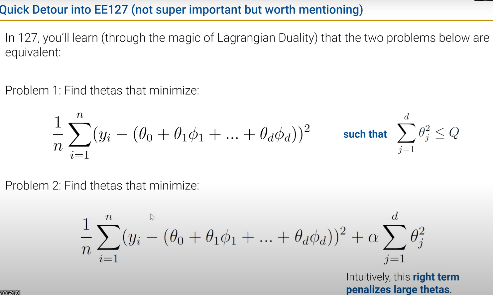
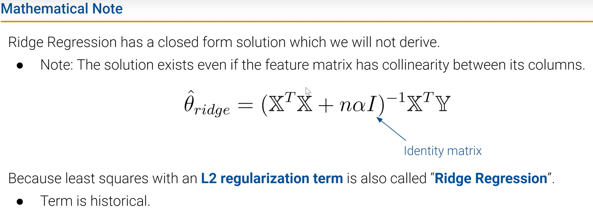
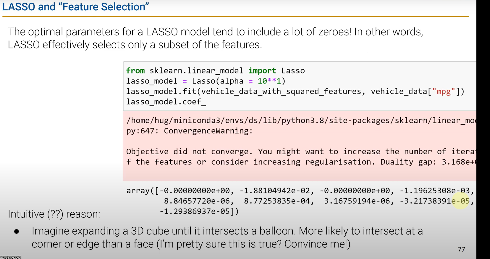
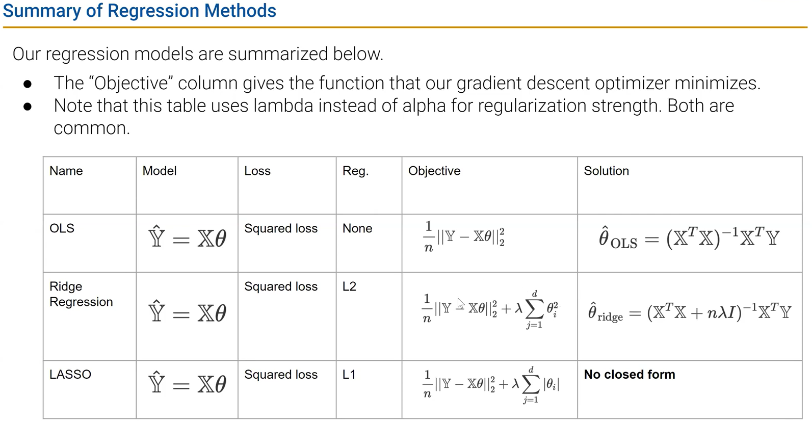

# DATA100-L15: Cross Validation, Regularization


# Cross Validation
## the holdout method

```python
from sklearn.utils import shuffle
training_set, dev_set = np.split(shuffle(data), [int(.8*len(data))])
```
比较validation error和training error，选择最优的模型。


## K-fold cross validation

K=1 is equivalent to holdout method.


## Test sets
provide an unbiased estimate of the model's performance on new, unseen data.

# Regularization
## L2 regularization (Ridge)

the small the ball, the simpler the model

拉格朗日思想，$\alpha$ 越大，约束越强，模型越简单。

岭回归
## scaling data for regularization
标准化数据，be on the same scale
## L1 regularization (Lasso)


### summary

