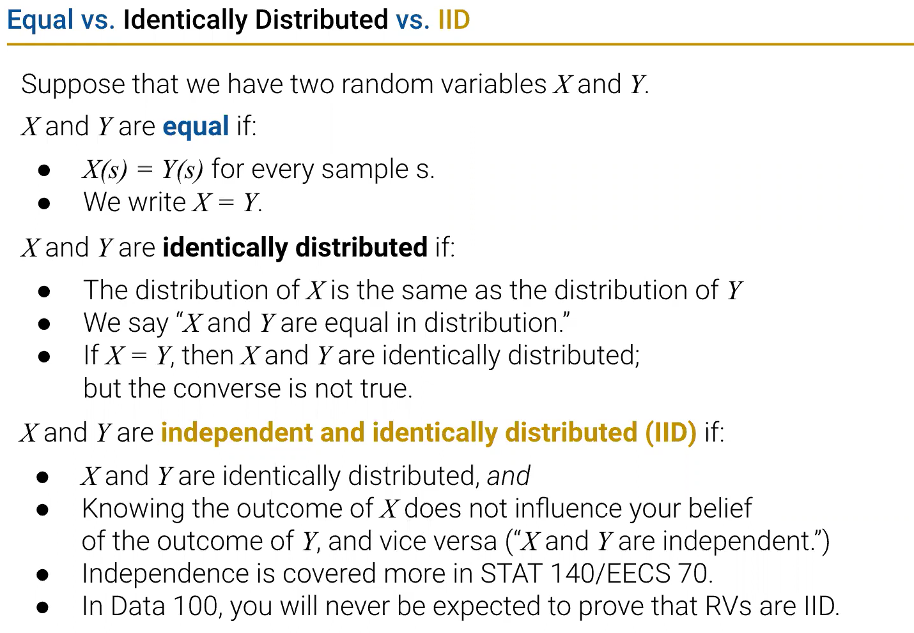
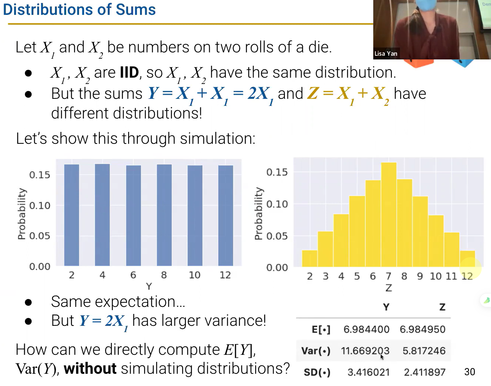

# DATA100-L16: Probability I: Random Variables

# 随机变量及其分布
参考 概率论与数理统计 课程即可
# 期望与方差
$$
\mathbb{E}[X] 和 Var(X)
$$
参考 概率论与数理统计 课程即可
# 随机变量的和
## equality vs Identically distributed vs IID

有意思的分析 :smirk:
## 期望和方差的性质
## 协方差与相关系数

# 伯努利（0-1）和Binomial分布
# Sample Statistics
## sample mean
## central limit theorem
