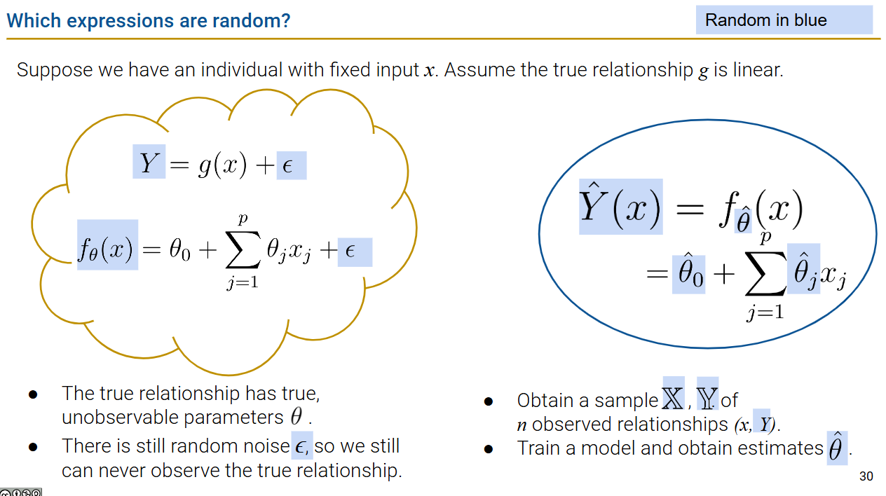
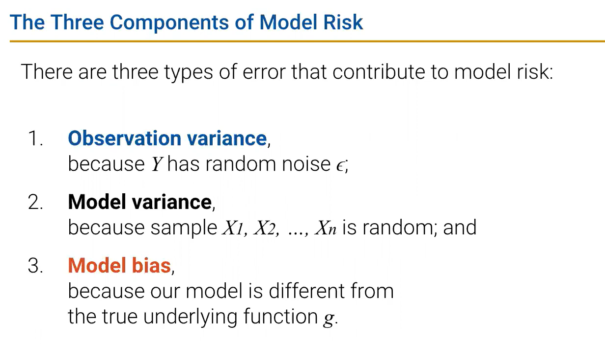
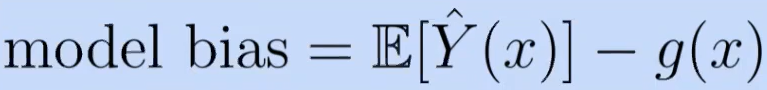
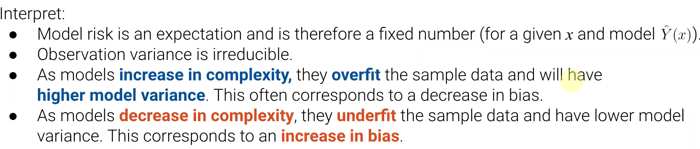
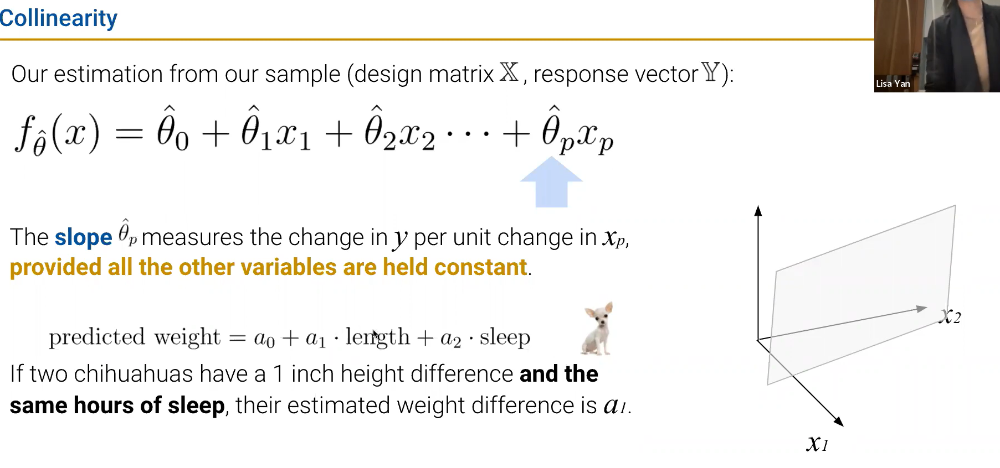

# DATA100-L17: Estimators, Bias, and Variance

# sample statistics (from last time)
参考 概率论与数理统计
# prediction vs. inference
## modeling: assumptions of randomness

# the bias-variance tradeoff

$$
model\ risk = observation\ variance + (model\ bias)^2+model\ variance
$$

$$
\mathbb{E}[(Y-\hat{Y}(x))^2] = \sigma^2+(\mathbb{E}[\hat{Y}(x)]-g(x))^2+Var(\hat{Y}(x))
$$

# interpreting slopes
- slope == 0? 假设检验证明是否无关

# [Extra]review of the Bootstrap
# [Extra]derivation of Bias-Variance
# decomposition

https://docs.google.com/presentation/d/1gzgxGO_nbCDajYs7qIpjzjQfJqKadliBOat7Es10Ll8/edit#slide=id.g11df3da7bd7_0_467
