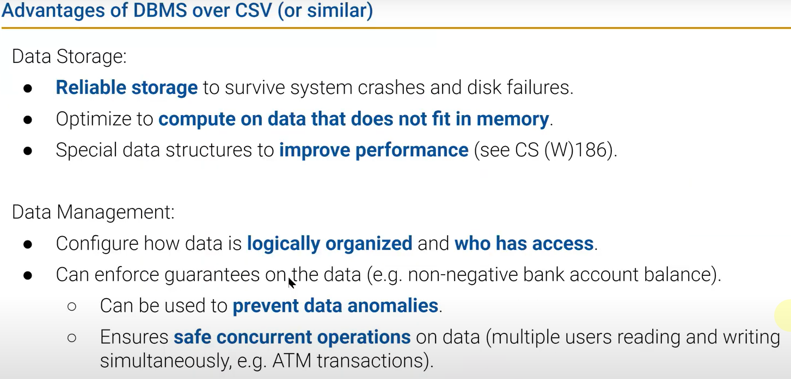
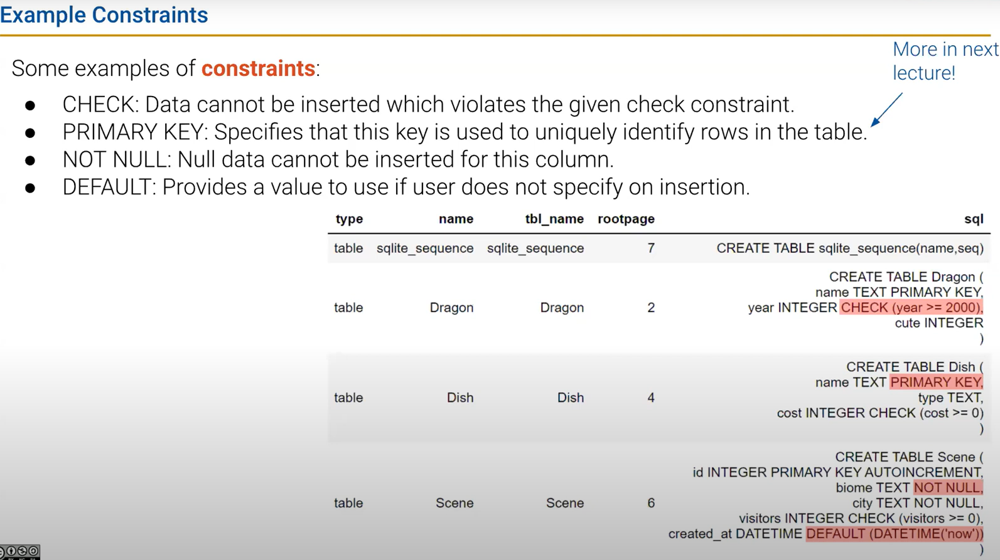
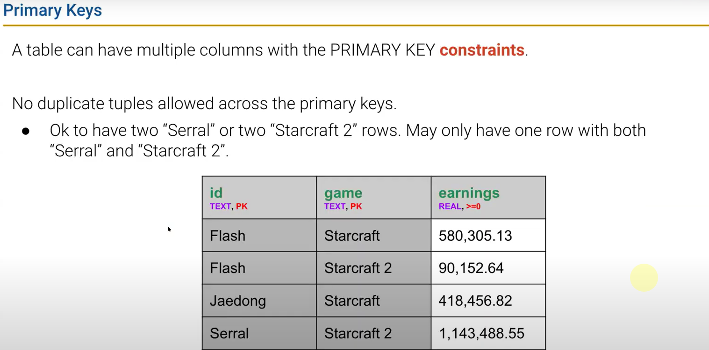
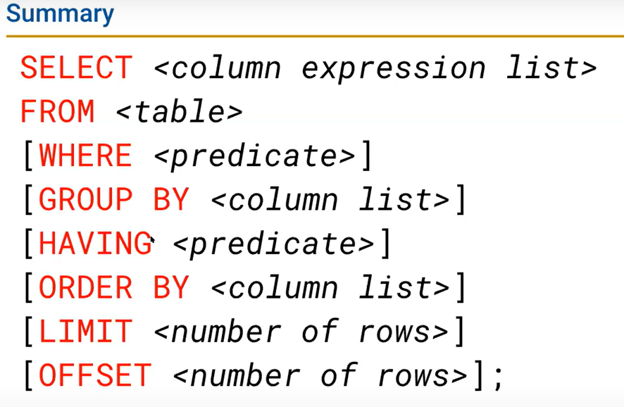

# DATA100-L18: SQL I


# why databases
structured query language (SQL) :yum:

DBMS: database management system


# sql example
type
- `INT` for integer
- `REAL` for decimal
- `TEXT` for string
- `BLOB` for ARBITRARY data
- `DATETIME` for date and time

different implementations of sql support different types 
# sql table
use singular, CamelCase for SQL tables!


# basic sql queries
通配
```sql
SELECT * FROM table_name;
```
选定子集
```sql
SELECT column1, column2 FROM table_name; 
```

`AS`  rename columns
```sql
SELECT cute AS cuteness, 
       smart AS intelligence 
FROM table_name; 
```
`WHERE` filter rows
```sql
SELECT * FROM table_name 
WHERE column1 = 'value1' AND column2 = 'value2'; 
```


`ORDER BY` sort rows `DESC` for descending order, `ASC` for ascending order
```sql
SELECT * FROM table_name 
ORDER BY column1 DESC; 
```

`LIMIT` restrict number of rows returned
```sql
SELECT * FROM table_name 
LIMIT 10; 
OFFSET 5; 
```
# basic GROUP BY Operations
```sql
SELECT column1
FROM table_name 
GROUP BY column1; 
```

```sql
SELECT column1, 
   SUM(column2),
   MAX(column3),
   MIN(column4) 
FROM table_name 
GROUP BY column1; 
```
`SUM`, `AVG`, `COUNT`, `MAX`, `MIN`, etc.
```sql
SELECT column1, 
   COUNT(*) 
FROM table_name 
GROUP BY column1; 
```
`COUNT(*)` counts the number of rows in each group.(even null values)

```sql
SELECT column1, column2
FROM table_name
GROUP BY column1, column2; 
HAVING COUNT(*) > 5; 
```
Generate a group for each unique combination of column1 and column2 values, but only include groups with more than 5 rows.

To filter groups, HAVING, to filter rows, WHERE (before HAVING).
# trickier GROUP BY Operations

# DISTINCT

see in lecture 18

```sql
SELECT type, AVG(DISTINCT cost)
FROM Dish
GROUP BY type;
```
```sql
SELECT DISTINCT type, cost 
FROM Dish
WHERE cost < 9;
```
