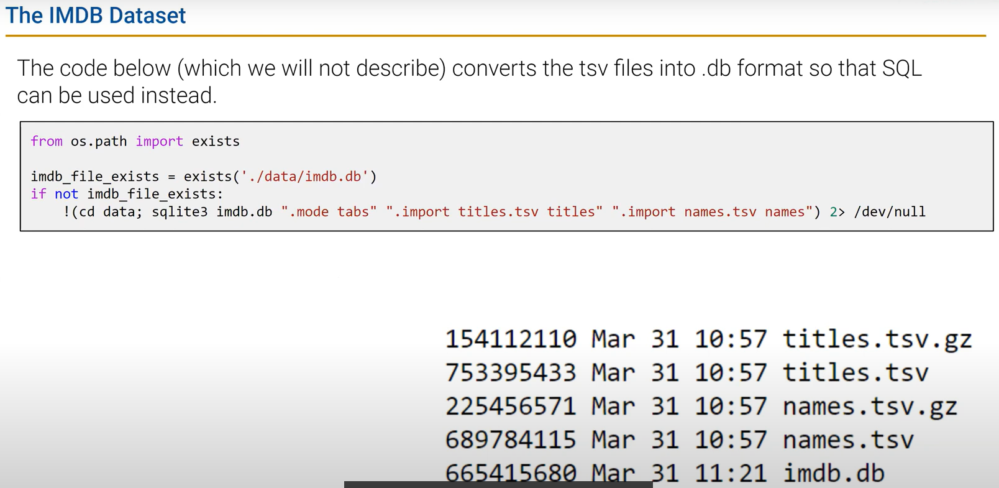

# DATA100-L19: SQL II and PCA I


# SQL II
## sql and pandas
how to connect sql to python
```python
import pandas as pd
import sqlalchmey
engine = sqlalchemy.create_engine('sqlite:///mydatabase.db')
connection = engine.connect()

pd.read_sql("""
SELECT * FROM mytable
GROUP BY column1, column2
""", connection)
```

## LIKE and CAST

`LIKE`: search for a pattern in a column
```sql
SELECT * FROM mytable
WHERE column1 LIKE '%value%'
```

`CAST`: convert data type

## SQL Joins

### Cross Join
```sql
SELECT *
FROM table1
CROSS JOIN table2
```

### Inner Join
```sql
SELECT *
FROM table1
INNER JOIN table2
ON table1.column1 = table2.column1
```
```sql
SELECT *
FROM t1, t2
WHERE t1.id = t2.id
```

### left/right/full outer join

### other join conditions


# PCA
## dimensionality and rank of data

dimensionality <===> rank

## two interpretations of matrix multiplication
- ***matrices as linear operations***
- ~***coordinate transformation***


## matrix decomposition and rank 

尽可能的保留主成分，而舍弃无关的成分 ===> rank
## manual matrix decomposition exercise
lin alg有的时候不能分析出真正的“rank",需要 


## singular value decomposition (high level look)
