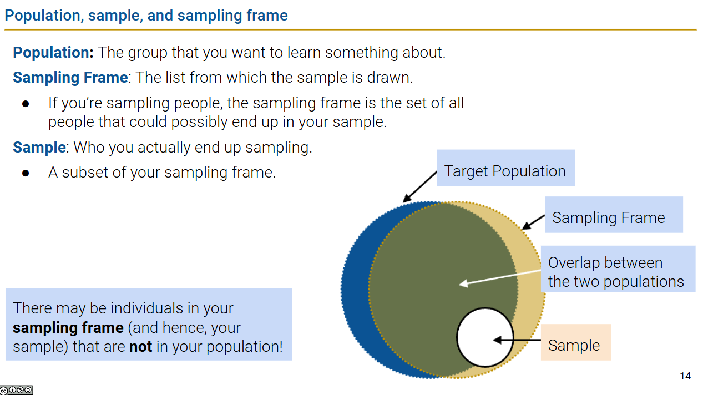
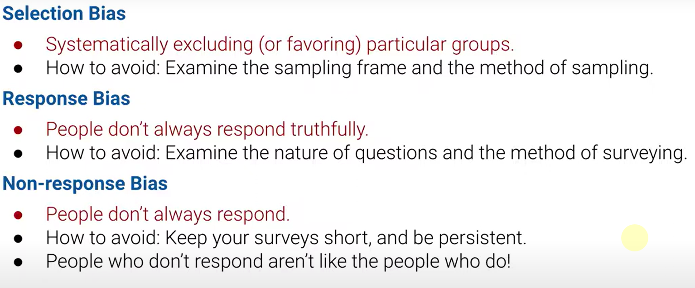
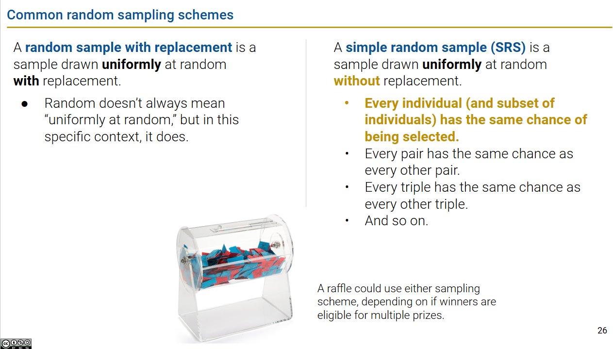

# DATA100-L2: Data Sampling and Probability

## two common errors
- chance error: randomness can vary
- bias error: systematic error in one direction 

## bias 

## common non-random samples
- convenience samples: samples that are easy to obtain but may not be representative of the population
- quota samples: samples that are drawn from a limited number of individuals or groups

## random samples
- random **can** produce biases
- but we can estimate the bias and chance error

properties of random samples:
- 明确概率
- **no need to be same chance** :yum:

scheme of random sampling:

"Random sample with replacement" 是统计学中的一个术语，指的是在进行抽样时，每次抽取的样本在放回原总体之后，再进行下一次抽取。这意味着同一个个体或元素有可能被多次抽取。

这种抽样方法的特点包括：
- 每次抽取都是独立的，即前一次的抽取结果不会影响后一次的抽取。
- 总体中的每个元素在每次抽取中被选中的概率是相同的。
- 由于样本被放回，样本的大小可以等于或小于总体的大小。

与之相对的是 "Random sample without replacement"，即不放回抽样，这种情况下，一旦一个元素被抽取，它就不会再次被抽取，因此抽取的样本量总是小于总体的大小。:wink:

**SRS**：:thinking:注意是每个"pair"！

## 多项式和二项式分布采样
