# DATA100-L20: PCA II

# recap and Goals
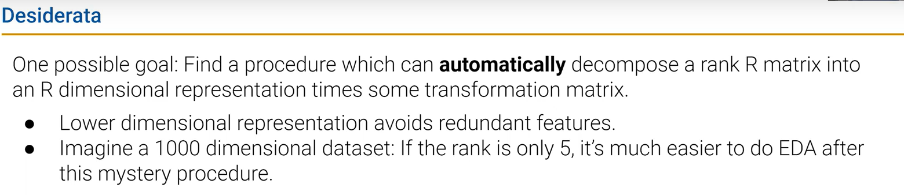
## approximate factorization
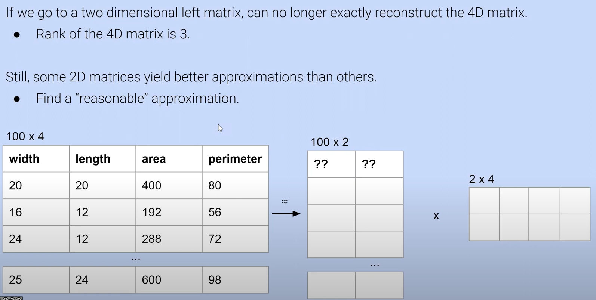
$W\ L\rightarrow (W+L)/ 2$
rank 下降使得信息缺失了

所以 $M_{100 \times 4} = N_{100 \times P} \times Q_{P \times 4}$ P的值尽量不要小于原来的"秩"

# singular value decomposition (SVD)
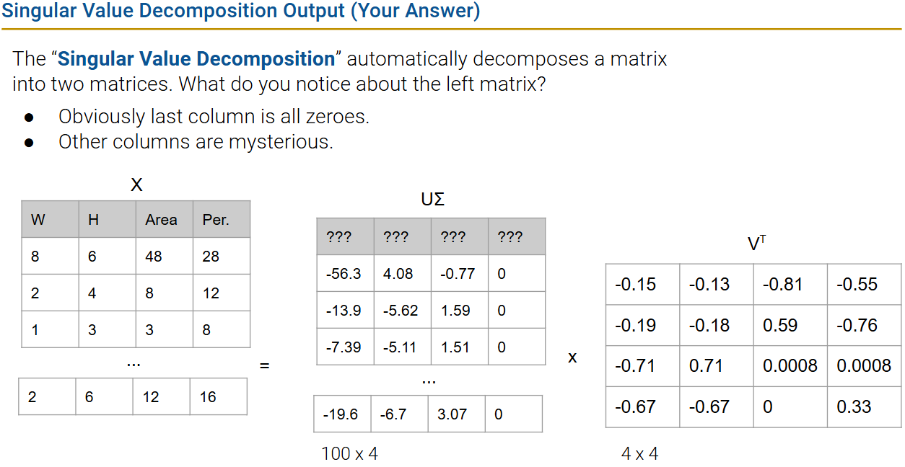

# low rank approximation
no bad! seem good!
# SVD theory
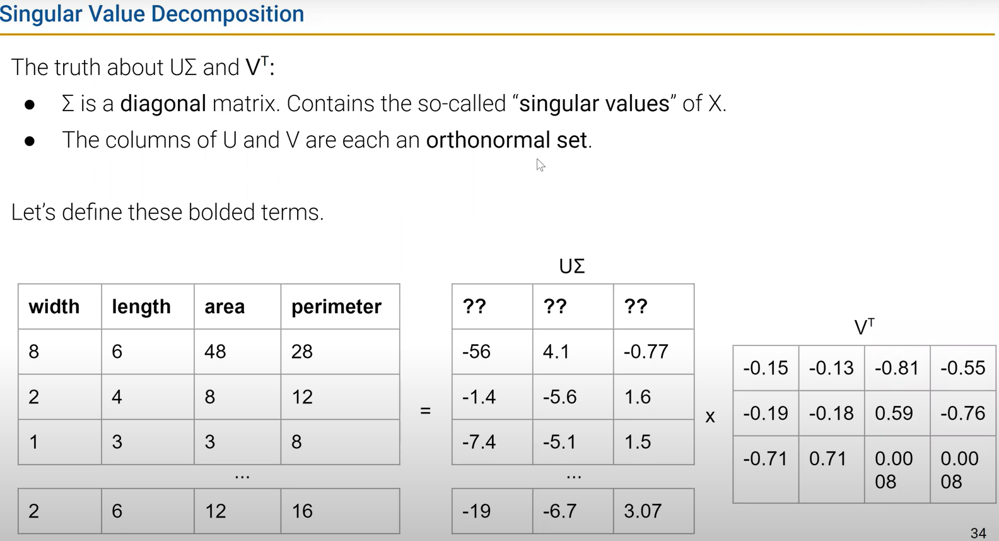
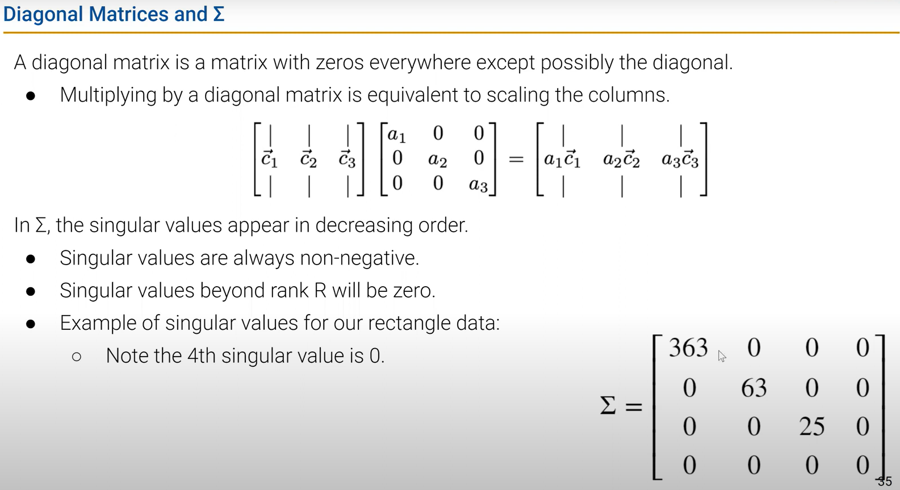
验证orthonormal set
- V@V.T = I

当相乘的时候本质上是旋转，不会拉伸
# Principal Components
***零中心化***再来看PCA
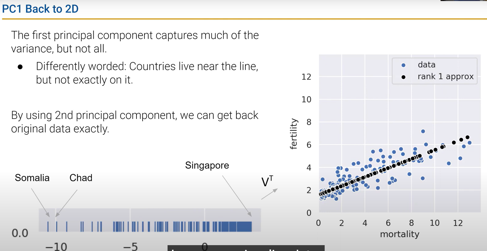
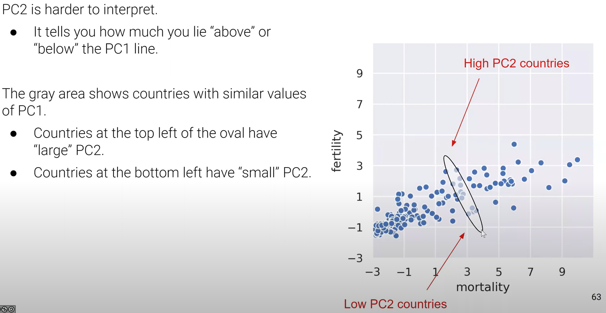

# Principal Components and Variance
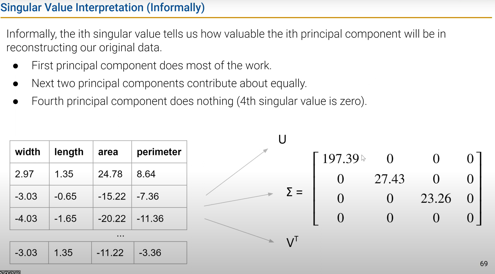
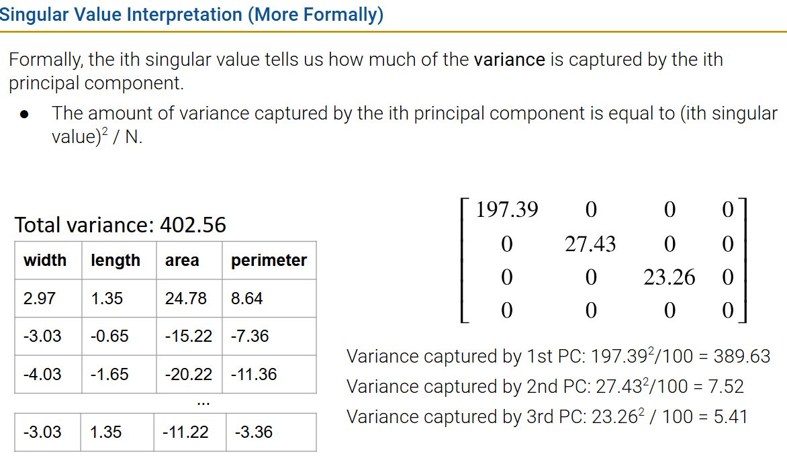
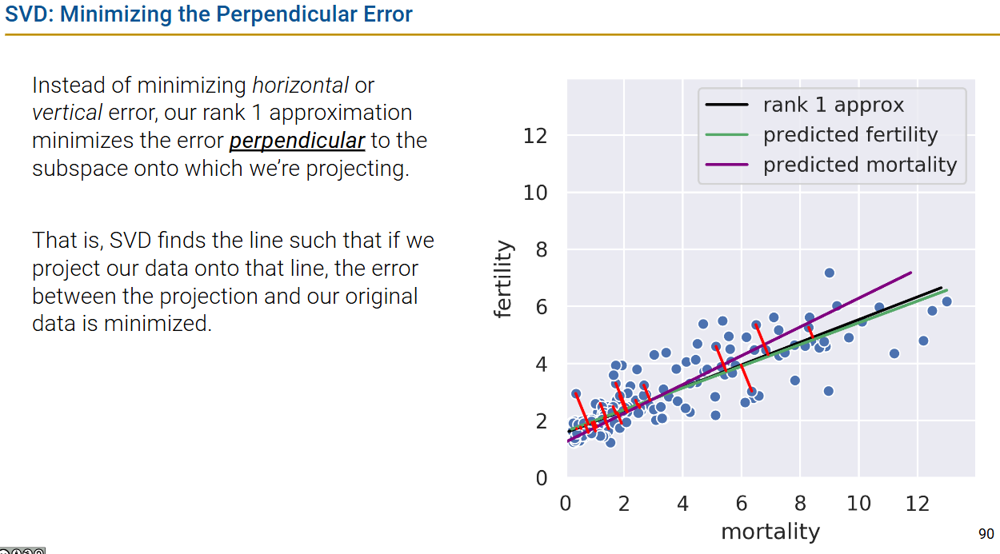
# PCA example
Why is useful? :thinking: 
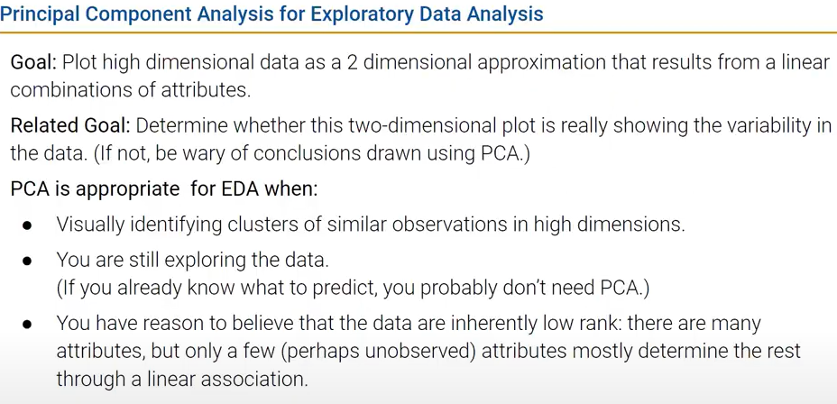

