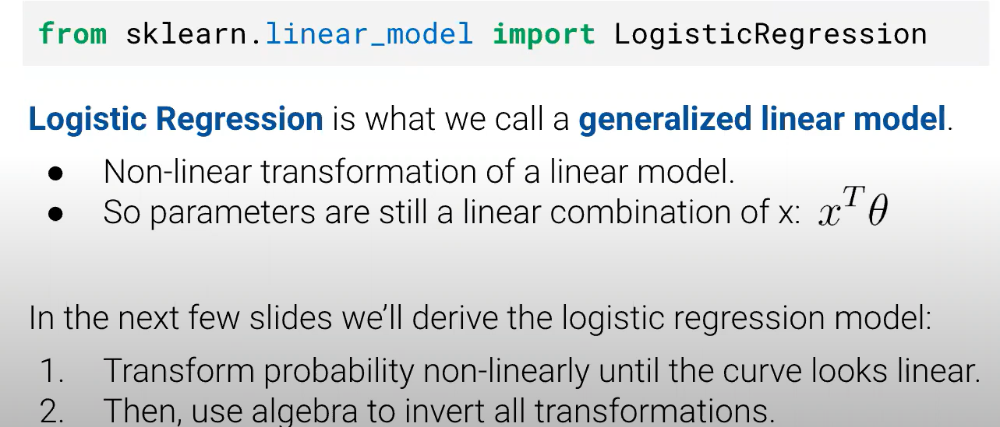

# DATA100-L21: Classification and Logistic Regression I

# Regression vs. Classification
全攻略:yum:

# intuition: the coin flip
重新定义概率，只需要满足一些性质即可。参考 概率论与数理统计
# deriving the logistic regression model
knn一瞥

这说明可以从某些变化转换为线性性质
1. 考虑 probability $p$
2. 考虑 odds $\frac{p}{1-p}$
3. 考虑 log odds

广义线性由此可见
## Graph of Averages
## the sigmoid function
$$
\sigma(t)=\frac{1}{1+e^{-t}}
$$
# the logistic regression model
## comparison to linear regression

# parameter estimation

## pitfalls of squared loss

1. non-convex
2. bounded, MSE ∈[0，1]
3. conceptually questionable, not matching the "Probability and 0/1 labels"
## cross-entropy loss
$$
-\frac{1}{N}\sum_{i=1}^N[y_i\log(p_i)+(1-y_i)\log(1-p_i)]
$$

***Loss function should penalize well!***
## maximum likelihood estimation
see extra in L22!
