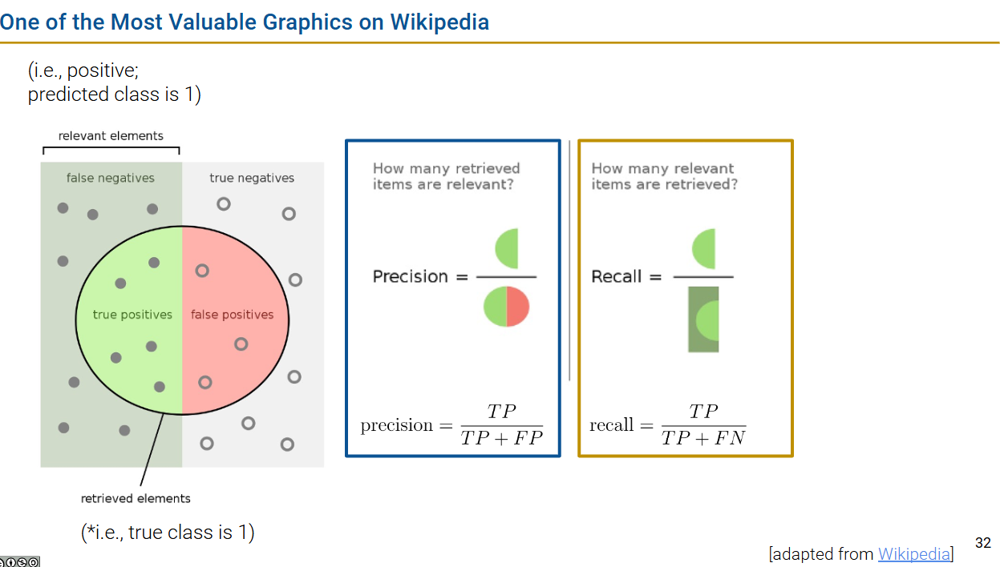
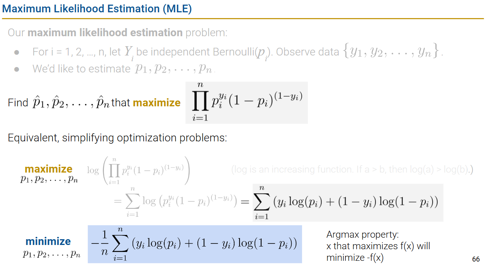

# DATA100-L22: Logistic Regression II


# logistic regression model continued
## sklearn demo
go to see lec code! 
## MLE: high-level, detailed (recorded)

# linear separability and regularization
线性可分性：如果存在一个 **超平面（hyperplane）** 可以将数据集分割成两部分，那么这就是线性可分的。

超平面的维度和数据集的维度相同

$$
C
$$
注意对“push”的理解！

#### 另一种理解正则化的角度


这里是避免loss出现无限大的情况（梯度爆炸？），避免出现使前面情况发生的参数（infinite theta）出现，所以在loss里面预先加入正则化项。

# performance metrics
## accuracy
```python
# using sklearn
model.score(X_test, y_test)
```
## imbalanced data, precision, recall
`Acc` is not a good metric for imbalanced data, use precision and recall instead!!!

$$
acc= \frac{TP+TN}{n}\\
precision(精确率)=\frac{TP}{TP+FP}\\
recall(召回率)=\frac{TP}{TP+FN}
$$



# adjusting the classification threshold(阈值界限)
## a case study

变界限可能是因为imbalanced data导致的
## ROC curves and AUC
怎么选择阈值？


# [extra] detailed MLE, gradient descent, PR curves

## Why cross-entropy?
- KL散度: https://www.textbook.ds100.org/ch/24/classification_cost_justification.html?highlight=divergence
- MLE

以下讨论MLE，二分类的话以 **伯努利** 举例



## PR curves

false positive在T变大的时候增加得更快，所以可能slightly decrease


考虑PR


## 插曲
似乎自然科学所有学科都可以被解构为 “观测到的知识点（context）” + 信息数理化（math & computer science） ？

换言之只需要一方面不断扩充数据/知识点，另一方面提出高明的信息数理化分析方法，就可以推动科学的进步？:thinking: :thinking: :question:

https://docs.google.com/presentation/d/1YsxPERhul760_0TrLhawljbWWqDbtIp5tUm05irfkmw/edit#slide=id.g12444cd4007_0_537
