# DATA100-L23: Decision Trees

# Multiclass Classification
多分类问题 但是没有softmax :cry:
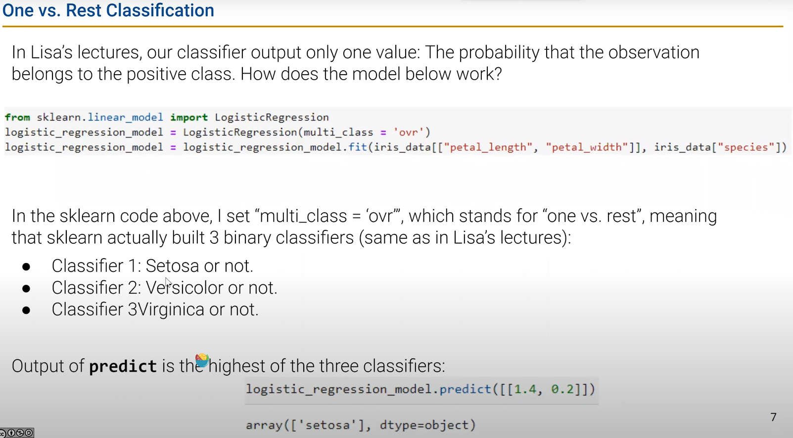

# Decision Trees (conceptually)
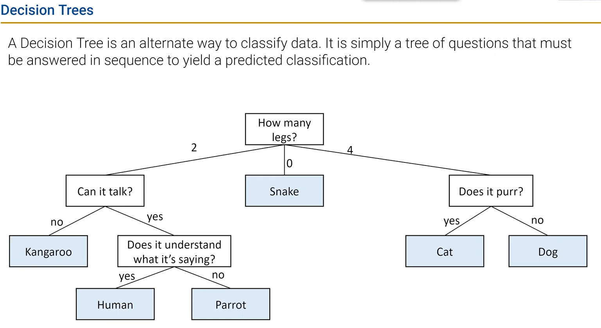

# Decision Tree Demo
## Creating Decision Trees in sklearn
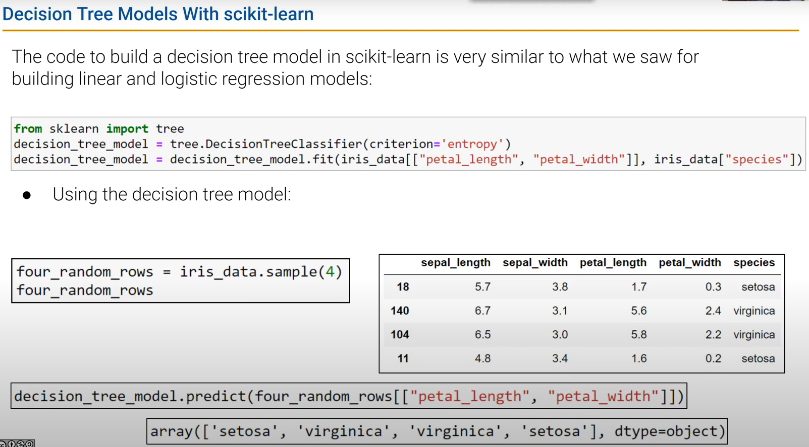
可视化代码见lecture code
## Evaluating Tree Accuracy
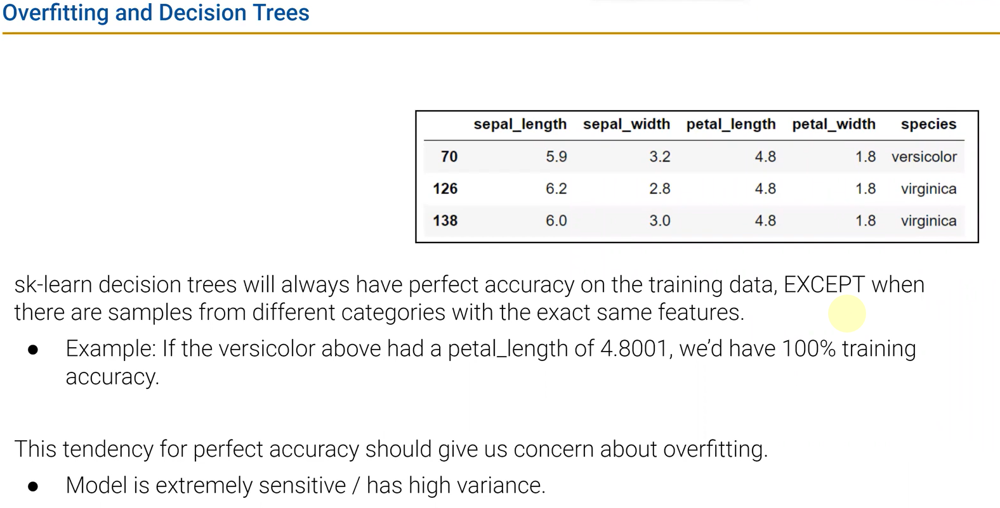

## Overfit Decision Tree Example
tree is too complex to generalize well to new data
too tall and narrow

有用的特征越多，树的结构可能比较简单:thinking:
# The Decision Tree Generation Algorithm
## Intuitively Evaluating Split Quality
分割怎么样“更明显”？
## Entropy
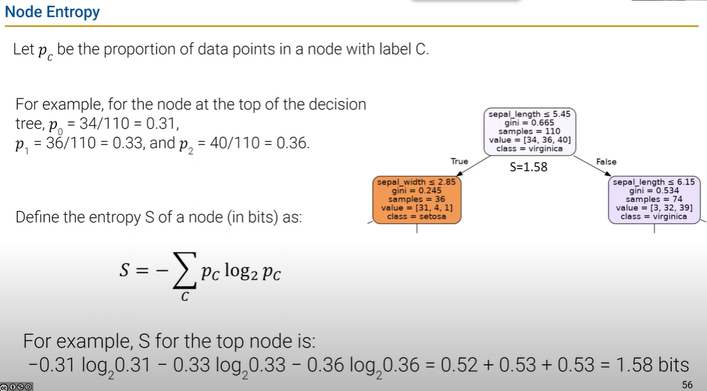
沿着树向下，信息熵越小？可能变大！
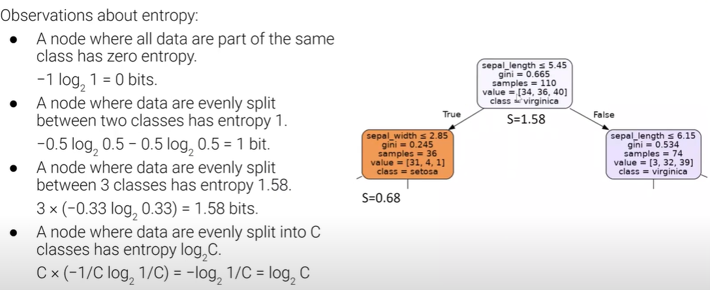
## Generating Trees Using Entropy
Weighted entropy can decrease! 

Traditional decision tree generation algorithm: 
- All of the data starts in the root node.
- Repeat until every node is either pure or unsplittable:
    - Pick the best feature x and split value β such that the ΔWS is maximized, e.g. x = petal_width, β = 0.8 has ΔWS = 0.91.
    - Split data into two nodes, one where x < β, and one where x ≥ β.

Notes: A node that has only one samples from one class is called a “pure” node. A node that has overlapping data points from different classes and thus that cannot be split is called “unsplittable”. 

# Avoiding Overfitting
正则化在这里不起作用？
## Heuristically Restricting Decision Tree Complexity（启发式算法）
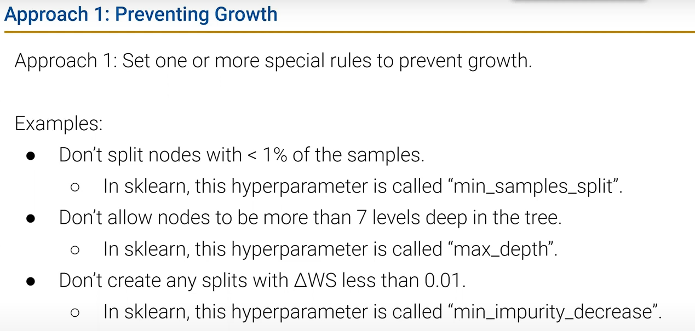
Approach2: allow full growth of the tree, but Prune the tree. 

## Embracing Decision Tree Complexity with Random Forests
:wood: :yum: 
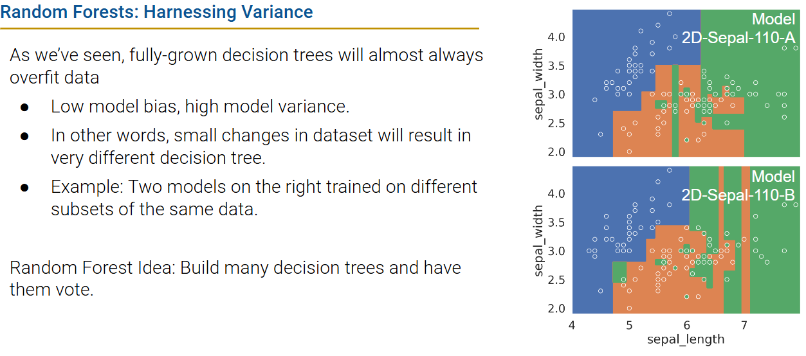
Bagging: Short for Bootstrap AGGregatING.
- Generate bootstrap resamples of training data.
- Fit one model for each resample.
- Final model = average predictions of each small model.
- Invented by Leo Breiman in 1994 (Berkeley Statistics!).

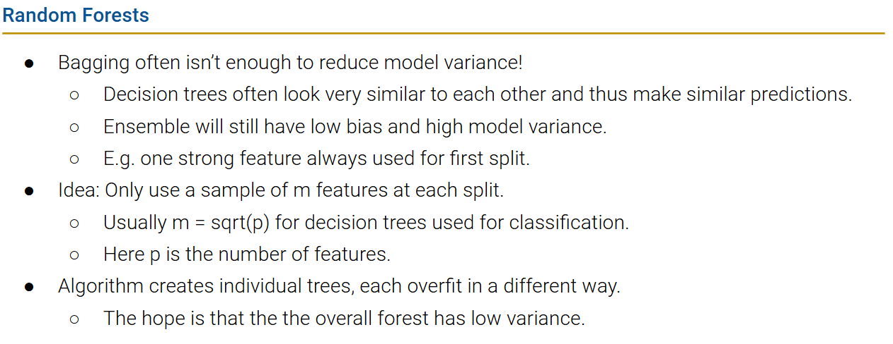
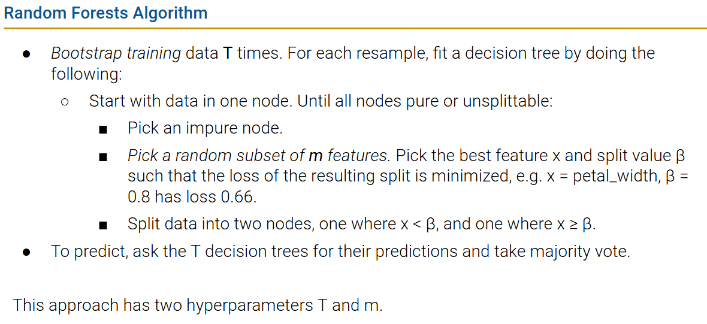

### 启发式的特点
These ideas are generally “heuristic”
- Not provably best or mathematically optimal.
- Instead, they are just ideas that somebody thought sounded good, implemented, then found to work in practice acceptably well.

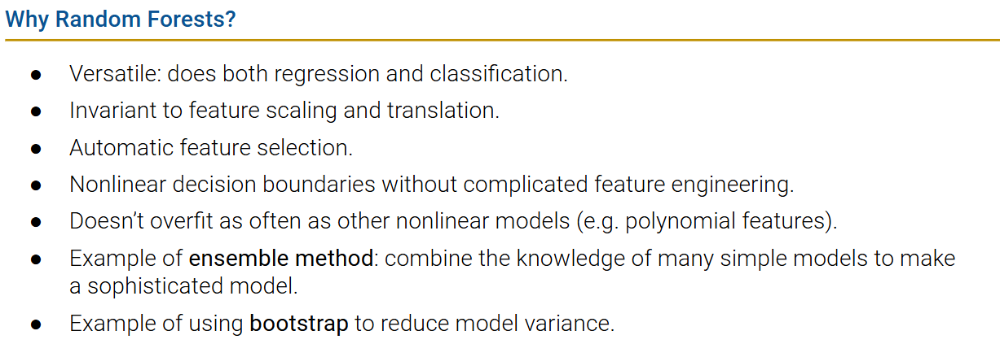

# Summary and Context
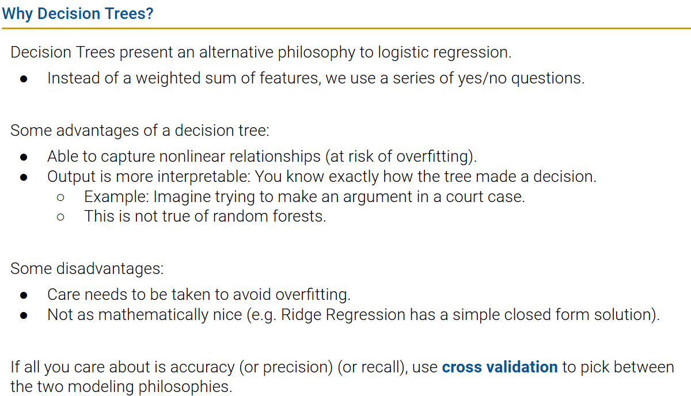

Decision trees provide an alternate non-linear framework for classification and regression.
- The underlying principle is fundamentally different.
- Decision boundaries can be more complex.
-    Danger of overfitting is high.
-    Small decision trees are very easy to interpret.
-    Doing regression with a tree is straightforward. See [statquest](https://www.youtube.com/watch?v=g9c66TUylZ4) video.

Keeping complexity under control is not nearly as mathematically elegant and relies on heuristic rules. 
-    Hard constraints.
-    Pruning rules.
-    Random forests: 
      -    Generate multiple trees using bootstrap.
      -    Have the trees vote on the outcome.

