# DATA100-L24: Clustering

# introduction to clustering
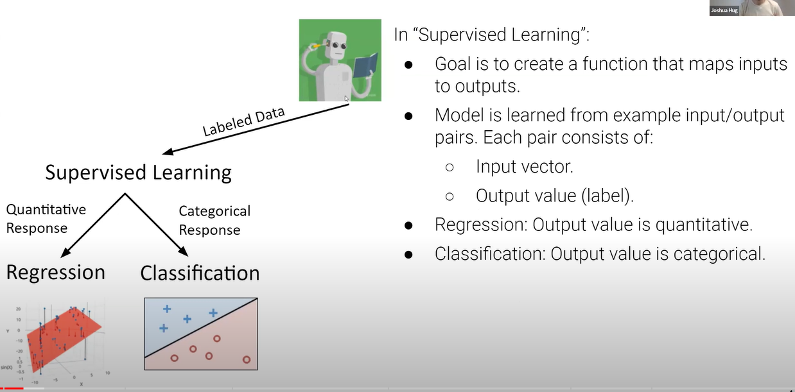
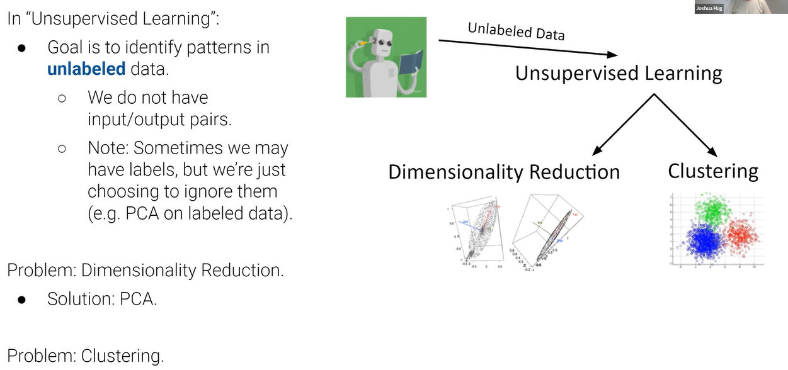
no label at all :cry:

# K-means clustering
[算法动画演示](https://docs.google.com/presentation/d/1qYThwhMXKjCH390AQ29Ob27bUDjV5DWBTmGEzby-Bto/edit#slide=id.p)

K-Means vs KNN
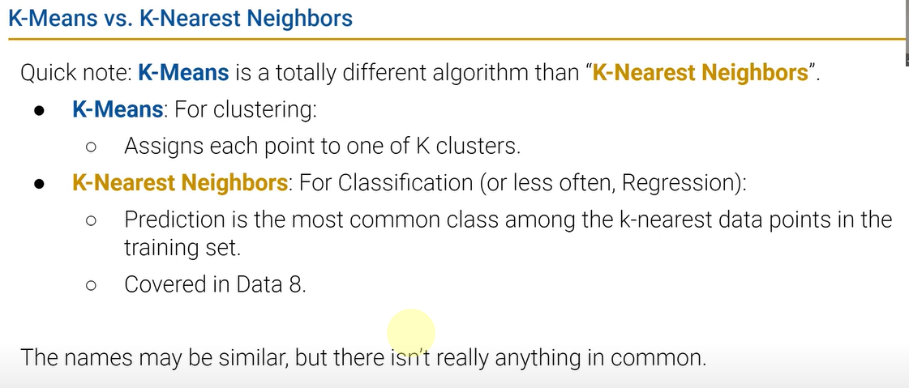

# minimizing inertia
convex?? 损失函数不一定凸，梯度下降难顶  how to see which one is better :question:
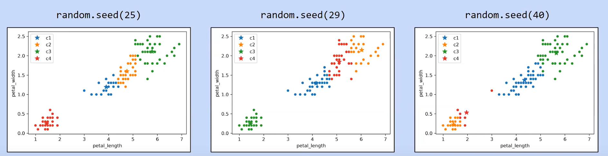
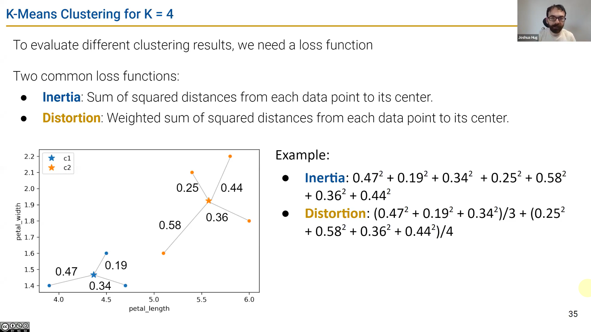
但是找到全局最优解非常困难
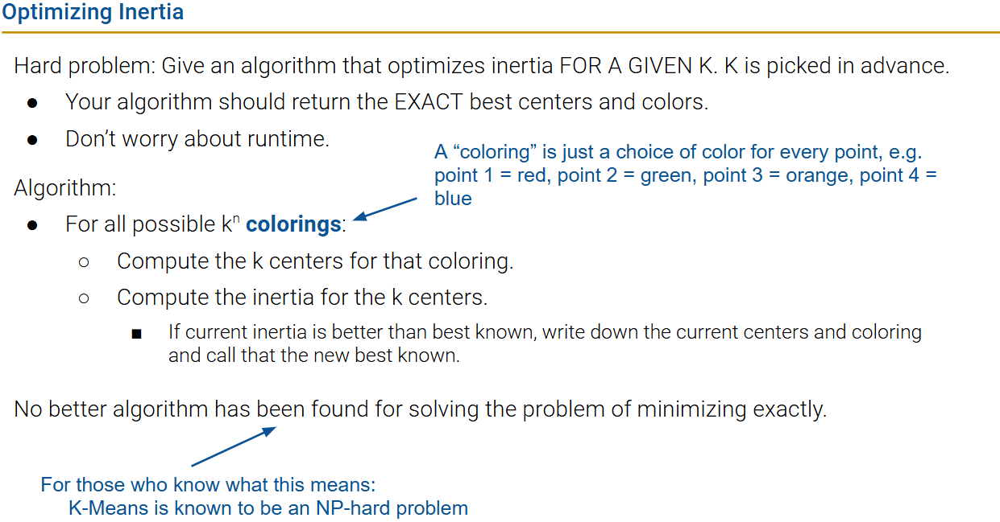
# agglomerative clustering
演示见上面链接以及lec code！

和CS61B的minimum spanning tree类似，每次合并两个最近的点，直到终止条件

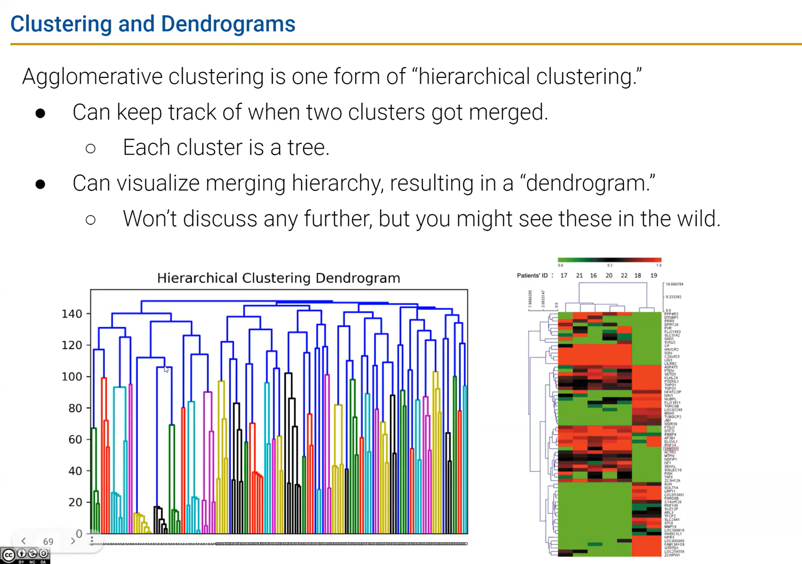
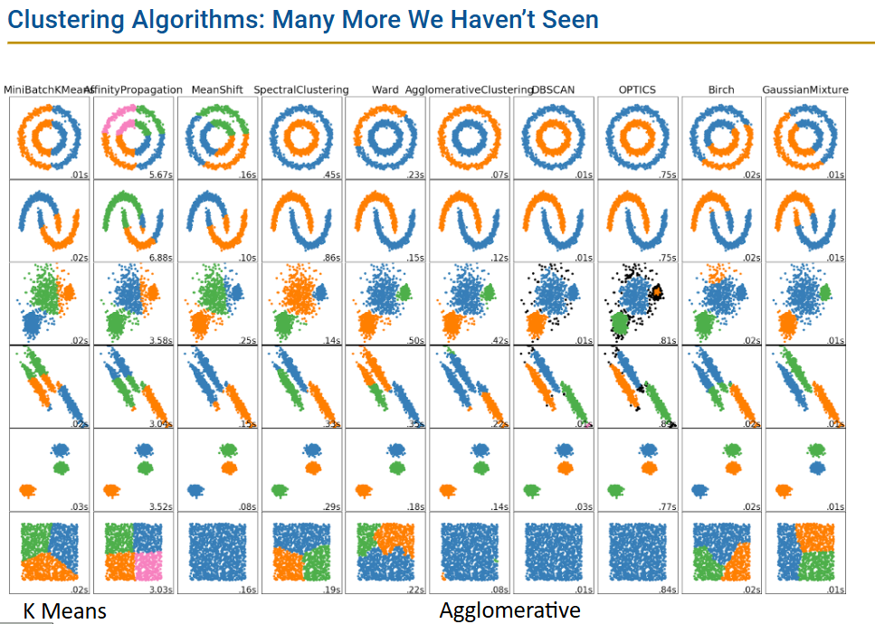
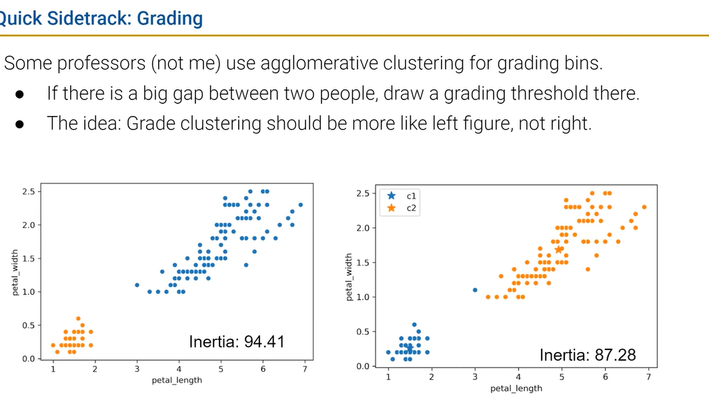
outlier 有时忽略处理或者自成一类
# picking K
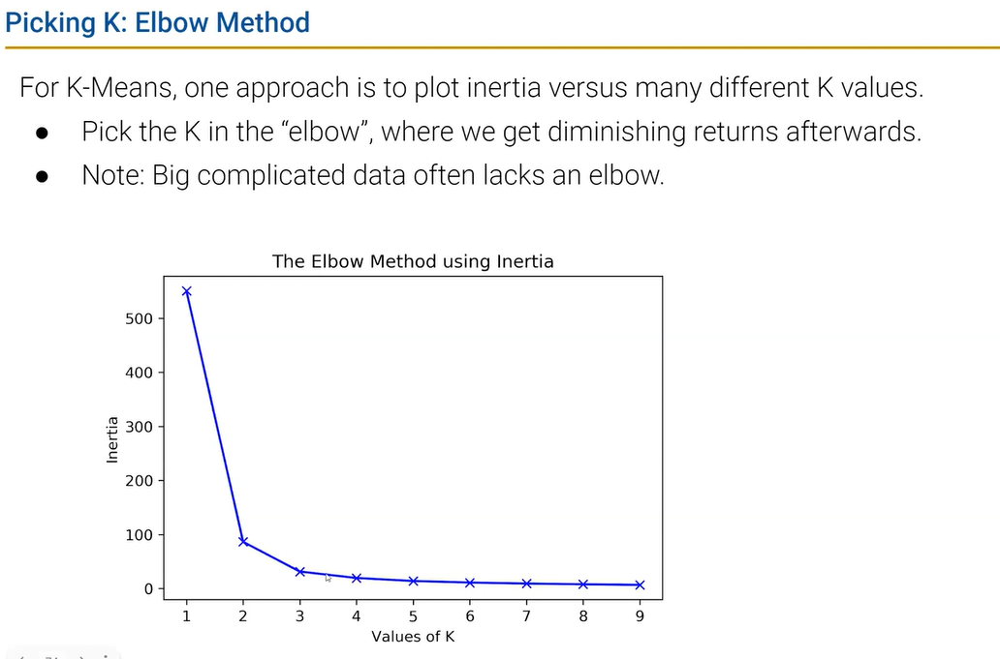

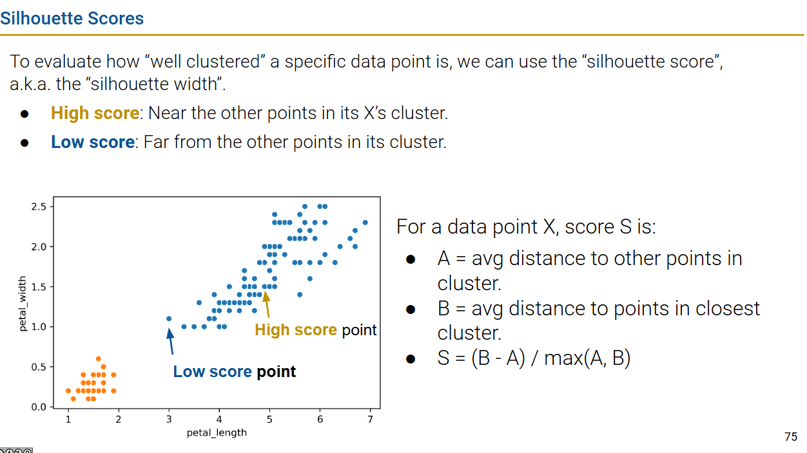
Smax？
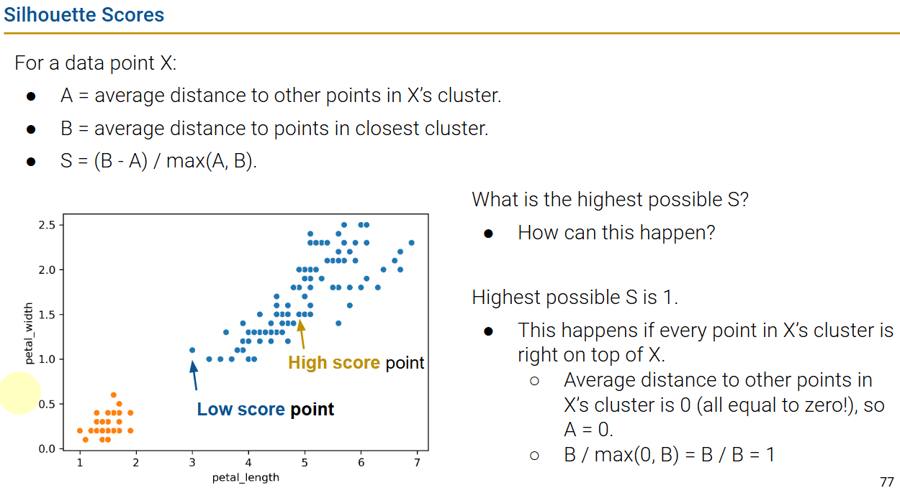

can s be negative?
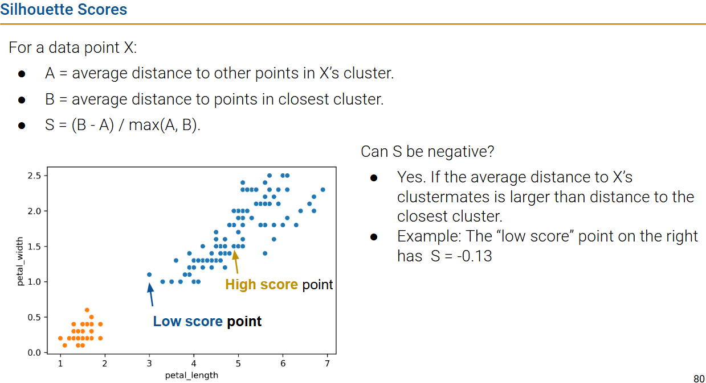
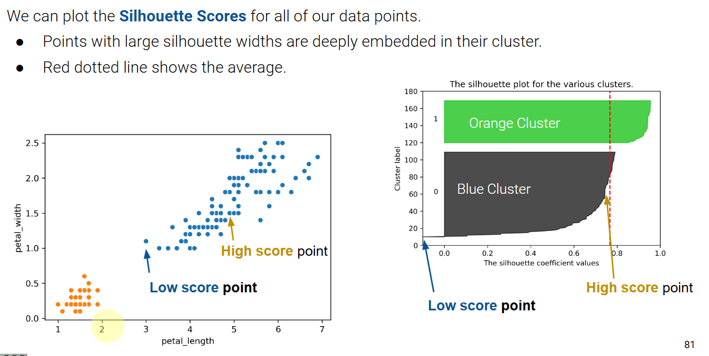
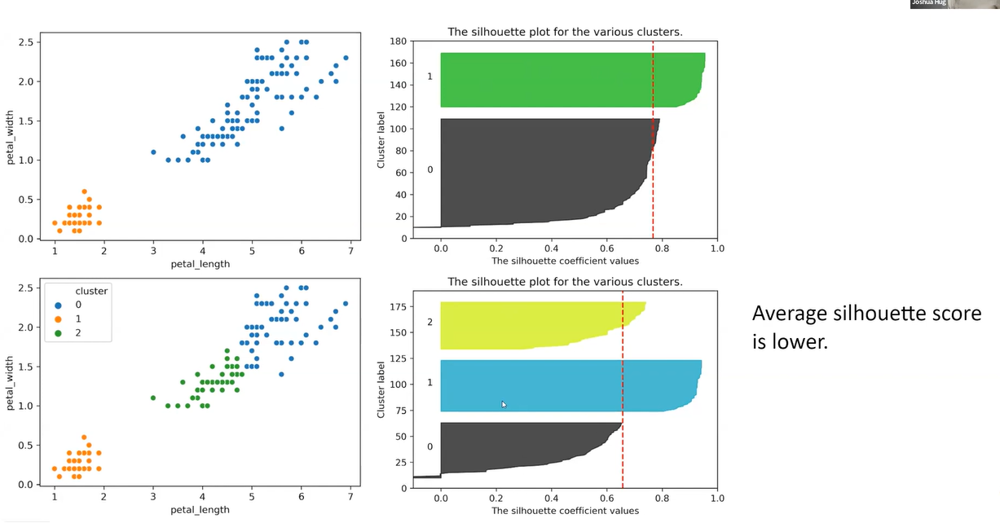

## summary
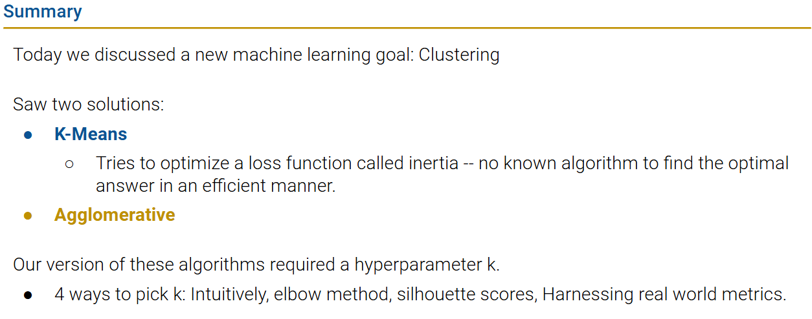
