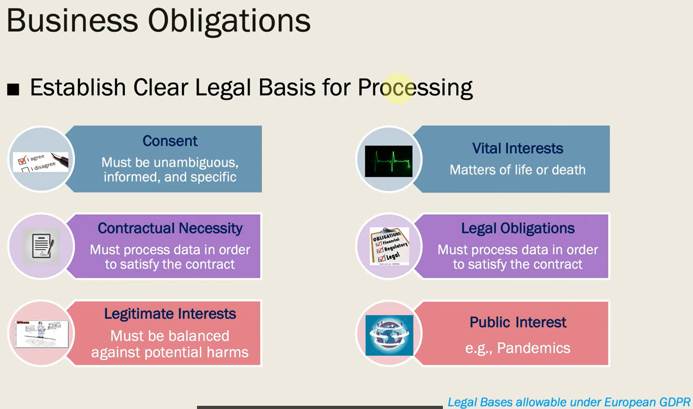
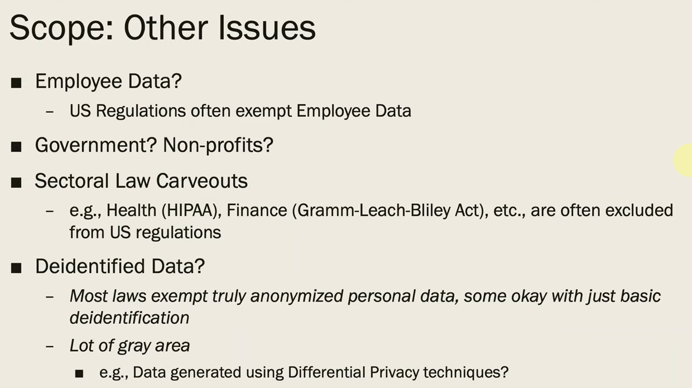
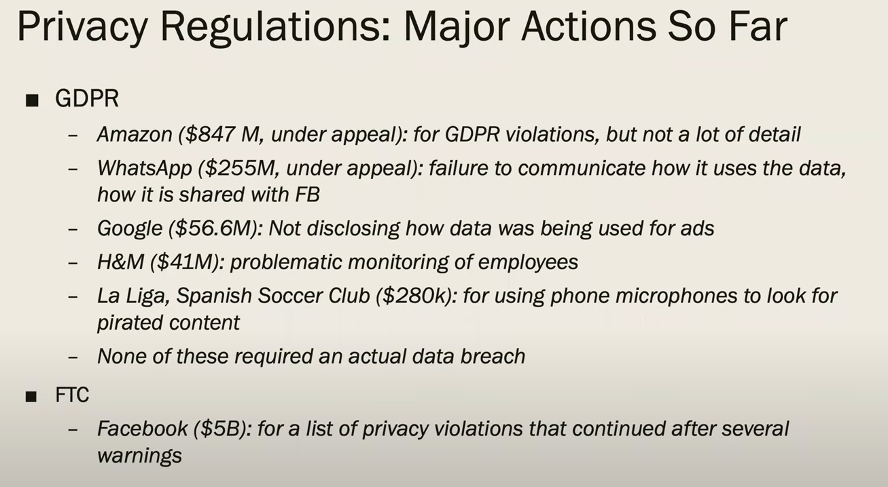
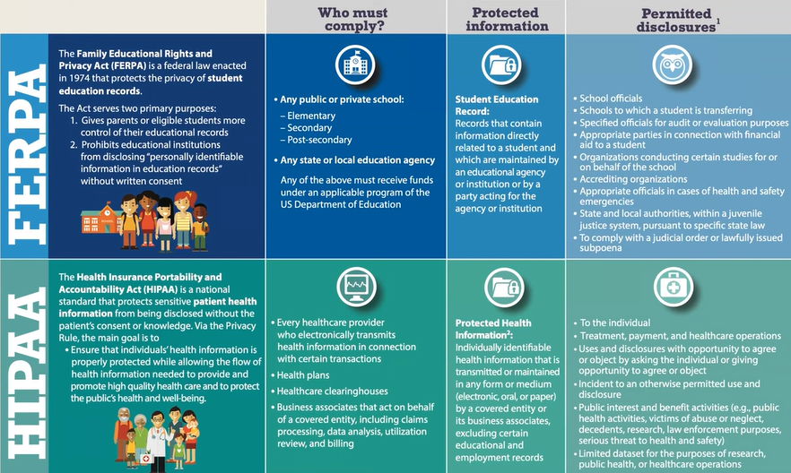
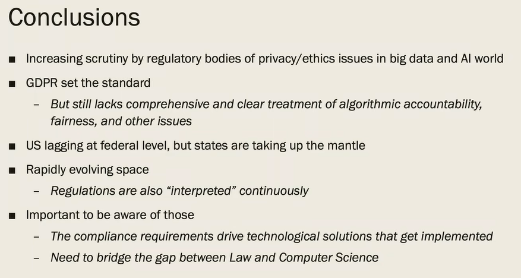

# DATA100-L25: Data Regulations

# impetus for regulation
# why "you" should care
Because you are gonna to be a data scientist and product owner!
# regulations: Privacy laws
GDPR (General Data Protection Regulation)
CCPA (California Consumer Privacy Act)
Cyber Security Law in China

deletion can be more difficult than you think :smirk:

传输也要监管 

fully take advantage of the "regulations"

take care of gray areas :thinking:
work with dear NGO and GO 

# other regulations/ regulatory bodies

