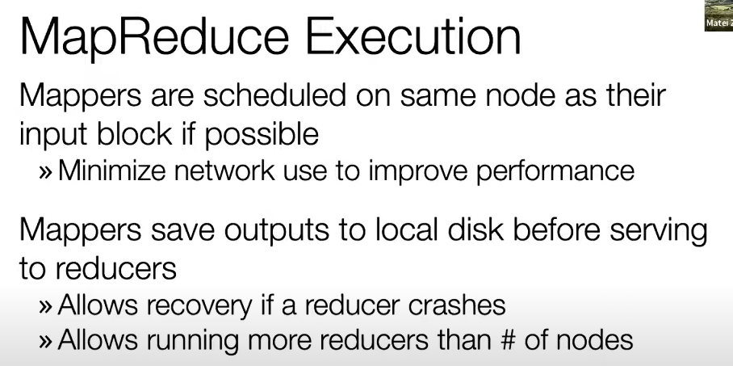
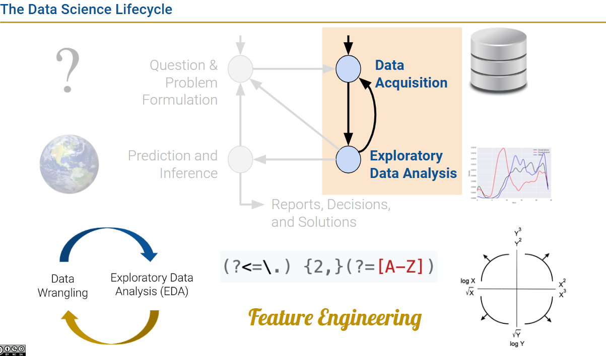

# DATA100-L26: Parallel Data Analytics; Conclusion

# mapreduce

MapReduce是一种编程模型,用于大规模数据集的并行运算[1][2][3]。它将复杂的并行计算过程抽象为两个函数:Map和Reduce[4]。

**Map函数**将输入数据集拆分成独立的块,并对每个块应用映射操作,生成一组中间键值对[1][2][3]。**Reduce函数**会对所有Map的输出进行合并操作,生成最终结果[1][2][3]。

MapReduce的主要特点包括[4][5]:

- 易于编程:程序员只需描述做什么,具体怎么做由系统的执行框架处理
- 良好的扩展性:可通过添加节点扩展集群能力
- 高容错性:通过计算迁移或数据迁移等策略提高集群的可用性与容错性

MapReduce采用"分而治之"策略,将大规模数据集切分成多个独立的分片,这些分片可以被多个Map任务并行处理[4]。它设计的一个理念是"计算向数据靠拢",移动数据需要大量的网络传输开销[4]。

总之,MapReduce是一种简单、可扩展的并行计算模型,通过抽象Map和Reduce函数,使得程序员可以轻松编写大规模并行应用程序,而无需关注底层的分布式细节[1][2][3][4][5]。

Citations:
[1] https://baike.baidu.com/item/MapReduce/133425
[2] https://zh.wikipedia.org/zh-hans/MapReduce
[3] https://www.ibm.com/cn-zh/topics/mapreduce
[4] https://cshihong.github.io/2018/05/11/MapReduce%E6%8A%80%E6%9C%AF%E5%8E%9F%E7%90%86/
[5] https://cloud.tencent.com/developer/article/1778549

# apache spark

lazy strategy: 延迟计算策略,Spark默认采用这种策略,即只有当数据真正被使用时才会计算。

编译优化语句执行顺序！

# Conclusion

工具链

# What is next?

有用的data science链接
http://kaggle.com
https://github.com/awesomedata/awesome-public-datasets
http://toolbox.google.com/datasetsearch
https://towardsdatascience.com
https://www.reddit.com/r/dataisbeautiful/
https://fivethirtyeight.com
