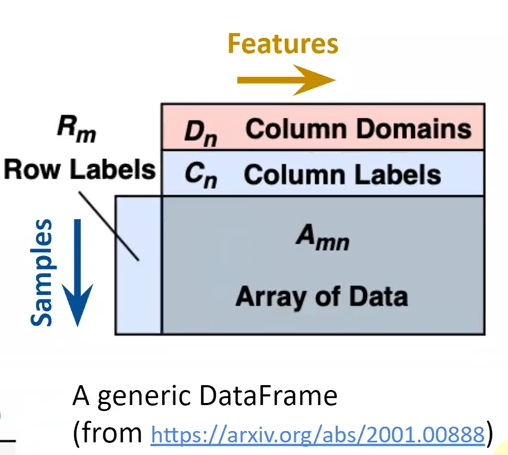
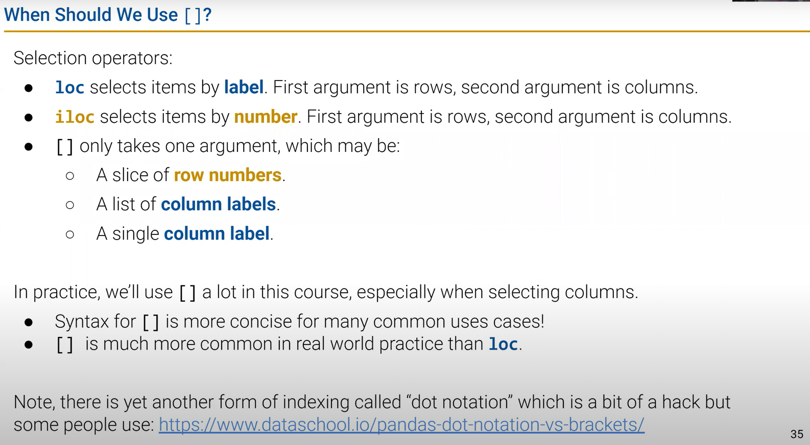
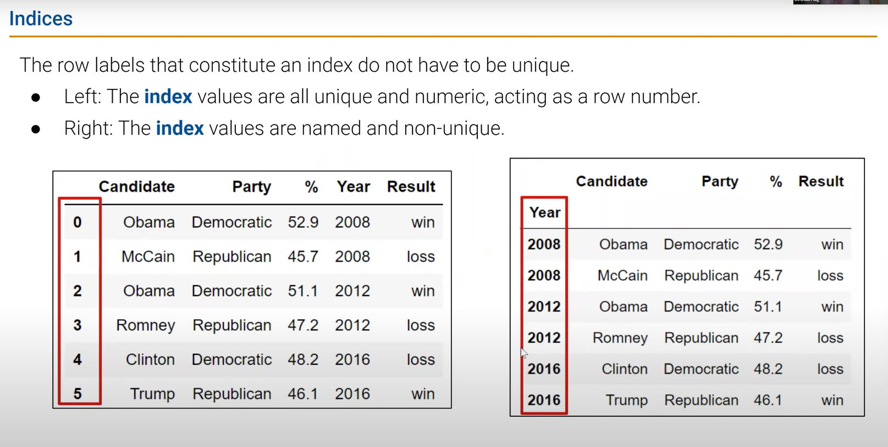
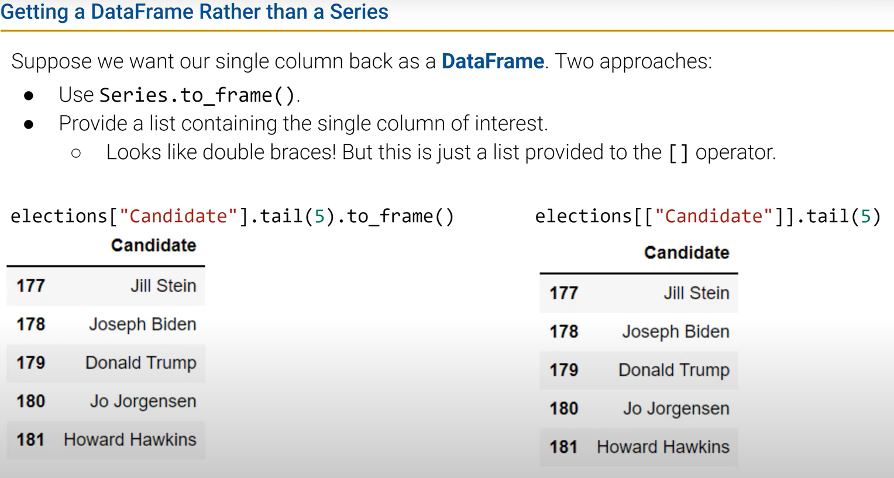
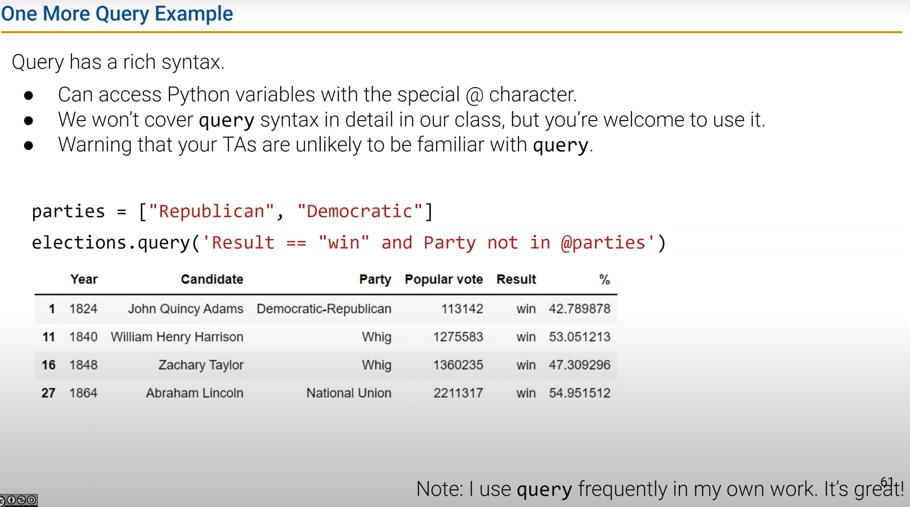

# DATA100-L3: Pandas Ⅰ

## DataFrames: a data structure for tabular data


### API
always remember to turn to GPT/google/doc

## indexing and loc/iloc
generate subsets:
- `loc`: an operator select items by labels
  ```python
  df.loc[row_indexer, column_indexer]
  ```
  - `row_indexer`: can be a single label, a list of labels, slice（闭区间）, single ***value***
  - `column_indexer`: same as `row_indexer`
  - returns a DataFrame or Series

- `iloc`: an operator select items by positions
  ```python
  df.iloc[row_indexer, column_indexer]
  ```
  - `row_indexer`: numeric index or a list of numeric indices，此时回到python经典索引 **左闭右开**
  - `column_indexer`: same as `row_indexer`
  - returns a DataFrame or Series
**通常情况下，我们使用 `loc` 进行索引**
- `.head(6)` and `.tail()` to get the first or last few rows of a DataFrame(syntactic sugar)

## [ ]: context sensitive operator 


## series: a data structure for 1D labeled data
## index: a array-like object that labels the rows and columns of a DataFrame

columns: usually do not have same name.

转换：


## conditional selection

## 类型意识!
三种数据类型中的哪一个？？？
### describe()
### sample()
```python
df.sample(n=5, replace=True) # randomly select 5 rows
```

### value_counts()
```python
df['column_name'].value_counts() # count the frequency of each value in a column
```
return a Series with the count of each value in the column.

### unique()
```python
df['column_name'].unique() # get all unique values in a column
```
return a numpy array with the unique values in the column.

### sort_values()
```python
df.sort_values(by='column_name', ascending=False) # sort the DataFrame by values in a column
```
return a new DataFrame with the rows sorted by values in a column.

## reference
https://www.textbook.ds100.org/ch/a04/ref_pandas.html

https://pandas.pydata.org/pandas-docs/stable/reference/index.html
