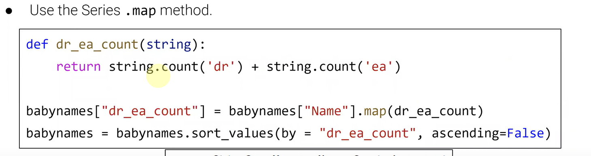
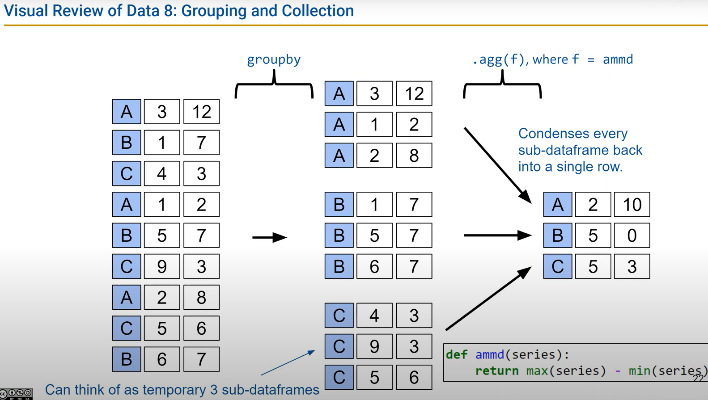
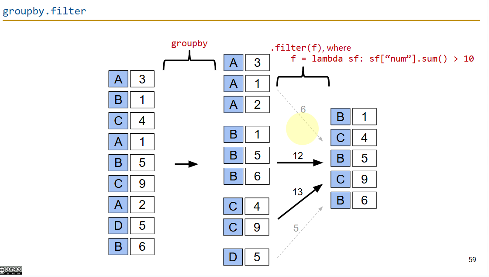

# DATA100-L4: Pandas Ⅱ


## lambda function

```python    
lambda x: x**2
```
非显式定义函数，可以直接使用lambda表达式来定义一个函数。
This is a lambda function that takes in one argument `x` and returns the square of `x`.

#### 再看sort_values()
注意传递key
```python
df.sort_values(by='column_name', keys=lambda x: x.str.lower(), ascending=True)
```

## add move modify and so on
#### sort by length of string
- approach1: create a new column and add to original df
```python
newdf = df["Name"].str.len() # create a new column with length of each string
df['length'] = newdf
df.sort_values(by='length', ascending=True)
```
#### drop column


## groupby.agg
### never use loops in this class!

```python
df.groupby('column_name').agg(f)
```
- f is a dictionary of functions to apply to each column.
  - The function can be a lambda function or a named function.

## groupby
type: pandas.core.groupby.generic.**DataFrameGroupBy**
### filter
```python
df.groupby('column_name').filter(lambda x: x['column_name'].mean() > 10)
```
- This will return a new DataFrame with only the groups that have a mean value greater than 10.


### multi index 多维索引
using pivot_table()
```python
df.pivot_table(index=['column1', 'column2'], columns='column3', values='column4', aggfunc='mean')
```
- This will create a multi-index pivot table with the specified index and columns, and the mean of column4 for each group.

using groupby()
```python
df.groupby(['column1', 'column2']).agg({'column3': 'mean', 'column4':'sum'})
```
- This will group the DataFrame by column1 and column2, and calculate the mean and sum of column3 and column4 for each group.


## joining tables
```python
left.merge(right, on='column_name', how='inner', lefton='column_name_left', righton='column_name_right')
```


