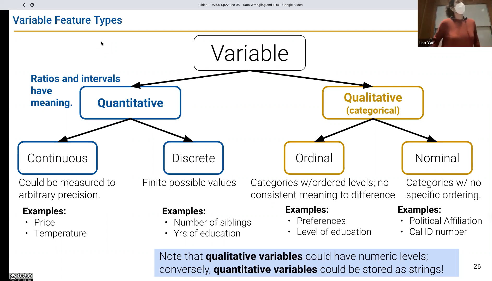
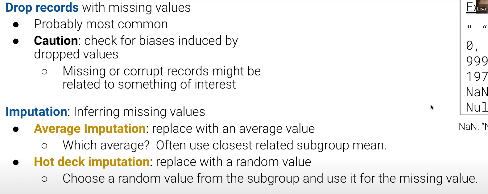

# DATA100-L5: Data Wrangling and EDA


EDA: Exploratory Data Analysis
## Infinite loop
DW & EDA......

DW: raw data -> clean data -> usable data

## key data properties to consider in EDA
### structure
  - file format
    - rectangular data: tables and matrices
    - CSV, TabSV/TSV, json(is a dict)
    - txt, XML
```python
    pd.read_csv('filename.tsv',delimiter='\t')
```
***turn to lec jupyter notebook to see more details***
- 变量种类

注意：不唯一，不全面
- multiple files 主键？


### granularity(颗粒度？) scope and temporality
#### 颗粒度
#### scope: sampling frame
#### temporality: time-series data
unix time posix time

### faithfulness
#### missing data?


