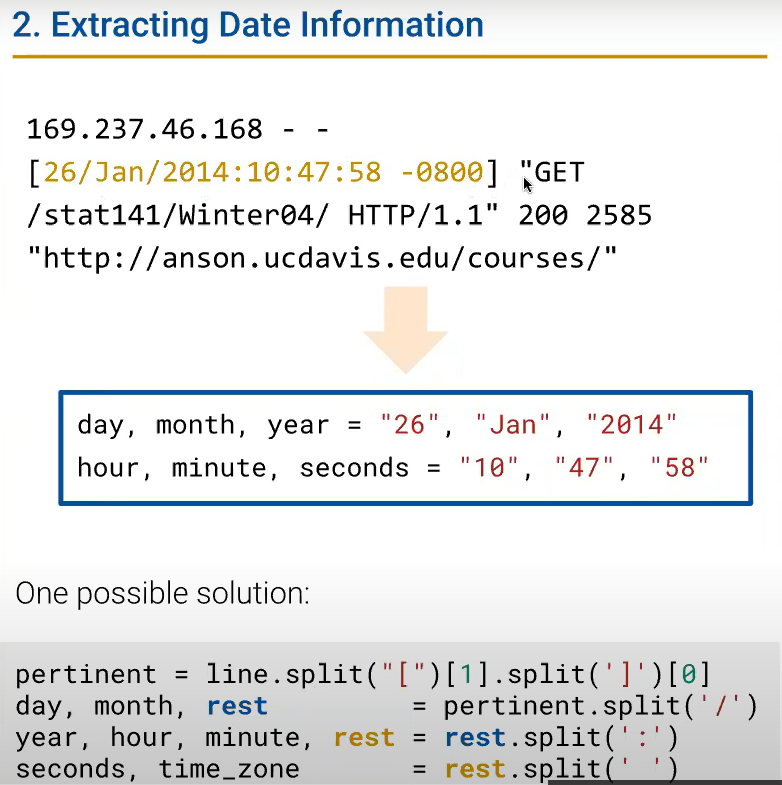

# DATA100-L6: Regex


## text data
### python string methods
`.replace(str1, str2)`

`.split('/')`


## regex
参考Tools正则表达式笔记

`|` 优先级较低
感兴趣的练习↓
https://alf.nu/RegexGolf

### python re 
- `.sub()`


pattern(`r"......"`) is a raw string, which means that backslashes are not interpreted as escape characters.

eg: "\\\\section" in regular str, "\\section" in raw str.

- `.findall(pattern, string)`
```python
import re

pattern = r'\b\w{3}\b'
string = 'The quick brown fox jumps over the lazy dog'

matches = re.findall(pattern, string)
print(matches)
```
Output:
```shell
['The', 'fox', 'dog']
```
- `extract()`
- `extractall()`

有时会有`ser.str.extract()`形式！
