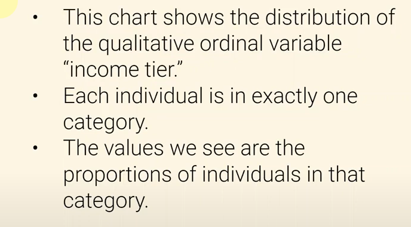
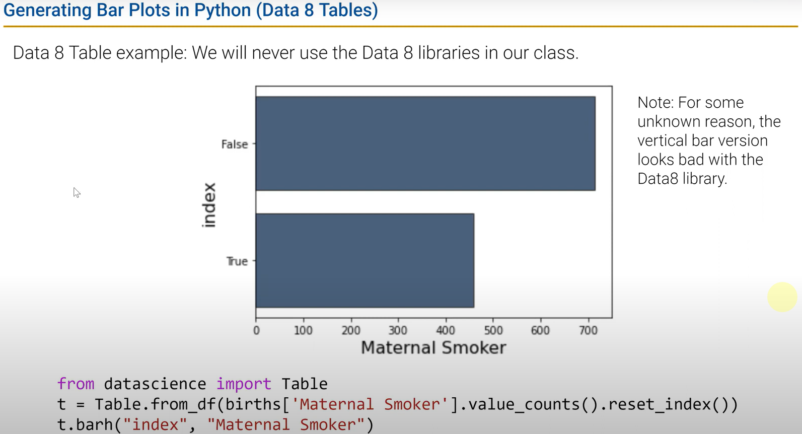
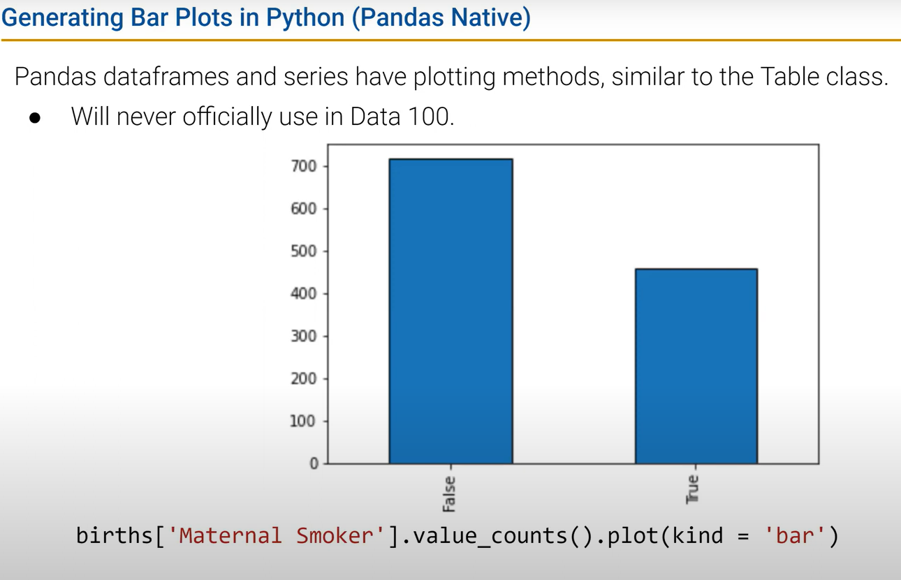
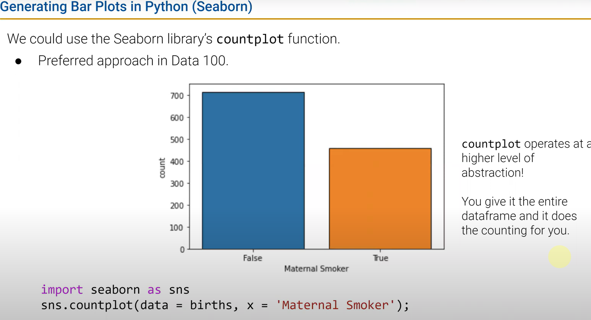
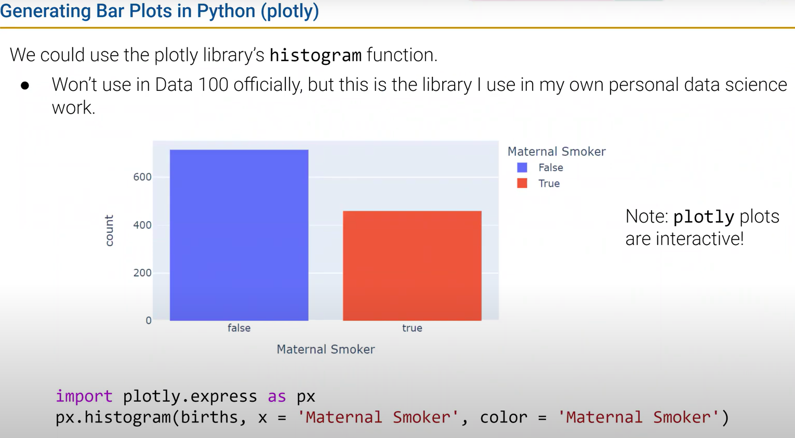
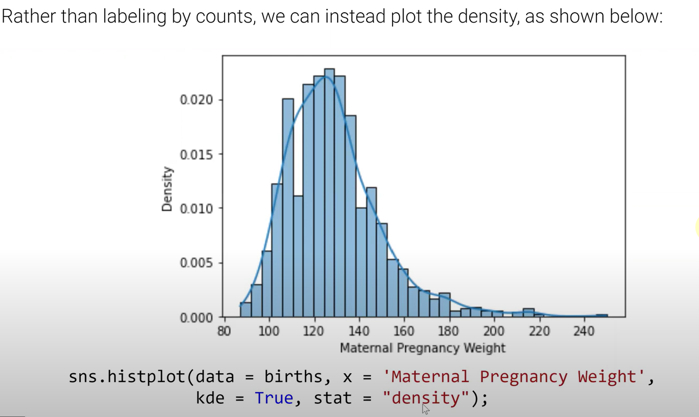
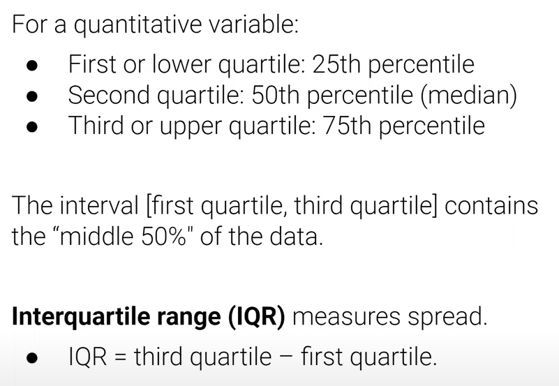
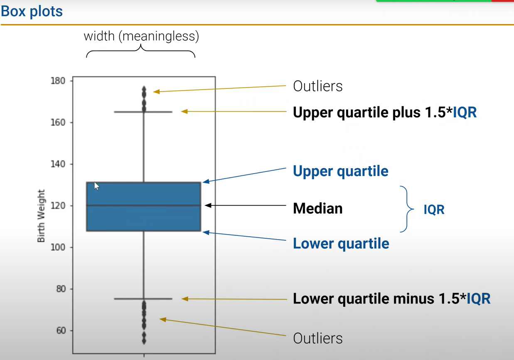
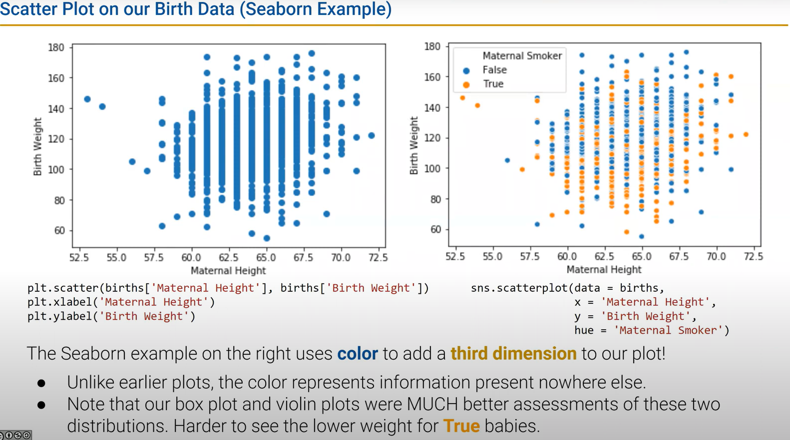
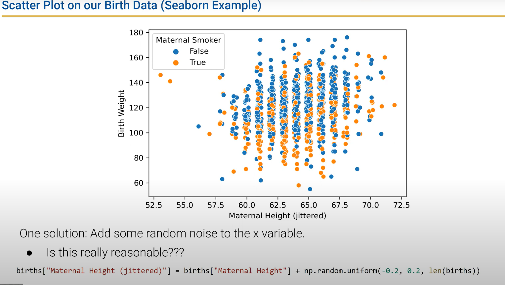

# DATA100-L7: Visualization Ⅰ


## distribution 定义


## bar plots for distribution
### data8 example

### compound way 

### *seaborn* example

```python
import seaborn as sns
sns.countplot(x='variable', data=df)
# rug plot
sns.rugplot(x='variable', data=df, color='black')
```

### plotly example


## 处理异常值（outliers）和峰值（mode）
### density curve
密度曲线看峰

- 箱型图


```python
import seaborn as sns
sns.boxplot(x='variable', data=df)
```

- violin plot
和箱型图对比来看，violin plot宽度有意义
```python
import seaborn as sns
sns.violinplot(x='variable', data=df)
```


处理overplotting
random jitter

