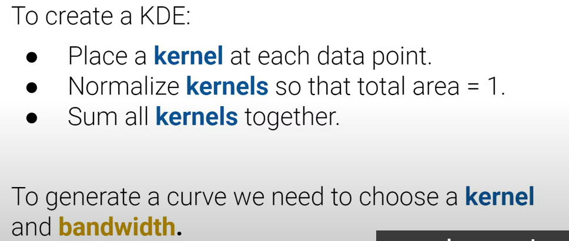
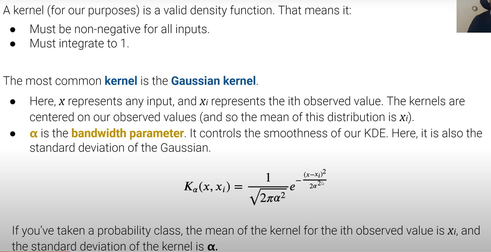
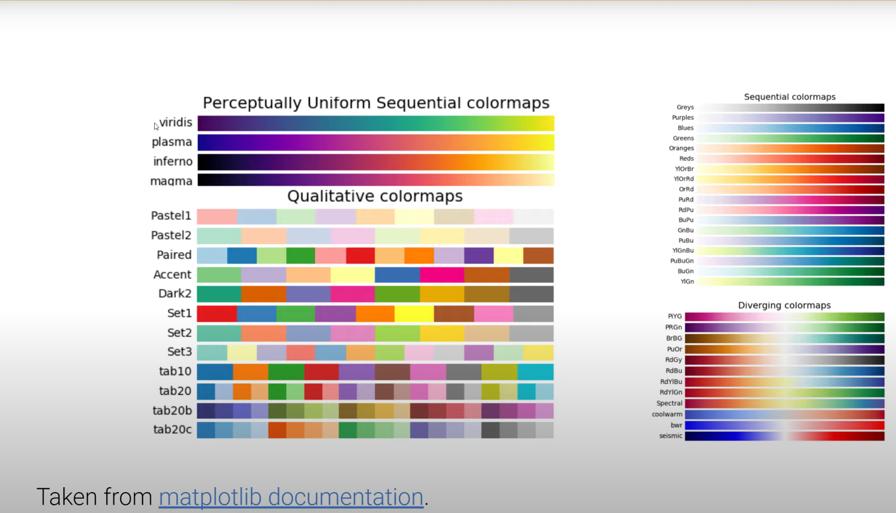
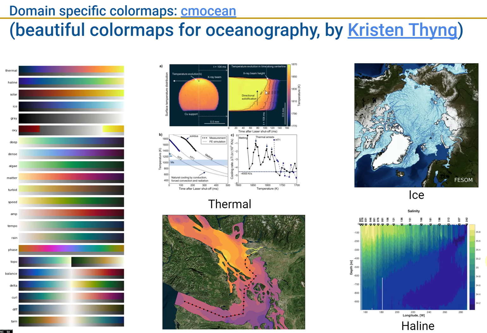
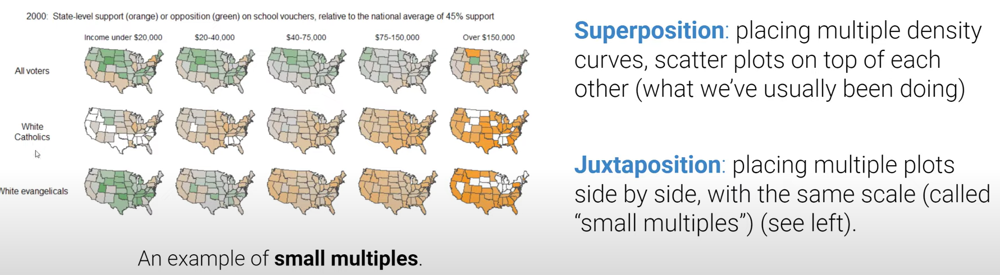
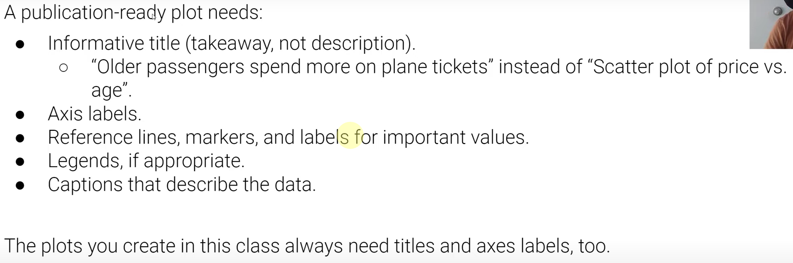
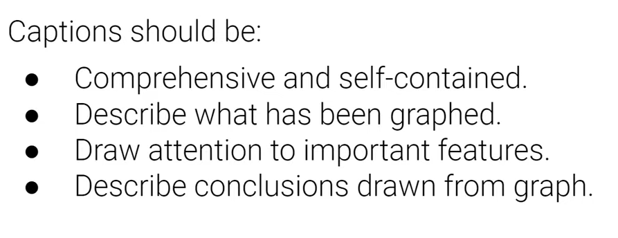

# DATA100-L8: Visualizations Ⅱ

# Kernel Density Functions
## KDE Mechanics
### smoothing in 1D（histograms）
rug ---> histogram
### smoothing in 2D（heatmaps/Hex Plot）
### KDEs

代码实现：
`sns.distplot(data, kde=True)`
## Kernel Functions and Bandwidth

$\alpha$ 越大，曲线越平滑

当然也有其他的kernel函数，比如：
- triangular kernel
- epanechnikov kernel
- boxcar kernel

# Visualization Theory
注意可视化的目的！

仅仅靠统计方法不够直观并且不够准确！
## Information Channels
color, shape, size, position (coordinate), and orientation
## Harnessing X/Y
do not use different scales for x and y in the same visualization!

比例适中
## Harnessing Color
选颜色，jet, viridis主题等等

最好选择perceptually uniform的颜色！而jet不是！Inferno， Turbo可以

## Harnessing Markings
人更倾向于比较整齐的直方图（一维长度）

避免移动调整基线！

***取决于讲什么故事***
## Harnessing Conditioning

## Harnessing Context

# Transformations
linearize线性化处理

log transform对数变换

更多的代码参考jupyter notebook
