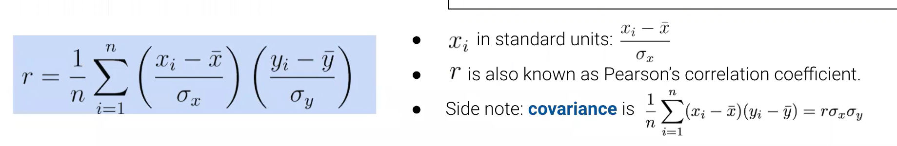
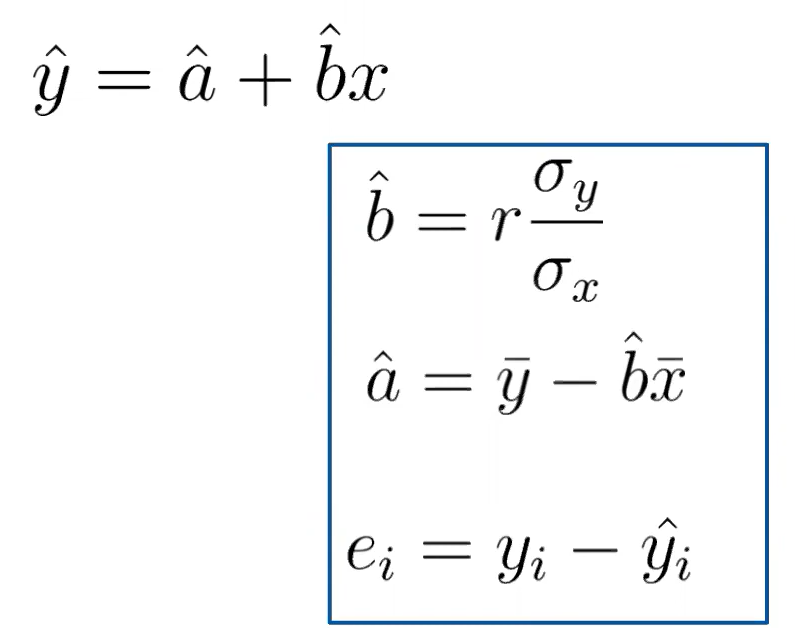
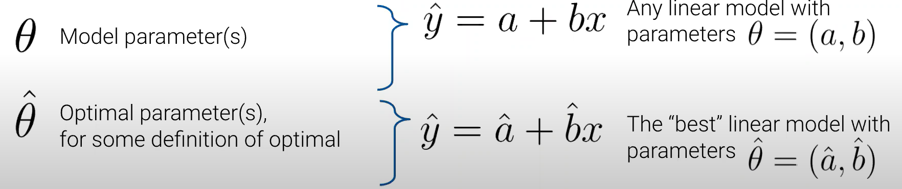
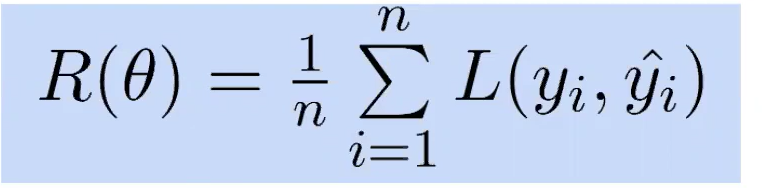
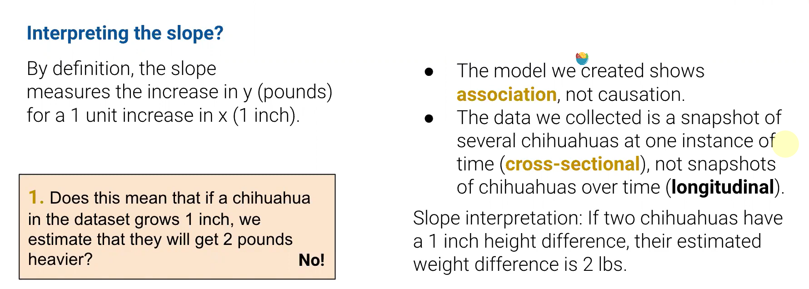
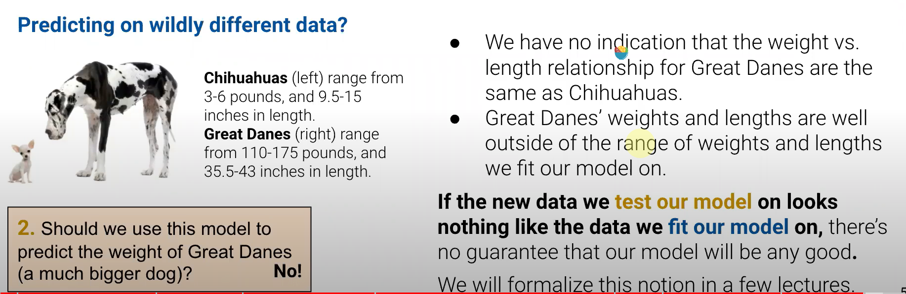
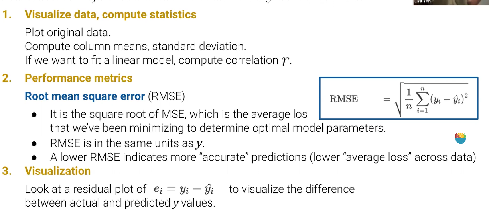

# DATA100-L9: Introduction to Modeling, Simple Linear Regression

# regression line, correlation
高中最小二乘法(least squares regression)，线性回归

# model
$“all\ models\ are\ wrong,\ but\ some\ are\ useful”$

trade between interpretability and accuracy

物理or统计模型
# the modeling process: definitions
SLR: Simple Linear Regression

明确input和parameter的区别

有些统计模型可以没有参数！

# loss functions
metric for good or bad 

# minimizing average loss (Empirical Risk 期望风险？)

最优化！
# interpreting SLR: slope, Anscombe's quartet
1. 解释参数意义

2. 预测未知数据

# evaluating the model: RMSE, Residual Plot

