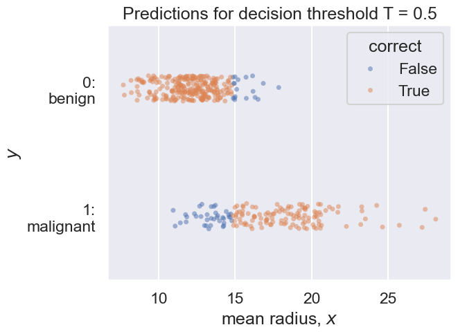

# DATA100-lab12: Logistic Regression


```python
# Initialize Otter
import otter
grader = otter.Notebook("lab12.ipynb")
```

# Lab 12: Logistic Regression


```python
# Run this cell to set up your notebook
import numpy as np
import pandas as pd
import sklearn
import sklearn.datasets
import matplotlib.pyplot as plt
import seaborn as sns

import plotly.offline as py
import plotly.graph_objs as go
import plotly.figure_factory as ff


%matplotlib inline
sns.set()
sns.set_context("talk")
```

<br/><br/>
<hr style="border: 5px solid #003262;" />
<hr style="border: 1px solid #fdb515;" />

## Objectives

In Questions 1 and 2 of this lab, we will manually construct the logistic regression model and minimize cross-entropy loss using `scipy.minimize`. This structure mirrors the linear regression labs from earlier in the semester and lets us dive deep into how logistic regression works.

Lastly, in Question 3 we introduce the `sklearn.linear_model.LogisticRegression` module that you would use in practice, and we explore performance metrics for classification.

<br/><br/>

We will explore a breast cancer dataset from the University of Wisconsin ([source](https://archive.ics.uci.edu/ml/datasets/breast+cancer+wisconsin+(diagnostic))). This dataset can be loaded using the `sklearn.datasets.load_breast_cancer()` method.  


```python
# just run this cell
data = sklearn.datasets.load_breast_cancer()

# data is actually a dictionnary
print(data.keys())
print(data.DESCR)
```

    dict_keys(['data', 'target', 'frame', 'target_names', 'DESCR', 'feature_names', 'filename', 'data_module'])
    .. _breast_cancer_dataset:
    
    Breast cancer wisconsin (diagnostic) dataset
    --------------------------------------------
    
    **Data Set Characteristics:**
    
    :Number of Instances: 569
    
    :Number of Attributes: 30 numeric, predictive attributes and the class
    
    :Attribute Information:
        - radius (mean of distances from center to points on the perimeter)
        - texture (standard deviation of gray-scale values)
        - perimeter
        - area
        - smoothness (local variation in radius lengths)
        - compactness (perimeter^2 / area - 1.0)
        - concavity (severity of concave portions of the contour)
        - concave points (number of concave portions of the contour)
        - symmetry
        - fractal dimension ("coastline approximation" - 1)
    
        The mean, standard error, and "worst" or largest (mean of the three
        worst/largest values) of these features were computed for each image,
        resulting in 30 features.  For instance, field 0 is Mean Radius, field
        10 is Radius SE, field 20 is Worst Radius.
    
        - class:
                - WDBC-Malignant
                - WDBC-Benign
    
    :Summary Statistics:
    
    ===================================== ====== ======
                                            Min    Max
    ===================================== ====== ======
    radius (mean):                        6.981  28.11
    texture (mean):                       9.71   39.28
    perimeter (mean):                     43.79  188.5
    area (mean):                          143.5  2501.0
    smoothness (mean):                    0.053  0.163
    compactness (mean):                   0.019  0.345
    concavity (mean):                     0.0    0.427
    concave points (mean):                0.0    0.201
    symmetry (mean):                      0.106  0.304
    fractal dimension (mean):             0.05   0.097
    radius (standard error):              0.112  2.873
    texture (standard error):             0.36   4.885
    perimeter (standard error):           0.757  21.98
    area (standard error):                6.802  542.2
    smoothness (standard error):          0.002  0.031
    compactness (standard error):         0.002  0.135
    concavity (standard error):           0.0    0.396
    concave points (standard error):      0.0    0.053
    symmetry (standard error):            0.008  0.079
    fractal dimension (standard error):   0.001  0.03
    radius (worst):                       7.93   36.04
    texture (worst):                      12.02  49.54
    perimeter (worst):                    50.41  251.2
    area (worst):                         185.2  4254.0
    smoothness (worst):                   0.071  0.223
    compactness (worst):                  0.027  1.058
    concavity (worst):                    0.0    1.252
    concave points (worst):               0.0    0.291
    symmetry (worst):                     0.156  0.664
    fractal dimension (worst):            0.055  0.208
    ===================================== ====== ======
    
    :Missing Attribute Values: None
    
    :Class Distribution: 212 - Malignant, 357 - Benign
    
    :Creator:  Dr. William H. Wolberg, W. Nick Street, Olvi L. Mangasarian
    
    :Donor: Nick Street
    
    :Date: November, 1995
    
    This is a copy of UCI ML Breast Cancer Wisconsin (Diagnostic) datasets.
    https://goo.gl/U2Uwz2
    
    Features are computed from a digitized image of a fine needle
    aspirate (FNA) of a breast mass.  They describe
    characteristics of the cell nuclei present in the image.
    
    Separating plane described above was obtained using
    Multisurface Method-Tree (MSM-T) [K. P. Bennett, "Decision Tree
    Construction Via Linear Programming." Proceedings of the 4th
    Midwest Artificial Intelligence and Cognitive Science Society,
    pp. 97-101, 1992], a classification method which uses linear
    programming to construct a decision tree.  Relevant features
    were selected using an exhaustive search in the space of 1-4
    features and 1-3 separating planes.
    
    The actual linear program used to obtain the separating plane
    in the 3-dimensional space is that described in:
    [K. P. Bennett and O. L. Mangasarian: "Robust Linear
    Programming Discrimination of Two Linearly Inseparable Sets",
    Optimization Methods and Software 1, 1992, 23-34].
    
    This database is also available through the UW CS ftp server:
    
    ftp ftp.cs.wisc.edu
    cd math-prog/cpo-dataset/machine-learn/WDBC/
    
    .. dropdown:: References
    
      - W.N. Street, W.H. Wolberg and O.L. Mangasarian. Nuclear feature extraction
        for breast tumor diagnosis. IS&T/SPIE 1993 International Symposium on
        Electronic Imaging: Science and Technology, volume 1905, pages 861-870,
        San Jose, CA, 1993.
      - O.L. Mangasarian, W.N. Street and W.H. Wolberg. Breast cancer diagnosis and
        prognosis via linear programming. Operations Research, 43(4), pages 570-577,
        July-August 1995.
      - W.H. Wolberg, W.N. Street, and O.L. Mangasarian. Machine learning techniques
        to diagnose breast cancer from fine-needle aspirates. Cancer Letters 77 (1994)
        163-171.
    
    

<br/>
字典转DataFrame！
Since the data format is a dictionary, we do some preprocessing to create a `pandas.DataFrame`.


```python
# just run this cell
df = pd.DataFrame(data.data, columns=data.feature_names)
df.head()
```


<div>
<style scoped>
    .dataframe tbody tr th:only-of-type {
        vertical-align: middle;
    }

    .dataframe tbody tr th {
        vertical-align: top;
    }

    .dataframe thead th {
        text-align: right;
    }
</style>
<table border="1" class="dataframe">
  <thead>
    <tr style="text-align: right;">
      <th></th>
      <th>mean radius</th>
      <th>mean texture</th>
      <th>mean perimeter</th>
      <th>mean area</th>
      <th>mean smoothness</th>
      <th>mean compactness</th>
      <th>mean concavity</th>
      <th>mean concave points</th>
      <th>mean symmetry</th>
      <th>mean fractal dimension</th>
      <th>...</th>
      <th>worst radius</th>
      <th>worst texture</th>
      <th>worst perimeter</th>
      <th>worst area</th>
      <th>worst smoothness</th>
      <th>worst compactness</th>
      <th>worst concavity</th>
      <th>worst concave points</th>
      <th>worst symmetry</th>
      <th>worst fractal dimension</th>
    </tr>
  </thead>
  <tbody>
    <tr>
      <th>0</th>
      <td>17.99</td>
      <td>10.38</td>
      <td>122.80</td>
      <td>1001.0</td>
      <td>0.11840</td>
      <td>0.27760</td>
      <td>0.3001</td>
      <td>0.14710</td>
      <td>0.2419</td>
      <td>0.07871</td>
      <td>...</td>
      <td>25.38</td>
      <td>17.33</td>
      <td>184.60</td>
      <td>2019.0</td>
      <td>0.1622</td>
      <td>0.6656</td>
      <td>0.7119</td>
      <td>0.2654</td>
      <td>0.4601</td>
      <td>0.11890</td>
    </tr>
    <tr>
      <th>1</th>
      <td>20.57</td>
      <td>17.77</td>
      <td>132.90</td>
      <td>1326.0</td>
      <td>0.08474</td>
      <td>0.07864</td>
      <td>0.0869</td>
      <td>0.07017</td>
      <td>0.1812</td>
      <td>0.05667</td>
      <td>...</td>
      <td>24.99</td>
      <td>23.41</td>
      <td>158.80</td>
      <td>1956.0</td>
      <td>0.1238</td>
      <td>0.1866</td>
      <td>0.2416</td>
      <td>0.1860</td>
      <td>0.2750</td>
      <td>0.08902</td>
    </tr>
    <tr>
      <th>2</th>
      <td>19.69</td>
      <td>21.25</td>
      <td>130.00</td>
      <td>1203.0</td>
      <td>0.10960</td>
      <td>0.15990</td>
      <td>0.1974</td>
      <td>0.12790</td>
      <td>0.2069</td>
      <td>0.05999</td>
      <td>...</td>
      <td>23.57</td>
      <td>25.53</td>
      <td>152.50</td>
      <td>1709.0</td>
      <td>0.1444</td>
      <td>0.4245</td>
      <td>0.4504</td>
      <td>0.2430</td>
      <td>0.3613</td>
      <td>0.08758</td>
    </tr>
    <tr>
      <th>3</th>
      <td>11.42</td>
      <td>20.38</td>
      <td>77.58</td>
      <td>386.1</td>
      <td>0.14250</td>
      <td>0.28390</td>
      <td>0.2414</td>
      <td>0.10520</td>
      <td>0.2597</td>
      <td>0.09744</td>
      <td>...</td>
      <td>14.91</td>
      <td>26.50</td>
      <td>98.87</td>
      <td>567.7</td>
      <td>0.2098</td>
      <td>0.8663</td>
      <td>0.6869</td>
      <td>0.2575</td>
      <td>0.6638</td>
      <td>0.17300</td>
    </tr>
    <tr>
      <th>4</th>
      <td>20.29</td>
      <td>14.34</td>
      <td>135.10</td>
      <td>1297.0</td>
      <td>0.10030</td>
      <td>0.13280</td>
      <td>0.1980</td>
      <td>0.10430</td>
      <td>0.1809</td>
      <td>0.05883</td>
      <td>...</td>
      <td>22.54</td>
      <td>16.67</td>
      <td>152.20</td>
      <td>1575.0</td>
      <td>0.1374</td>
      <td>0.2050</td>
      <td>0.4000</td>
      <td>0.1625</td>
      <td>0.2364</td>
      <td>0.07678</td>
    </tr>
  </tbody>
</table>
<p>5 rows × 30 columns</p>
</div>


The prediction task for this data is to predict whether a tumor is benign or malignant (a binary decision) given characteristics of that tumor. As a classic machine learning dataset, the prediction task is captured by the field `data.target`. To put the data back in its original context we will create a new column called `"malignant"` which will be 1 if the tumor is malignant and 0 if it is benign (reversing the definition of `target`).

In this lab, we will fit a simple **classification model** to predict breast cancer from the cell nuclei of a breast mass. For simplicity, we will work with only one feature: the `mean radius` which corresponds to the size of the tumor. Our output (i.e., response) is the `malignant` column.


```python
# just run this cell

# Target data_dict['target'] = 0 is malignant 1 is benign
df['malignant'] = (data.target == 0).astype(int)

# Define our features/design matrix X
X = df[["mean radius"]]
Y = df['malignant']
```

<br/>

Before we go further, we will split our dataset into training and testing data. This lets us explore the prediction power of our trained classifier on both seen and unseen data.


```python
# just run this cell
# Create a 75-25 train-test split
from sklearn.model_selection import train_test_split
X_train, X_test, Y_train, Y_test = train_test_split(X,Y, test_size=0.25, random_state=42)
print(f"Training Data Size: {len(X_train)}")
print(f"Test Data Size: {len(X_test)}")
```

    Training Data Size: 426
    Test Data Size: 143
    

<br/><br/>
<hr style="border: 5px solid #003262;" />
<hr style="border: 1px solid #fdb515;" />

# Part 1: Defining the Model

In these first two parts, you will manually build a logistic regression classifier.

Recall that the Logistic Regression model is written as follows:

$$\Large f_{\theta}(x) = \sigma ( x^T \theta)$$

where $f_{\theta}(x)= P(Y=1 | x)$ is the probability that our observation belongs to class 1, and $\sigma$ is the sigmoid activation function:

$$\sigma(z) = \frac{1}{1 + e^{-z}}$$

If we have a single feature, then $x$ is a scalar and our model has parameters $\theta = (\theta_0, \theta_1)$ as follows:

$$\Large f_{\theta}(x) = \sigma (\theta_0 + \theta_1 x)$$

Therefore just like OLS, if we have $n$ datapoints and $p$ features, then we can construct the design matrix
$$\mathbb{X} \in \mathbb{R}^{n \times (p + 1)}$$
with an all-ones column. Run the below cell to construct `X_intercept_train`. The syntax should look familiar:


```python
# just run this cell
def add_bias_column(X):
    return np.hstack([np.ones((len(X), 1)), X])

X_intercept_train = add_bias_column(X_train)
X_intercept_train.shape
```


    (426, 2)


<br/>

<hr style="border: 1px solid #fdb515;" />

## Question 1

### Question 1a

Using the above definition for $\mathbb{X}$, we can also construct a matrix representation of our Logistic Regression model, just like we did for OLS. Noting that $\theta = (\theta_0, \theta_1, \dots, \theta_p$), the vector $\hat{\mathbb{Y}}$ is:

$$\Large \hat{\mathbb{Y}} = \sigma(\mathbb{X} \theta) $$

Then the $i$-th element of $\hat{\mathbb{Y}}$ is the probability that the $i$-th observation belongs to class 1, given the feature vector is the $i$-th row of design matrix $\mathbb{X}$ and the parameter vector is $\theta$.

Below, implement the `lr_model` function to evaluate this expression. You should use `@` or `np.dot`.


<!--
BEGIN QUESTION
name: q1a
-->


```python
def sigmoid(z):
    """
    The sigmoid function, defined for you
    """
    return 1 / (1 + np.exp(-z))

def lr_model(theta, X):
    """
    Return the logistic regression model as defined above.
    You should not need to use a for loop; use @ or np.dot.
    
    Args:
        theta: The model parameters. Dimension (p+1,).
        X: The design matrix. Dimension (n, p+1).
    
    Return:
        Probabilities that Y = 1 for each datapoint.
        Dimension (n,).
    """
    return sigmoid(X @ theta)
```


```python
grader.check("q1a")
```

<br/><br/>

---

###  Question 1b: Compute Empirical Risk
Now let's try to analyze the cross-entropy loss from logistic regression. Suppose for a single observation, we predict probability $p$ that the true response $y$ is in class 1 (otherwise the prediction is 0 with probability $1 - p$). The cross-entropy loss is:

$$ - \left( y \log(p) + (1 - y) \log(1 - p) \right)$$

For the logistic regression model, the **empirical risk** is therefore defined as the average cross-entropy loss across all $n$ datapoints:

$$\Large R(\theta) = -\frac{1}{n} \sum_{i=1}^n \left( y_i \log(\sigma(X_i^T \theta)) + (1 - y_i) \log(1 - \sigma(X_i^T \theta))  \right) $$

Where $y_i$ is the $i-$th response in our dataset, $\theta$ are the parameters of our model, $X_i$ is the i'th row of our design matrix $\mathbb{X}$, and $\sigma(X_i^T \theta)$ is the probability that the response is 1 given input $X_i$.

**Note**: In this class, when performing linear algebra operations we interpret both rows and columns as column vectors. So if we wish to calculate the dot product between row $X_i$ and a vector $v$, we write $X_i^Tv$.

Below, implement the function `lr_loss` that computes empirical risk over the dataset. Feel free to use functions defined in the previous part.


```python
def lr_avg_loss(theta, X, Y):
    '''
    Compute the average cross entropy loss using X, Y, and theta.
    You should not need to use a for loop. 

    Args:
        theta: The model parameters. Dimension (p+1,)
        X: The design matrix. Dimension (n, p+1).
        Y: The label. Dimension (n,).

    Return:
        The average cross entropy loss.
    '''
    n = X.shape[0]
    return -1/n * np.sum(Y * np.log(sigmoid(X @ theta)) + (1-Y) * np.log(1-sigmoid(X @ theta)))
```


```python
grader.check("q1b")
```

<br/><br/>

Below is a plot showing the average training cross-entropy loss for various values of $\theta_0$ and $\theta_1$ (respectively x and y in the plot).


```python
# just run this cell
with np.errstate(invalid='ignore', divide='ignore'):
    uvalues = np.linspace(-8,8,70)
    vvalues = np.linspace(-5,5,70)
    (u,v) = np.meshgrid(uvalues, vvalues)
    thetas = np.vstack((u.flatten(),v.flatten()))
    lr_avg_loss_values = np.array([lr_avg_loss(t, X_intercept_train, Y_train) for t in thetas.T])
    lr_loss_surface = go.Surface(name="Logistic Regression Loss",
            x=u, y=v, z=np.reshape(lr_avg_loss_values,(len(uvalues), len(vvalues))),
            contours=dict(z=dict(show=True, color="gray", project=dict(z=True)))
        )
    fig = go.Figure(data=[lr_loss_surface])
    fig.update_layout(
        scene = dict(
            xaxis_title='theta_0',
            yaxis_title='theta_1',
            zaxis_title='Loss'),
            width=700,
            margin=dict(r=20, l=10, b=10, t=10))
    py.iplot(fig)
```


```python
with np.errstate(invalid='ignore', divide='ignore'):
    uvalues = np.linspace(-8,8,70)
    vvalues = np.linspace(-5,5,70)
    (u,v) = np.meshgrid(uvalues, vvalues)
    thetas = np.vstack((u.flatten(),v.flatten()))
    lr_loss_values = np.array([lr_avg_loss(t, X_intercept_train, Y_train) for t in thetas.T])
    lr_loss_surface = go.Surface(name="Logistic Regression Loss",
            x=u, y=v, z=np.reshape(lr_loss_values,(len(uvalues), len(vvalues))),
            contours=dict(z=dict(show=True, color="gray", project=dict(z=True)))
        )
    fig = go.Figure(data=[lr_loss_surface])
    # fig.update_layout(
    #     scene = dict(
    #         xaxis_title='theta_1',
    #         yaxis_title='theta_2',
    #         zaxis_title='Loss'),
    #         width=700,
    #         margin=dict(r=20, l=10, b=10, t=10))
    py.iplot(fig)
```

<br/>

---

### Question 1c
Describe one interesting observation about the loss plot above.

<!--
BEGIN QUESTION
name: q1c
-->

<br/><br/>
<hr style="border: 5px solid #003262;" />
<hr style="border: 1px solid #fdb515;" />

# Part 2: Fit and Predict

### [Tutorial] `scipy.optimize.minimize`

The next two cells call the `minimize` function from `scipy` on the `lr_avg_loss` function you defined in the previous part. We pass in the training data to `args` ([documentation](https://docs.scipy.org/doc/scipy/reference/generated/scipy.optimize.minimize.html)) to find the `theta_hat` that minimizes the average cross-entropy loss over the train set.


```python
# just run this cell
from scipy.optimize import minimize

min_result = minimize(lr_avg_loss,
                      x0=np.zeros(X_intercept_train.shape[1]),
                      args=(X_intercept_train, Y_train))
# args: Extra arguments passed to the objective function and its derivatives (fun, jac and hess functions).

min_result
```


      message: Optimization terminated successfully.
      success: True
       status: 0
          fun: 0.3123767645005891
            x: [-1.387e+01  9.372e-01]
          nit: 16
          jac: [-4.210e-07 -7.335e-06]
     hess_inv: [[ 7.478e+02 -5.212e+01]
                [-5.212e+01  3.683e+00]]
         nfev: 57
         njev: 19


```python
# just run this cell
theta_hat = min_result['x']
theta_hat
```


    array([-13.87178941,   0.93723937])


<br/>

Because our design matrix $\mathbb{X}$ leads with a column of all ones, `theta_hat` has two elements: $\hat{\theta}_0$ is the estimate of the intercept/bias term, and $\hat{\theta}_1$ is the estimate of the slope of our single feature.

<br/><br/>

It's time for a recap:
* For logistic regression with parameter $\theta$, $P(Y = 1 | x) = \sigma(x^T \theta)$, where $\sigma$ is the sigmoid function and $x$ is a feature vector. Therefore $\sigma(x^T \theta)$ is the Bernoulli probability that the response is 1 given the feature is $x$ Otherwise the response is 0 with probability $P(Y = 0 | x) = 1 - \sigma(x^T \theta)$.
* The $\hat{\theta}$ that *minimizes* average log-entropy loss of our training data also *maximizes* the likelihood of observing the training data according to the logistic regression model (check out lecture for more details).

The main takeaway is that logistic regression models **probabilities** of classifying datapoints as 1 or 0. Next, we use this takeaway to implement model predictions.

<br/>

<hr style="border: 1px solid #fdb515;" />

## Question 2

Using the `theta_hat` estimate above, we can construct a **decision rule** for classifying a datapoint with observation $x$. Let $P(Y = 1 | x) = \sigma(x^T \hat{\theta})$:


$$\Large \text{classify}(x) = \begin{cases} 1, & P(Y = 1 | x) \geq 0.5 \\ 0, & P(Y = 1 | x) < 0.5 \end{cases}$$

This decision rule has a decision **threshold** $T = 0.5$. This threshold means that we treat the classes $0$ and $1$ "equally." Lower thresholds mean that we are more likely to predict $1$, whereas higher thersholds mean that we are more likely to predict $0$.

<br/>

Implement the `lr_predict` function below, which returns a vector of predictions according to the logistic regression model. The function  takes a design matrix of observations `X`, parameter estimate `theta`, and decision threshold `threshold` with default value 0.5.


<!--
BEGIN QUESTION
name: q2
-->


```python
def lr_predict(theta, X, threshold=0.5):
    '''
    Classification using a logistic regression model
    with a probability threshold.

    Args:
        theta: The model parameters. Dimension (p+1,)
        X: The design matrix. Dimension (n, p+1).
        threshold: decision rule threshold for predicting class 1.

    Return:
        A vector of predictions.
    '''
    return (sigmoid(X @ theta) >= threshold).astype(int) # 转换数据类型！

# do not modify below this line
Y_train_pred = lr_predict(theta_hat, X_intercept_train)
Y_train_pred
```


    array([0, 0, 0, 1, 1, 1, 0, 1, 0, 0, 0, 0, 1, 1, 0, 1, 0, 0, 0, 0, 0, 1,
           0, 0, 0, 0, 0, 0, 0, 0, 0, 0, 0, 1, 1, 0, 0, 0, 0, 0, 1, 1, 0, 0,
           0, 1, 0, 1, 0, 0, 0, 0, 1, 0, 0, 1, 0, 0, 0, 1, 0, 1, 1, 0, 0, 0,
           0, 0, 0, 0, 0, 0, 0, 0, 0, 0, 0, 0, 1, 1, 1, 0, 0, 1, 0, 0, 0, 0,
           0, 0, 0, 0, 1, 1, 0, 0, 1, 0, 0, 1, 0, 0, 0, 1, 0, 1, 0, 0, 0, 0,
           0, 0, 0, 0, 1, 0, 0, 0, 0, 0, 1, 1, 0, 0, 0, 0, 1, 0, 0, 0, 1, 1,
           0, 0, 0, 0, 1, 0, 0, 0, 0, 0, 0, 0, 1, 0, 0, 0, 1, 0, 1, 1, 0, 0,
           0, 0, 1, 1, 0, 0, 1, 0, 1, 1, 0, 0, 0, 0, 1, 0, 0, 1, 0, 0, 0, 1,
           0, 1, 0, 1, 0, 0, 1, 1, 0, 0, 1, 0, 1, 1, 0, 1, 1, 0, 1, 1, 1, 1,
           0, 0, 0, 1, 1, 0, 1, 1, 1, 1, 0, 0, 0, 0, 0, 0, 0, 0, 1, 1, 0, 0,
           1, 0, 0, 0, 0, 0, 1, 0, 0, 1, 1, 0, 1, 0, 1, 0, 0, 0, 0, 0, 0, 1,
           0, 0, 1, 0, 0, 0, 0, 0, 0, 1, 1, 0, 0, 1, 0, 1, 1, 0, 1, 1, 0, 1,
           1, 1, 0, 0, 0, 0, 0, 0, 0, 1, 0, 0, 0, 1, 0, 0, 1, 0, 0, 1, 0, 1,
           1, 0, 0, 1, 0, 1, 1, 0, 1, 0, 0, 0, 1, 0, 0, 0, 0, 0, 0, 1, 0, 1,
           1, 0, 0, 0, 1, 1, 0, 1, 1, 0, 0, 0, 1, 0, 1, 1, 0, 0, 1, 0, 0, 0,
           0, 0, 1, 0, 1, 0, 0, 0, 0, 0, 0, 0, 0, 0, 1, 1, 1, 1, 0, 0, 0, 0,
           1, 0, 1, 0, 0, 0, 0, 0, 1, 1, 0, 0, 0, 0, 0, 0, 1, 0, 1, 1, 0, 0,
           1, 1, 1, 0, 0, 1, 1, 1, 0, 0, 1, 0, 0, 0, 0, 1, 1, 0, 0, 0, 0, 0,
           0, 0, 0, 1, 0, 0, 0, 0, 0, 0, 0, 1, 1, 1, 0, 0, 0, 1, 1, 0, 1, 0,
           0, 1, 0, 0, 0, 0, 0, 0])


```python
grader.check("q2")
```

<br/><br/>

### [Tutorial] Linearly separable data

How do these predicted classifications compare to the true responses $\mathbb{Y}$?

Run the below cell to visualize our predicted responses, the true responses, and the probabilities we used to make predictions. We use `sns.stripplot` which introduces some jitter to avoid overplotting.


```python
# just run this cell
plot_df = pd.DataFrame({"X": np.squeeze(X_train),
                        "Y": Y_train,
                        "Y_pred": Y_train_pred,
                        "correct": (Y_train == Y_train_pred)})
sns.stripplot(data=plot_df, x="X", y="Y", orient='h', alpha=0.5, hue="correct")
plt.xlabel('mean radius, $x$')
plt.ylabel('$y$')
plt.yticks(ticks=[0, 1], labels=['0:\nbenign', '1:\nmalignant'])
plt.title("Predictions for decision threshold T = 0.5")
plt.show()
```


    

    


<br/>

Because we are using a decision threshold $T = 0.5$, we predict $1$ for all $x$ where $\sigma(x^T\theta) \geq 0.5$, which happens when $x^T\theta = 0$. For the single mean radius feature, we can use algebra to solve for the boundary to be approximately $x \approx 14.8$.

In other words, will always predict $0$ (benign) if the mean radius feature is less than 14.8, and $1$ (malignant) otherwise. However, in our training data there are datapoints with large mean radii that are benign, and vice versa. Our data is not **linearly separable** by a vertical line.

The above visualization is useful when we have just one feature. In practice, however, we use other performance metrics to diagnose our model performance. Next, we will explore several such metrics: accuracy, precision, recall, and confusion matrices.

<br/><br/>
<hr style="border: 5px solid #003262;" />
<hr style="border: 1px solid #fdb515;" />

# Part 3: Quantifying Performance


### [Tutorial] sklearn's `LogisticRegression`
Instead of using the model structure we built manually in the previous questions, we will instead use sklearn's `LogisticRegression` model, which operates similarly to the sklearn OLS, Ridge, and LASSO models.

Let's first fit a logistic regression model to the training data. Some notes: 
* Like with linear models, the `fit_intercept` argument specifies if model includes an intercept term. We therefore pass in the original matrix `X_train` in the call to `lr.fit()`.
* sklearn fits a **regularized** logistic regression model as specified by the `solver='lbfgs'` argument; read the [documentation](https://scikit-learn.org/stable/modules/generated/sklearn.linear_model.LogisticRegression.html) for more details.


```python
# just run this cell
from sklearn.linear_model import LogisticRegression

lr = LogisticRegression(
        fit_intercept=True,
        solver = 'lbfgs')

lr.fit(X_train, Y_train)
lr.intercept_, lr.coef_
```


    (array([-13.75518968]), array([[0.92897696]]))


<br/>

Note that because we are now fitting a regularized logistic regression model, the estimated coefficients above deviate slightly from our numerical findings in Question 1.

<br/>

Like with linear models, we can call `lr.predict(x_train)` to classify our training data with our fitted model.


```python
# just run this cell
lr.predict(X_train)
```


    array([0, 0, 0, 1, 1, 1, 0, 1, 0, 0, 0, 0, 1, 1, 0, 1, 0, 0, 0, 0, 0, 1,
           0, 0, 0, 0, 0, 0, 0, 0, 0, 0, 0, 1, 1, 0, 0, 0, 0, 0, 1, 1, 0, 0,
           0, 1, 0, 1, 0, 0, 0, 0, 1, 0, 0, 1, 0, 0, 0, 1, 0, 1, 1, 0, 0, 0,
           0, 0, 0, 0, 0, 0, 0, 0, 0, 0, 0, 0, 1, 1, 1, 0, 0, 1, 0, 0, 0, 0,
           0, 0, 0, 0, 1, 1, 0, 0, 1, 0, 0, 1, 0, 0, 0, 1, 0, 1, 0, 0, 0, 0,
           0, 0, 0, 0, 1, 0, 0, 0, 0, 0, 1, 1, 0, 0, 0, 0, 1, 0, 0, 0, 1, 1,
           0, 0, 0, 0, 1, 0, 0, 0, 0, 0, 0, 0, 1, 0, 0, 0, 1, 0, 1, 1, 0, 0,
           0, 0, 1, 1, 0, 0, 1, 0, 1, 1, 0, 0, 0, 0, 1, 0, 0, 1, 0, 0, 0, 1,
           0, 1, 0, 1, 0, 0, 1, 1, 0, 0, 1, 0, 1, 1, 0, 1, 1, 0, 1, 1, 1, 1,
           0, 0, 0, 1, 1, 0, 1, 1, 1, 1, 0, 0, 0, 0, 0, 0, 0, 0, 1, 1, 0, 0,
           1, 0, 0, 0, 0, 0, 1, 0, 0, 1, 1, 0, 1, 0, 1, 0, 0, 0, 0, 0, 0, 1,
           0, 0, 1, 0, 0, 0, 0, 0, 0, 1, 1, 0, 0, 1, 0, 1, 1, 0, 1, 1, 0, 1,
           1, 1, 0, 0, 0, 0, 0, 0, 0, 1, 0, 0, 0, 1, 0, 0, 1, 0, 0, 1, 0, 1,
           1, 0, 0, 1, 0, 1, 1, 0, 1, 0, 0, 0, 1, 0, 0, 0, 0, 0, 0, 1, 0, 1,
           1, 0, 0, 0, 1, 1, 0, 1, 1, 0, 0, 0, 1, 0, 1, 1, 0, 0, 1, 0, 0, 0,
           0, 0, 1, 0, 1, 0, 0, 0, 0, 0, 0, 0, 0, 0, 1, 1, 1, 1, 0, 0, 0, 0,
           1, 0, 1, 0, 0, 0, 0, 0, 1, 1, 0, 0, 0, 0, 0, 0, 1, 0, 1, 1, 0, 0,
           1, 1, 1, 0, 0, 1, 1, 1, 0, 0, 1, 0, 0, 0, 0, 1, 1, 0, 0, 0, 0, 0,
           0, 0, 0, 1, 0, 0, 0, 0, 0, 0, 0, 1, 1, 1, 0, 0, 0, 1, 1, 0, 1, 0,
           0, 1, 0, 0, 0, 0, 0, 0])


Note that for a binary classification task, the sklearn model uses an unadjustable decision rule of 0.5. If you're interested in manually adjusting this threshold, check out the [documentation](https://scikit-learn.org/stable/modules/generated/sklearn.linear_model.LogisticRegression.html#sklearn.linear_model.LogisticRegression.predict_proba) for `lr.predict_proba()`.

<br/>

<hr style="border: 1px solid #fdb515;" />

## Question 3

### Question 3a: Accuracy

Fill in the code below to compute the training and testing accuracy, defined as:

$$
\text{Training Accuracy} = \frac{1}{n_{train\_set}} \sum_{i \in {train\_set}} {\mathbb{1}_{y_i == \hat{y_i}}}
$$

$$
\text{Testing Accuracy} = \frac{1}{n_{test\_set}} \sum_{i \in {test\_set}} {\mathbb{1}_{y_i == \hat{y_i}}}
$$

where for the $i$-th observation in the respective dataset, $\hat{y_i}$ is the predicted response and $y_i$ the true response.  $\mathbb{1}_{y_i == \hat{y_i}}$ is an indicator function which is $1$ if ${y_i} = \hat{y_i}$ and $ 0$ otherwise.

<!--
BEGIN QUESTION
name: q3a
-->


```python
train_accuracy = np.sum(Y_train == lr.predict(X_train)) / len(Y_train)
test_accuracy = np.sum(Y_test == lr.predict(X_test)) / len(Y_test)

print(f"Train accuracy: {train_accuracy:.4f}")
print(f"Test accuracy: {test_accuracy:.4f}")
```

    Train accuracy: 0.8709
    Test accuracy: 0.9091
    


```python
grader.check("q3a")
```

<br/>

---

### Question 3b: Precision and Recall

It seems we can get a very high test accuracy. What about precision and recall?  
- **Precision** (also called positive predictive value) is the fraction of true positives among the total number of data points predicted as positive.  真阳性 / (真阳性 + 假阳性)
- **Recall** (also known as sensitivity) is the fraction of true positives among the total number of data points with positive labels. 真阳性 / (真阳性 + 假阴性)

Precision measures the ability of our classifier to not predict negative samples as positive (i.e., avoid false positives), while recall is the ability of the classifier to find all the positive samples (i.e., avoid false negatives).


Below is a graphical illustration of precision and recall, modified slightly from [Wikipedia](https://en.wikipedia.org/wiki/Precision_and_recall):


Mathematically, Precision and Recall are defined as:
$$
\text{Precision} = \frac{n_{true\_positives}}{n_{true\_positives} + n_{false\_positives}}
$$

$$
\text{Recall} = \frac{n_{true\_positives}}{n_{true\_positives} + n_{false\_negatives}}
$$

Use the formulas above to compute the precision and recall for the **test set** using the `lr` model trained using sklearn.

<!--
BEGIN QUESTION
name: q3b
-->


```python
Y_test_pred = lr.predict(X_test)
# 注意bool索引！
precision = np.sum(Y_test_pred[Y_test == 1] == 1) / np.sum(Y_test_pred == 1)
recall = np.sum(Y_test_pred[Y_test == 1] == 1) / np.sum(Y_test == 1)

print(f'precision = {precision:.4f}')
print(f'recall = {recall:.4f}')
```

    precision = 0.9184
    recall = 0.8333
    


```python
grader.check("q3b")
```

<br/>

---

### Question 3c

Our precision is fairly high, while our recall is a bit lower.

Consider the following plots, which display the distribution of the **response variable** $\mathbb{Y}$ in the training and testing sets (sometimes called the target, or true response). Recall class labels are 0: benign, 1: malignant.

<!--
BEGIN QUESTION
name: q3c
-->


```python
fig, axes = plt.subplots(1, 2)
sns.countplot(x=Y_train, ax=axes[0]);
sns.countplot(x=Y_test, ax=axes[1]);

axes[0].set_title('Train')
axes[1].set_title('Test')
plt.tight_layout();
```


    

    


Based on the above distribution, what might explain the observed difference between our precision and recall metrics?


<!--
BEGIN QUESTION
name: q3c
-->

_This is due to the **class imbalance** between M and B in both train and test sets._

<br/><br/>

---

### [Tutorial] Confusion Matrices

To understand the link between precision and recall, it's useful to create a **confusion matrix** of our predictions. Luckily, `sklearn.metrics` provides us with such a function!

The `confusion_matrix` function ([documentation](https://scikit-learn.org/stable/modules/generated/sklearn.metrics.confusion_matrix.html)) categorizes counts of datapoints based if their true and predicted values match.

For the 143-datapoint test dataset:


```python
# just run this cell
from sklearn.metrics import confusion_matrix

Y_test_pred = lr.predict(X_test)
cnf_matrix = confusion_matrix(Y_test, Y_test_pred)
cnf_matrix
```


    array([[85,  4],
           [ 9, 45]])


We've implemented the following function to better visualize these four counts against the true and predicted categories:


```python
# just run this cell

def plot_confusion_matrix(cm, classes,
                          title='Confusion matrix',
                          cmap=plt.cm.Blues):
    """
    This function prints and plots the confusion matrix.
    """
    import itertools

    plt.imshow(cm, interpolation='nearest', cmap=cmap)
    plt.title(title)
    plt.colorbar()
    tick_marks = np.arange(len(classes))
    plt.xticks(tick_marks, classes, rotation=45)
    plt.yticks(tick_marks, classes)
    plt.grid(False)

    thresh = cm.max() / 2.
    for i, j in itertools.product(range(cm.shape[0]), range(cm.shape[1])):
        plt.text(j, i, np.round(cm[i, j], 2),
                 horizontalalignment="center",
                 color="white" if cm[i, j] > thresh else "black")

    plt.tight_layout()
    plt.ylabel('True label')
    plt.xlabel('Predicted label')
    
class_names = ['False', 'True']

plot_confusion_matrix(cnf_matrix, classes=class_names,
                      title='Confusion matrix, without normalization')
```


    

    


---

### Question 3d: Normalized Confusion Matrix

To better interpret these counts, assign `cnf_matrix_norm` to a **normalized confusion matrix** by the count of each true label category.

In other words, build a 2-D NumPy array constructed by normalizing `cnf_matrix` by the count of datapoints in each row. For example, the top-left quadrant of `cnf_matrix_norm` should represent the proportion of true negatives over the total number of datapoints with negative labels. 

**Hint**: In array broadcasting, you may encounter issues dividing 2-D NumPy arrays by 1-D NumPy arrays. Check out the `keepdims` parameter in `np.sum` ([documentation](https://numpy.org/doc/stable/reference/generated/numpy.sum.html)).

<!--
BEGIN QUESTION
name: q3d
-->


```python
cnf_matrix_norm = cnf_matrix / np.sum(cnf_matrix, axis=1, keepdims=True)

# do not modify below this line
plot_confusion_matrix(cnf_matrix_norm, classes=class_names,
                       title='Normalized confusion matrix')
```


    

    


```python
grader.check("q3d")
```

<br/>

Compare the normalized confusion matrix to the values you computed for precision and recall earlier:


```python
# just run this cell for your convenience
print(f'precision = {precision:.4f}')
print(f'recall = {recall:.4f}')
```

    precision = 0.9184
    recall = 0.8333
    

<br/>
Based on the definitions of precision and recall, why does only recall appear in the normalized confusion matrix? Why doesn't precision appear? (No answer required for this part; just something to think about.)

# Congratulations! You finished the lab!

---


