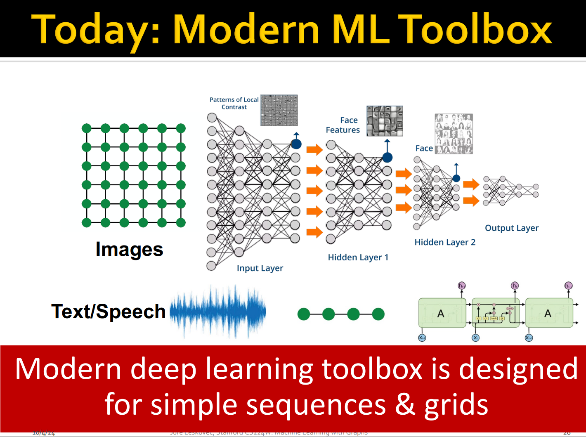
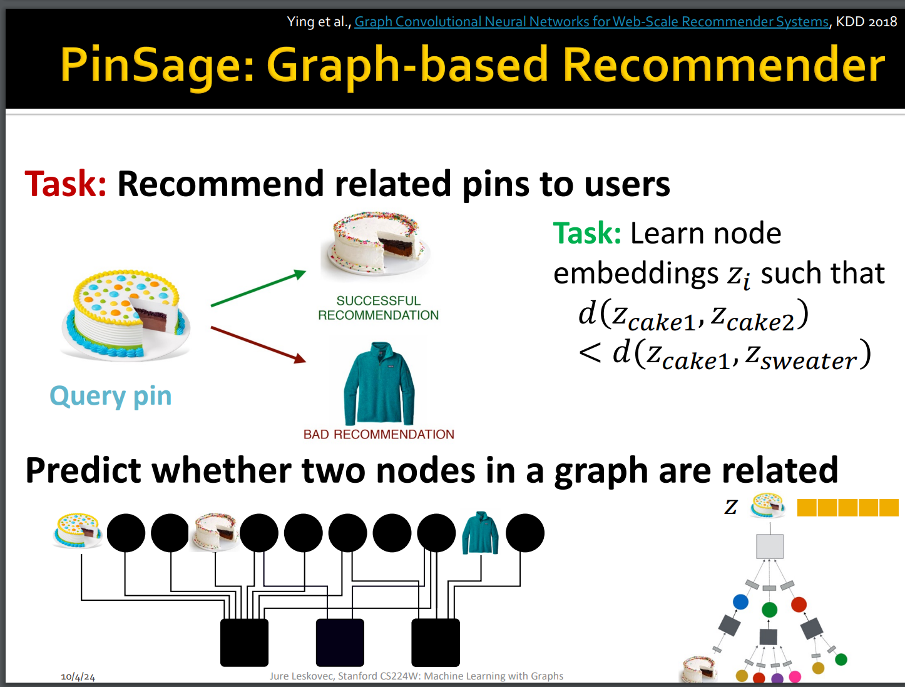
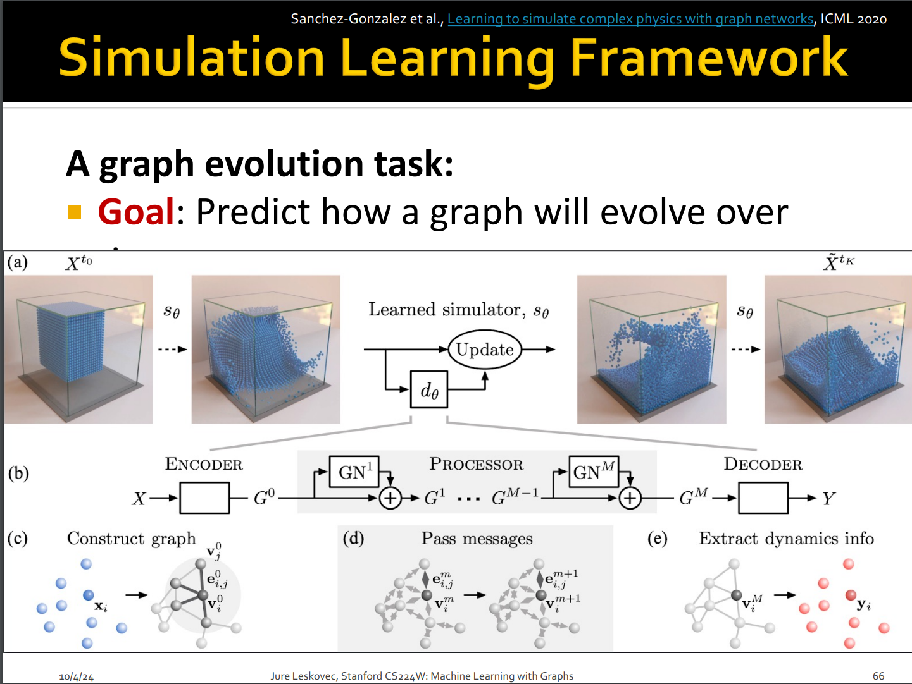
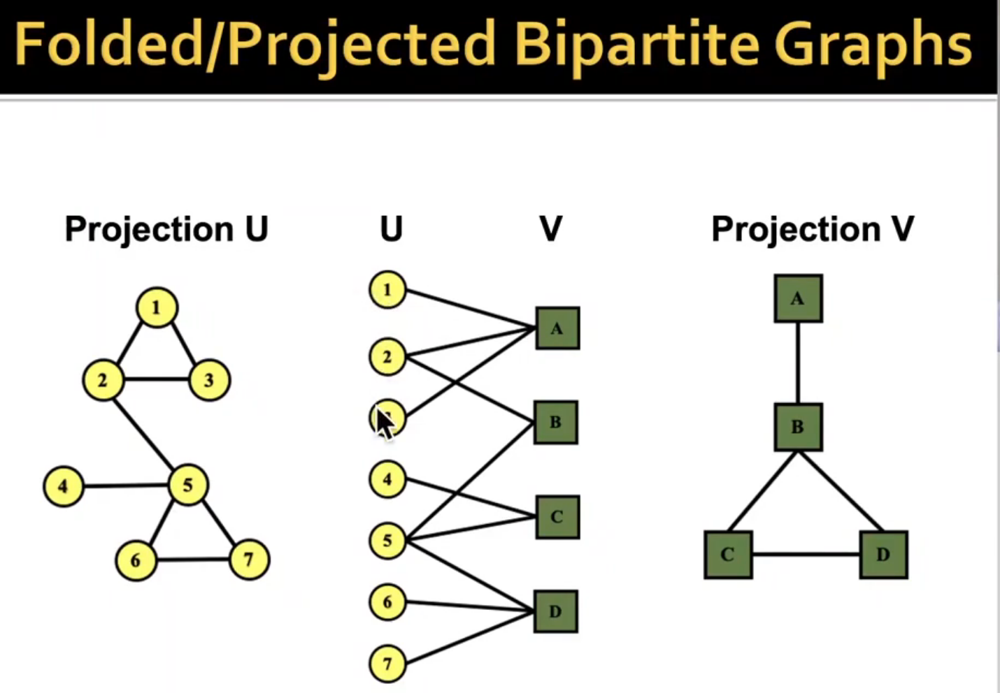
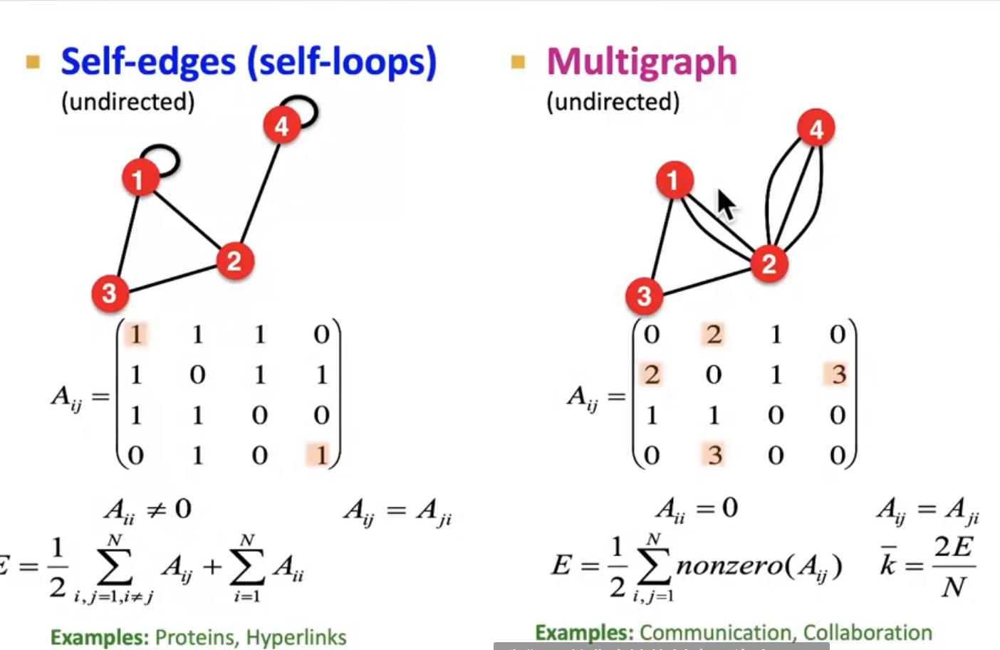
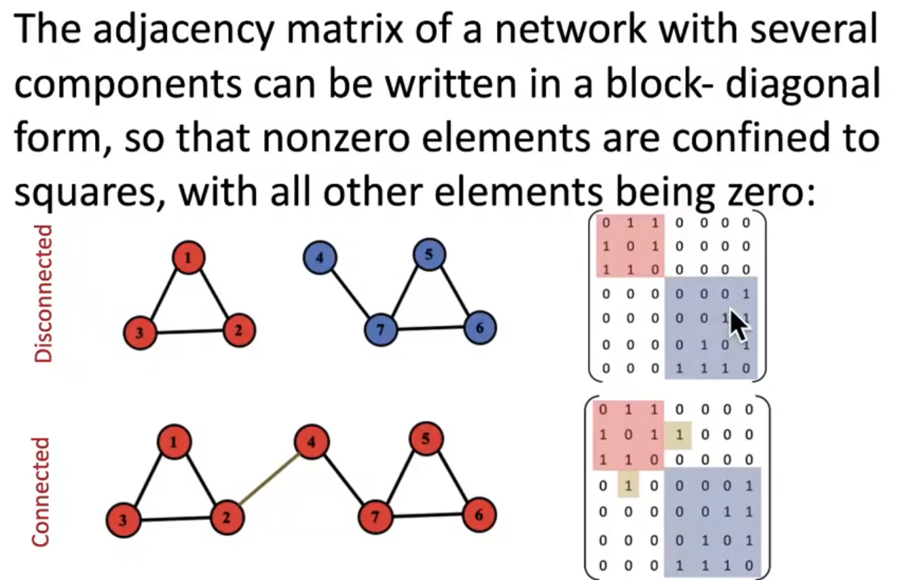

# L1-Intro

# CS224W: Intro to Graph Deep Learning

### GNN for img

也就是说gnn会比传统的cnn更好 :thinking:

gnn as encoder and diffusion process!

### how to build a graph?
基本图论知识见CS61B
- nodes???
- edges???

新的图的表示 双向图与投影图（仔细看线条）

自环的增加的degree为1

接邻矩阵表示连接性

