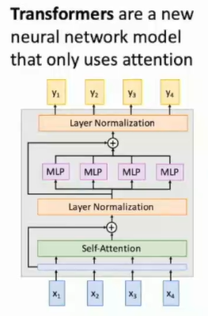

# L13-Attention

# Attention Mechanisms in Neural Networks

## introduction
What if Seq to Seq models processed long long sequences?

## Attention Mechanisms
> the core idea is that using weighted sum, and the coefficient can be learned from the model itself

In math, we do not actually care that wether input is a sequence or not.

given hidden states $h_i$ and the context vector $c$, we can calculate the attention weights as follows:

$$
e_{t, i, j} = f_{att}(s_{t-1}, h_{i,j}) \\
a_{t, :, :} = softmax(e_{t, :, :}) \\
c_{t} = \sum_{i,j} a_{t, i, j} h_{i,j}
$$

- "**Show, attend and tell**" ICML 2015, which setoff "X, Attend, and Y" :laughing:

## Attention Layers
then we wanna abstract this attention mechanism into a general attention layer, as so many work proves that attention mechanism is a crucial component in neural networks

> Inputs:
> 1. Query vector $q$, Shape: ($D_Q$,)
> 2. Input vector $x$, Shape: ($N_X$, $D_Q$)
> 3. Similarity function $f_{att}$, at first is *(scaled) dot production*

> Computation:
> 1. Similarity: $e$, Shape: ($N_X$, ), usually $e_i = q*X_i/\sqrt{D_Q}$
> 2. Attention weights: $a$, Shape: ($N_X$, )
> 3. Output vector: $y = \sum_{i=1}a_i x_i$, Shape: ($D_Q$, )

now then we turn into matrix form:
> Inputs:
> 1. Query matrix $Q$, Shape: ($N_Q$, $D_Q$)
> 2. Input matrix $X$, Shape: ($N_X$, $D_Q$)

> Computation:
> 1. Similarity: $E = Q*X^T/\sqrt{D_Q}$, Shape: ($N_Q$, $N_X$)
> 2. Attention weights: $A = softmax(E,dim=1)$, Shape: ($N_Q$, $N_X$)
> 3. Output vector: $Y = A*X$, Shape: ($N_Q$, $D_Q$)

$X$ was used twice (for similarity and output), and we wanna separate them into two matrices to make it more clear and flexible... KQV! :wink:

> Inputs:
> 1. Query matrix $Q$, Shape: ($N_Q$, $D_Q$)
> 2. Input matrix $X$, Shape: ($N_X$, $D_X$)
> 3. Key matrix $W_K$, Shape: ($D_X$, $D_Q$)
> 4. Value matrix $W_V$, Shape: ($D_X$, $D_V$)

> Computation:
> 1. Key vectors: $K = XW_K$, Shape: ($N_X$, $D_Q$)
> 2. Value vectors: $V = XW_V$, Shape: ($N_X$, $D_V$)
> 3. Similarity: $E = Q*K^T$, Shape: ($N_Q$, $N_X$)
> 2. Attention weights: $A = softmax(E,dim=1)$, Shape: ($N_Q$, $N_X$)
> 3. Output vector: $Y = AV$, Shape: ($N_Q$, $D_V$), maybe product and sum

## Self-Attention Layers
one query for per input vector

> Inputs:
> 1. Input matrix $X$, Shape: ($N_X$, $D_X$)
> 3. Key matrix $W_K$, Shape: ($D_X$, $D_Q$)
> 4. Value matrix $W_V$, Shape: ($D_X$, $D_V$)
> 4. Query matrix $W_Q$, Shape: ($D_X$, $D_Q$)

> Computation:
> 1. Query vectors: $Q = XW_Q$, Shape: ($N_X$, $D_Q$)
> 1. Key vectors: $K = XW_K$, Shape: ($N_X$, $D_Q$)
> 2. Value vectors: $V = XW_V$, Shape: ($N_X$, $D_V$)
> 3. Similarity: $E = QK^T$, Shape: ($N_Q$, $N_X$), need to be scaled by $\sqrt{D_Q}$
> 2. Attention weights: $A = softmax(E,dim=1)$, Shape: ($N_Q$, $N_X$)
> 3. Output vector: $Y = AV$, Shape: ($N_Q$, $D_V$), maybe product and sum

what happens if we change the order of input vectors?
- all the value will be the same, but permuted
- so we perform the attention on a SET of vectors

to solve this problem, we can use **positional encoding** to add information about the position of each vector in the sequence, maybe using `torch.cat`
### Masked Self-Attention Layers
force the model only use the past information, and ignore the future information, **predicting the next word**, at hidden level or similarity level

### Multi-Head Self-Attention Layers
spilt the input vectors into equal parts $h$, Query dimension $D_Q$

## Summary of Ways of Processing Sequences
- RNNs:
  - good at long seq
  - bad at parallel 
- 1D CNNs:
  - bad at long seq
  - good at parallel 
- Self-Attention: 
  - good at long seq
  - good at parallel 
  - bad at memory

## Attention is all you need :laughing:

Transformer!

then the General Pretrained Transformer (GPT) model's story begins...

