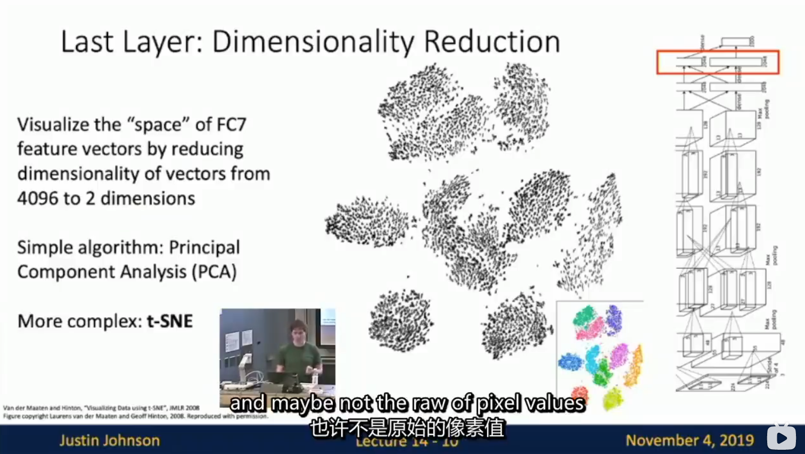
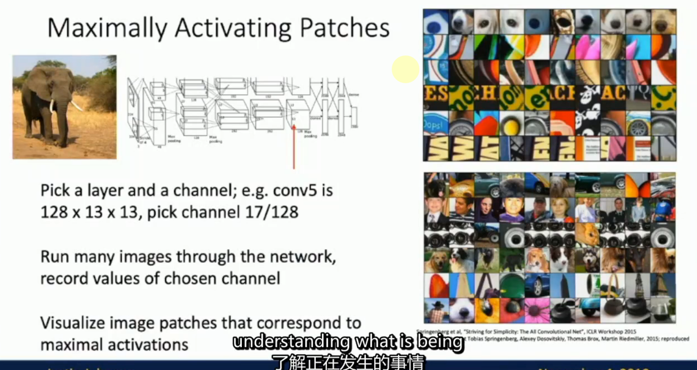
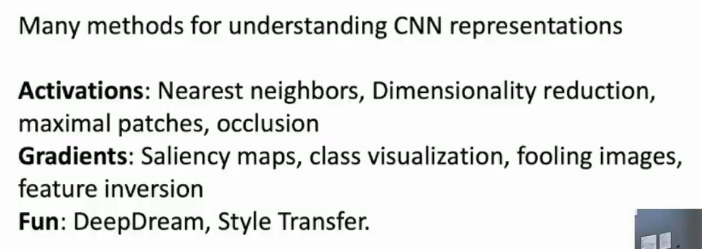

# L14-Visualizing and Understanding

# Visualizing and Understanding

## Visualizing
对第一层、第二层以及最后进入FC层的特征图进行可视化 

PCA√

t-SNE√ 非线性降维

最大激活

## Understanding

[细节](https://web.eecs.umich.edu/~justincj/slides/eecs498/WI2022/598_WI2022_lecture21.pdf)

