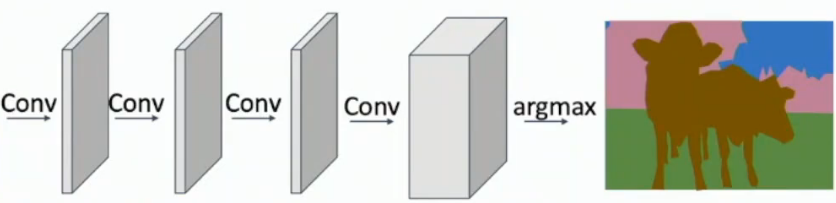
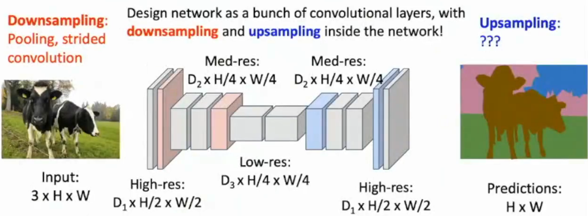
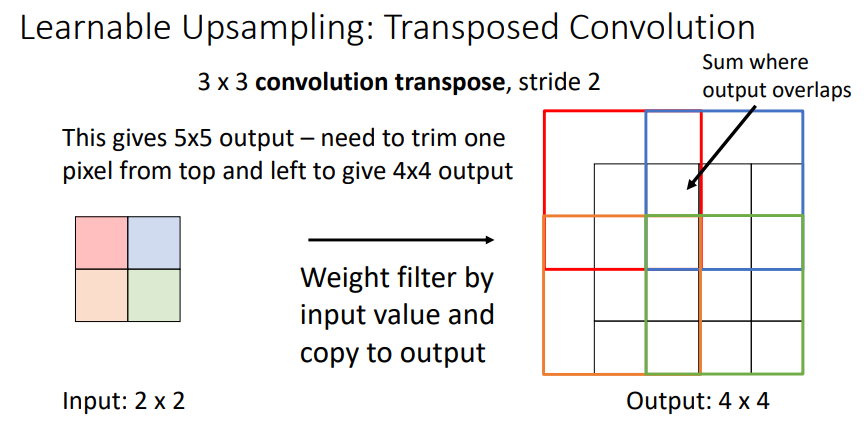

# L16: Image Segmentation

# Image Segmentation

Goal: to learn about what Fully Convolutional Networks (FCN) are and how they can be used for image segmentation. :thinking:

## Semantic Segmentation

- a simple way is to slide the window,  creating a slow RNN?
- another way is to build a Equal size Fully Convolutional Network (but receptive field is limited and hard to generalize to higher resolutions)

- U-Net like architecture :wink:

but how to UPSAMPLE the feature maps?

### Up-sampling
- simple built-in function, targets at the *average pooling*
  - bed of nails 
  - Nearest Neighbor
  - Bilinear Interpolation
    - Bicubic Interpolation also like this onw

- Max Unpooling, targets at the *max pooling*
  - when max pooling is used, remember the position of the maximum value, and use it (those places) to upsample the feature map

- [Transpose Convolution](https://web.eecs.umich.edu/~justincj/slides/eecs498/498_FA2019_lecture16.pdf), *learnable* weights

Ready for math? :wink:

when 1D, size=3, stride=1, padding=1...
$$
\vec{x}*\vec{a} = X \vec{a}
$$

$$
\begin{bmatrix}
x & y & z & 0 & 0 & 0 \\\\
0 & x & y & z & 0 & 0 \\\\
0 & 0 & x & y & z & 0 \\\\
0 & 0 & 0 & x & y & z \\\\
\end{bmatrix} 
\begin{bmatrix}
0 \\\\
a \\\\
b \\\\
c \\\\
d \\\\
0 \\\\
\end{bmatrix} =
\begin{bmatrix}
ay+bz  \\\\
ax+by+cz \\\\
bx+cy+dz  \\\\
cx+dy \\\\
\end{bmatrix} 
$$

$$ 
let \ \*^T\ be \ transpose \ convolution \Rightarrow \vec{x}*^T \vec{a} = X^T \vec{a}
$$

$$
\begin{bmatrix}
x & 0 & 0 & 0 \\\\
y & x & 0 & 0 \\\\
z & y & x & 0 \\\\
0 & z & y & x \\\\
0 & 0 & z & y \\\\
0 & 0 & 0 & z \\\\
\end{bmatrix} 
\begin{bmatrix}
a \\\\
b \\\\
c \\\\
d \\\\
\end{bmatrix} =
\begin{bmatrix}
ax  \\\\
ay+bx\\\\
az+by+cx  \\\\
bz+cy+dx  \\\\
cz+dy \\\\
dz \\\\
\end{bmatrix} 
$$

HOWEVER, when the stride is greater than 1, transposed conv can not be expressed as normal conv

when 1D, size=3, *stride=2*, padding=1...
$$
\vec{x}*\vec{a} = X \vec{a}
$$

$$
\begin{bmatrix}
x & y & z & 0 & 0 & 0 \\\\
0 & 0 & x & y & z & 0 \\\\
\end{bmatrix} 
\begin{bmatrix}
0 \\\\
a \\\\
b \\\\
c \\\\
d \\\\
0 \\\\
\end{bmatrix} =
\begin{bmatrix}
ay+bz  \\\\
bx+cy+dz  \\\\
\end{bmatrix} 
$$

$$ 
let \ \*^T\ be \ transpose \ convolution \Rightarrow \vec{x}*^T \vec{a} = X^T \vec{a}
$$

$$
\begin{bmatrix}
x & 0 \\\\
y & 0 \\\\
z & x \\\\
0 & y \\\\
0 & z \\\\
0 & 0 \\\\
\end{bmatrix} 
\begin{bmatrix}
a \\\\
b \\\\
\end{bmatrix} =
\begin{bmatrix}
ax \\\\
ay \\\\
az+bx \\\\
by  \\\\
bz \\\\
0 \\\\
\end{bmatrix} 
$$

- HHZZ: there is another way, which is upsampling the feature maps by a buit-in function, and then use a convolutional layer to learn the weights for the upsampling.

## Instance Segmentation

object detection + segmentation :wink:

see Mask R-CNN paper

## else 
- Panoptic Segmentation
- end to end Instance Segmentation
- key points segmentation & human pose estimation

