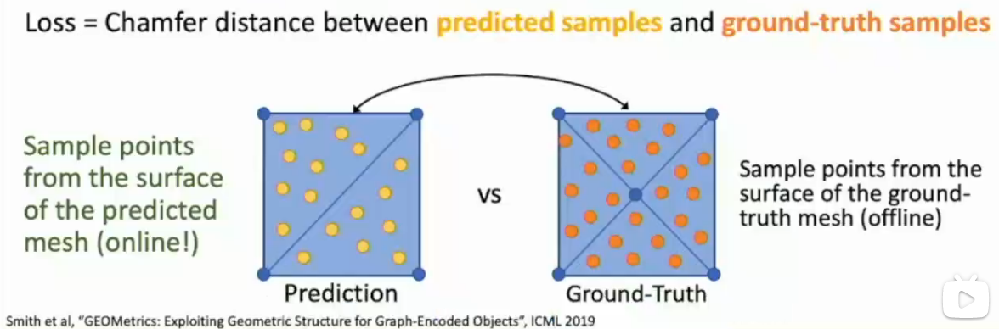

# L17-3D Vision

# 3D Vision
back to the start :laughing:

## shape prediction and ingest 3D information
5 data representation
- depth map
  - RGB + Depth image = RGB-D image 2.5D
  - raw 3D sensor can easily capture depth information
  - another type of depth map is *surface normal map*, which is a 2D image that represents the surface normal (using a normal vector) at each pixel location
  - all the mentioned maps can be learned with *Fully Convolutional Networks* (FCN) :thinking:

- Voxel grid
  - Occupancies! like a binary matrix/grid, can be learned by a 3D CNN
    - ECCV2016 paper: **3D-R2N2**, using a MLP to bridge the gap between 2D and 3D
    - can use 2D CNN to predict 3D occupancy grid, but sacrifices spatial invariant information
  - need high resolution to capture fine details
  - scaling is nontrivial :(, extremely computationally expensive!
    - Oct tree
    - Nested Shape Layers

- point cloud
  - can represent 3D objects as a set of less points
  - requires new architectures, losses
  - need post-processing for other tasks
    - Chamfer distance: 
     $d_{CD}(S_1,S_2)=\sum_{x \in S_1}\min_{y \in S_2}\lVert x-y\rVert\_2^2  + \sum_{y \in S_2} \min_{x \in S_1} \lVert x - y \rVert _2^2$
  - LiDAR :laughing:

- mesh
  - standard 3D object representation
  - Explicit representation: vertices, faces, edges
  - adaptive: flat? efficient! wanna more details? more faces!
  - can attach data on verts and interpolate over the whole surface, like color, normal, texture...
  - need to come up with new arch to process meshes with NN
    - ECCV2018 paper: **Pixel2Mesh** 
      - *Iterative refinement* of a 3D mesh
      - Graph Convolutional Network (*GCN*) to process mesh :laughing:
      - *Aligned* vertex features between 2D and 3D
      - Loss: convert mesh to point cloud, then use Chamfer distance as before

- Implicit surface / Signed Distance Function (SDF)
  - trying to learn a function to separate the 3D points into different regions
  - so that we can learn a implicit representation for the 3D shape

## metric learning for 3D data
- F1 score: 
$F_1 = 2 \frac{precision \cdot recall}{precision + recall}$
- IoU: 
$IoU = \frac{TP}{TP + FP + FN}$

## camera system
- view cooridnate system (VCS)
- canonical view volume (CVV)

## dataset
- ShapeNet
- Pix3D
- Mesh R-CNN, using Voxel and meshes

