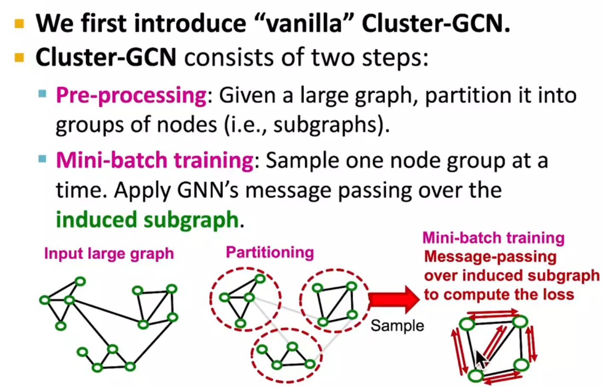

# L17-huge GNN

# Scaling up GNNs

直接load全部nodes又不太可能【naive approach】4090 / A100带不动

## neighbor sampling

对hub node的思考

see the paper 

## cluster-GCN

advanced

## Simplified GCN

舍弃了GCN的non-linearity，直接用linear layer

同质性？但是我想知道和glidar的区别？

