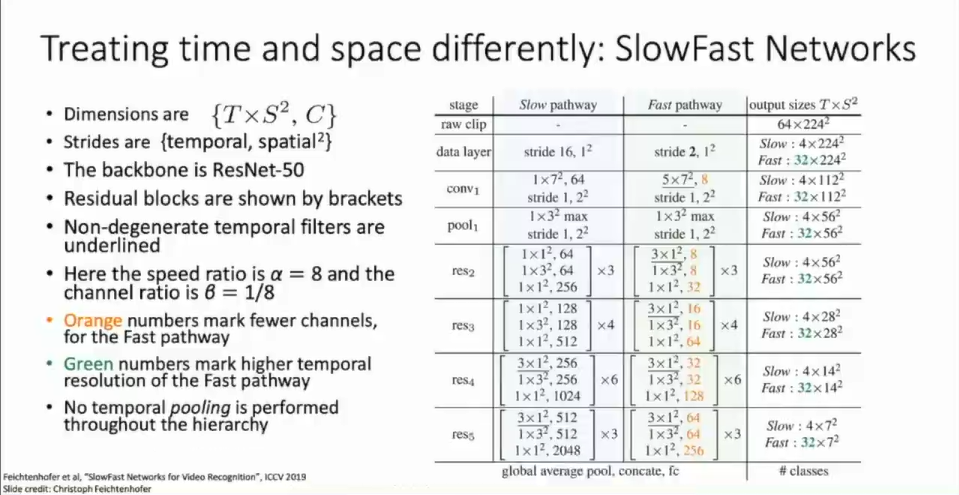

# L18-Video

# Video in NN

## Introduction
Video: 4D tensor, T x H x W x C, a sequence of frames(images).

### Video Classification

- Input: T x H x W x C
- Output: K classes, *actions* instead of *nouns*.

Problems: raw video are BIG, ~1.5GB per minute for SD(640x480x3)

Solutions: on short *clips*, eg. T=16, H=W=112, low fps

## Short Term model
### Single-Frame CNN
so you can use a 2D CNN on each frame independently :)

### Late Fusion

apply a MLP (pooling/concat/flatten...) on the entire features sequence

However, it is hard to compare low-level motion between each frames :(

### Early Fusion

- Input: T x H x W x C
- Reshape: T x H x W x C -> 3T x H x W (C=3)
- CNN on 3T x H x W -> D x H x W then standard 2D CNN process

too extreme, just fuse all the temporal information at the beginning

### 3D CNN / Slow Fusion
- Input: T x H x W x C
- each layer: D x T x H x W, using 3D conv and 3D pooling

good for keeping the *temporal shift-invariant*

from 2014, 3D CNN improved a lot

**C3D**: the vgg of 3D CNN, ICCV2015

but somehow all these model treat the time and space *equally*, which is not true in reality :thinking:, in fact, we human can recognize the *motion* just using 3 points

### Two-Stream Networks
In early CV, there are ways to extract *optical flow*
- Spatial CNN: extract features from a single frame
  - Input: 3 x H x W
  - Output: K classes
- Temporal CNN: extract features from a sequence of frames
  - Input: [2*(T-1)] x 3 x H x W, stack of optical flow
  - Output: K classes
- Final output: weighted sum of the two streams

## Long Term model
### Recurrent CNN
recall
$$
h_t = f_W(h_{t-1}, x_t)
$$

import the RNN (GRU/LSTM......) to deal with the features sequence 

a basic and beautiful idea: time sequence + CNN local framing

### Attention-based

CVPR2018, Spatial Temporal Self-Attention Network, non local neural networks
- trick: initialize the last conv weights of the attention mechanism as ZERO, easy to plug in 3D CNN

- but what is the best 3D CNN?
  - we do not want to reinvent those amazing 2D CNNs, so we can *inflate* those model into 3D! CVPR2017 **I3D**
  - inflate conv ops, weights (copy original weights from 2D CNN, repeat T times at time level) into 3D! Init-Finetune!

## Without Optical Flow
SlowFast Networks, ICCV2019 

## dataset
- Sports-1M, fine-grained action recognition dataset
- UCF101
- Kinetics-400

## other tasks
- Temporal Action Localization
- Spatio-Temporal Action Detection

