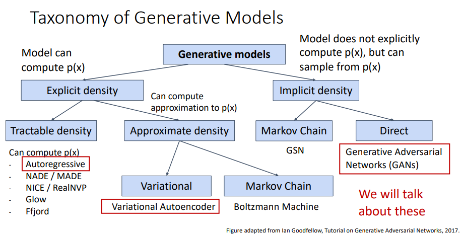

# L19-Generative Model I

# Generative Model I

## supervised learning vs unsupervised learning

supervised learning: labeled data, labeled target variable
- classification, semantic segmentation, object detection, etc.

unsupervised learning: unlabeled data, no target variable
- clustering, density estimation, *feature extraction/learning*, dimensionality reduction, etc.

we are trying to learn model the *distribution* of the data
## Discriminative, Generative, and Conditional Generative
all three types of learning can be used in a equation, x is the input variable, y is the target variable,

$$
P(x|y) = \frac{P(y|x)}{P(y)} P(x)
$$

- Discriminative models: $P(y|x)$
  - assign labels to input data
  - feature learning (supervised learning)
- Generative models: $P(x)$
  - feature learning (unsupervised learning)
  - detect outliers
  - sample to generate new data
- Conditional Generative models: $P(x|y)$
  - assign labels to input data, while rejecting the outliers
  - generate new data conditioned on the label

## AutoRegressive Model

Goal: wanna to write down an explicit function for $p(x) = f(x, W)$

Given dataset $D = \{x_1, x_2, \cdots, x_N\}$, we train the model by:

$$
\begin{align}
    W^{*} &= \arg\max_W \Pi_{n=1}^N p(x^{(i)}) \\\\
    &= \arg\max_W \sum_{n=1}^N \log p(x^{(i)}) \\\\
    &= \arg\max_W \sum_{n=1}^N \log f(x^{(i)}, W) \\\\
\end{align}
$$

assume that x consists of multiple subparts

$$
x = (x_1, x_2, \cdots, x_T)
$$

then we can break down the $p(x)$ into:

$$
\begin{align}
p(x) &= p(x_1, x_2, \cdots, x_T) \\\\
&= p(x_1)p(x_2|x_1)p(x_3|x_1,x_2) \cdots p(x_T|x_{T-1}, \cdots, x_1) \\\\
&= \prod_{t=1}^T p(x_t|x_1, \cdots, x_{t-1}) \\\\
&= \prod_{t=1}^T p(x_t|x_{<t})  \\\\
\end{align}
$$

this suggests that we can use an RNN! :astonished:

ICML2016 PixelRNN, NIPS 2016 PixelCNN

## Variational AutoEncoder (VAE)
see in the [colab notebook](https://drive.google.com/file/d/1cM3Qjk4QjXR-WQ1Z_RRyP4WmLczR17tV/view?usp=drive_link)

