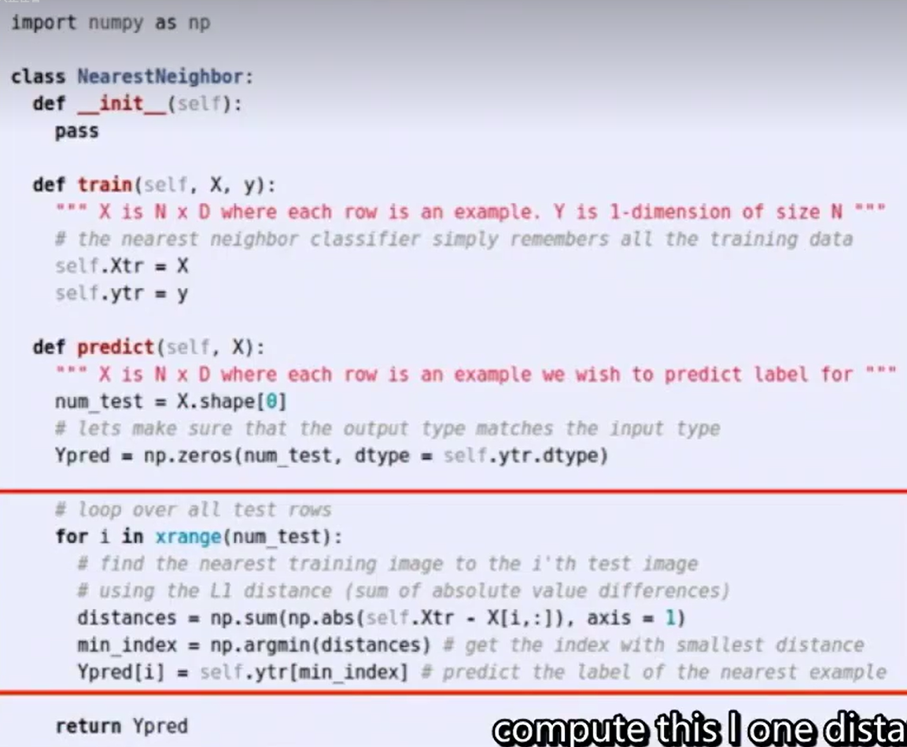
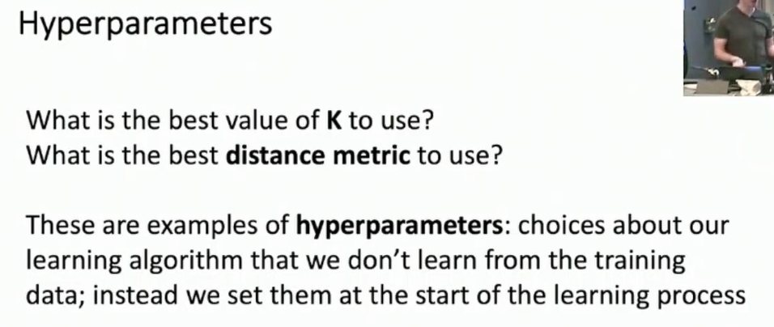
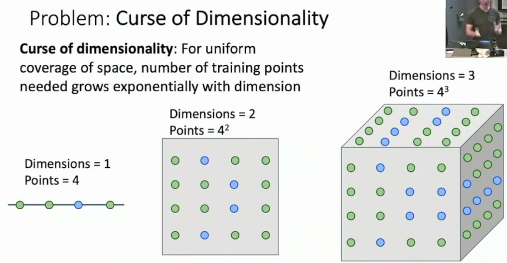
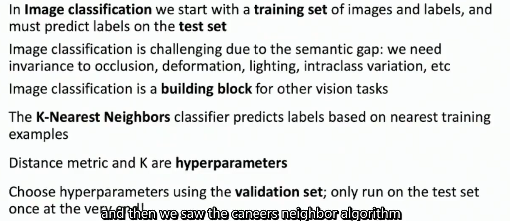

# L2-image classification

# Lecture 2: Image Classification

## Introduction
Image classification is the task of assigning a label...

can be a building-block for many applications

## More robust, data-driven approaches
### Understanding the dataset
- 简单介绍一下类似于MNIST, CIFAR-100等数据集的基本结构
- 提出Omniglot数据集的概念 few-shot learning

### Choosing a model

**Nearest Neighbor**
- find the *distance* metric between the test image and all the training images
- memorize the training images and their corresponding labels
- predict the label of the test image based on the nearest training image

With N examples...
- training time: O(1) or O(N), depending on the copying strategy
- testing time: O(N)

there are more knn... [see here](https://github.com/facebookresearch/faiss)

**决策边界平滑化**
- more neighboring examples， k :up:
- change the metric

### Evaluating the model
详见DATA-100课程 train / validation / test set的划分 & k-fold cross-validation的介绍

## 通用近似定理
knn可以拟合任意的连续函数

## 维度灾难

## 总结

