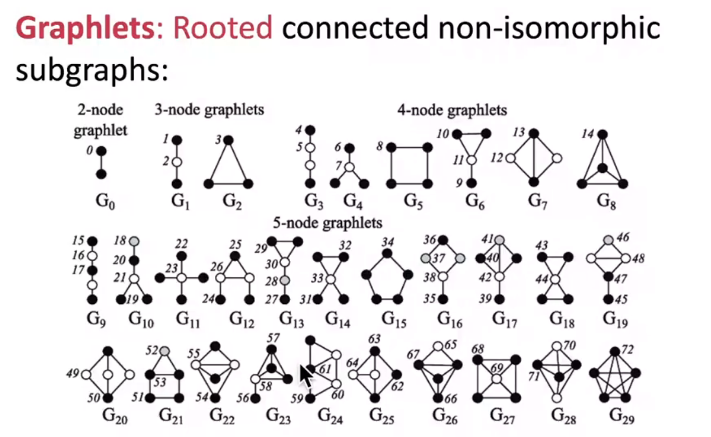
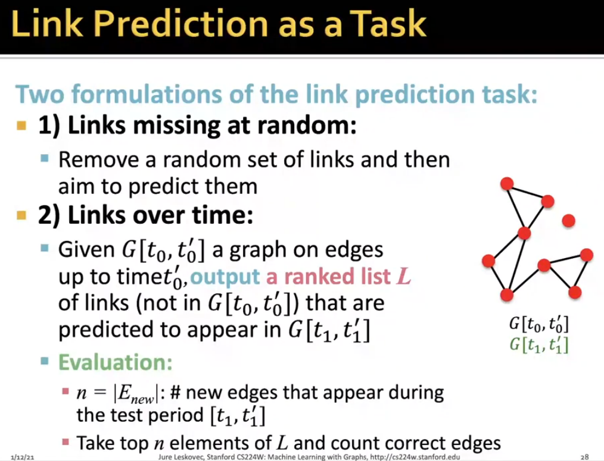
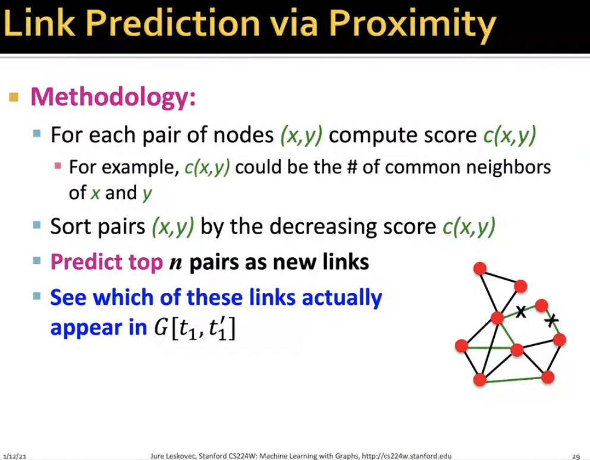
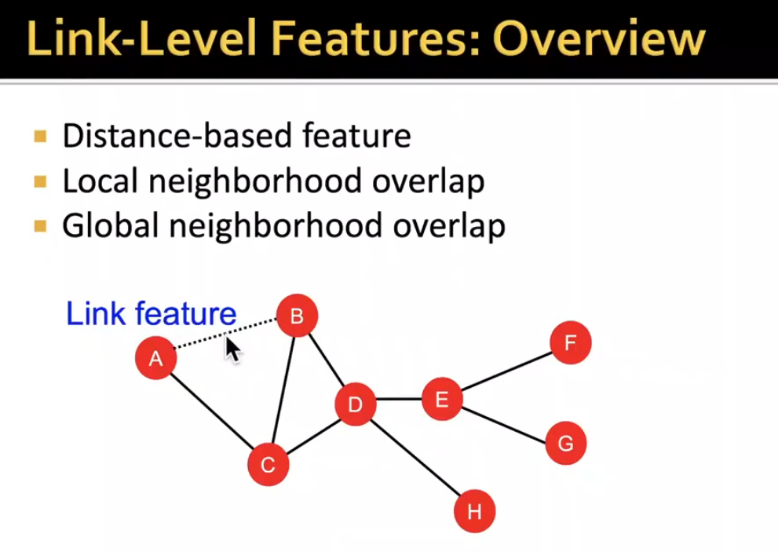
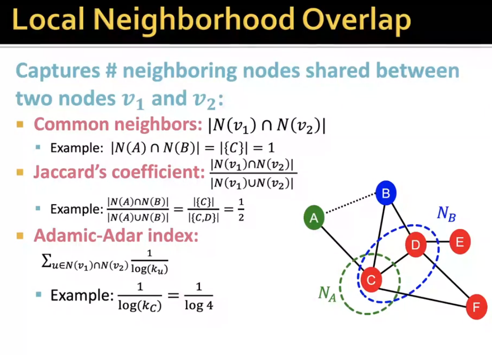
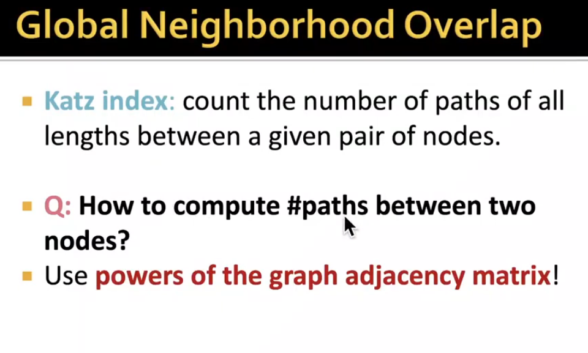
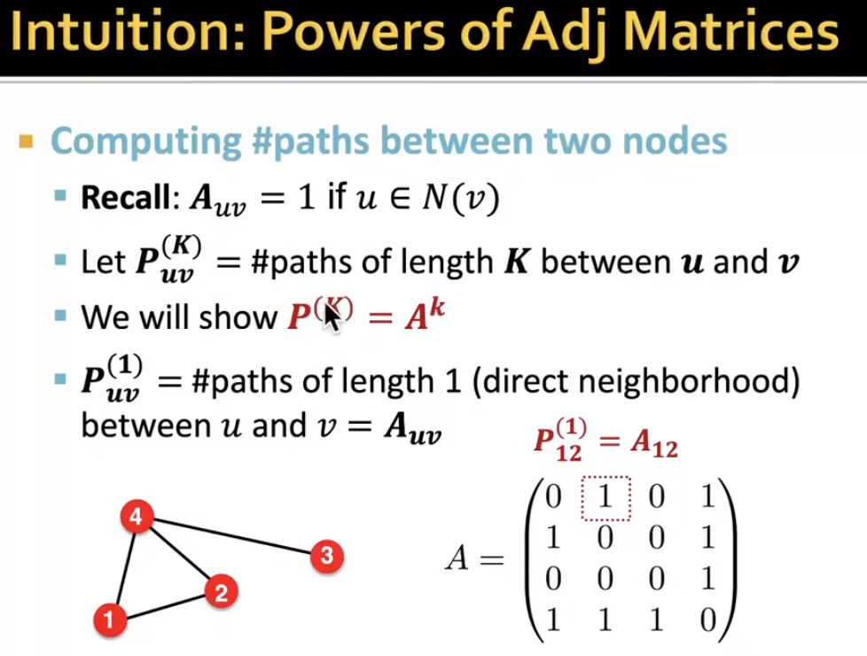
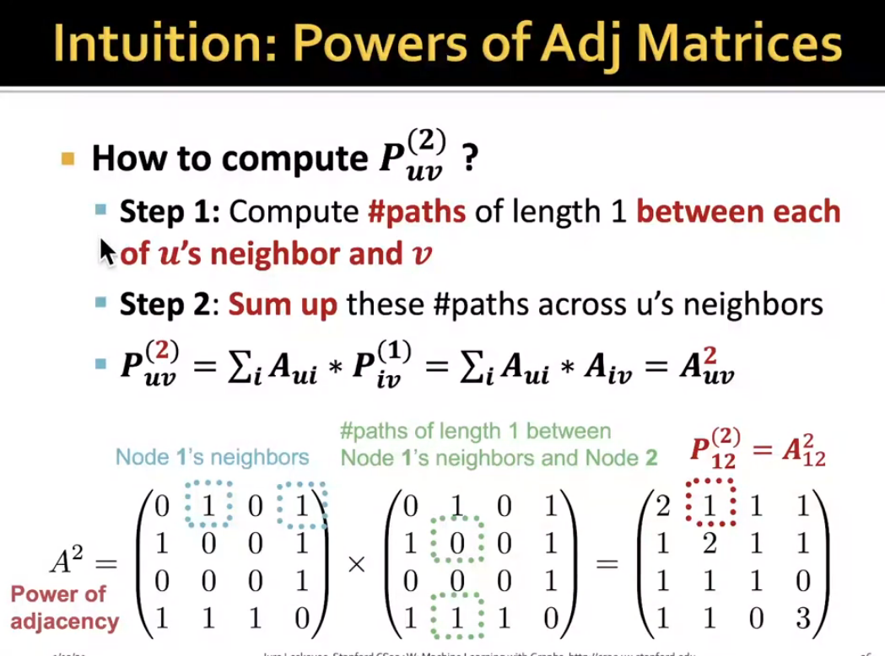
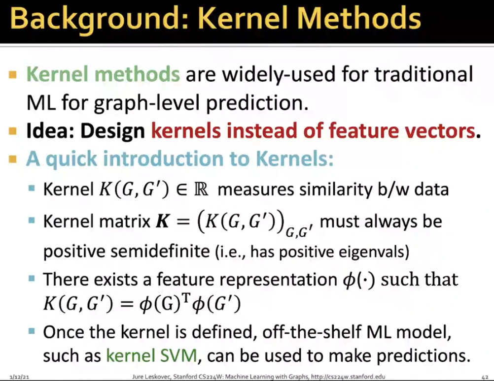
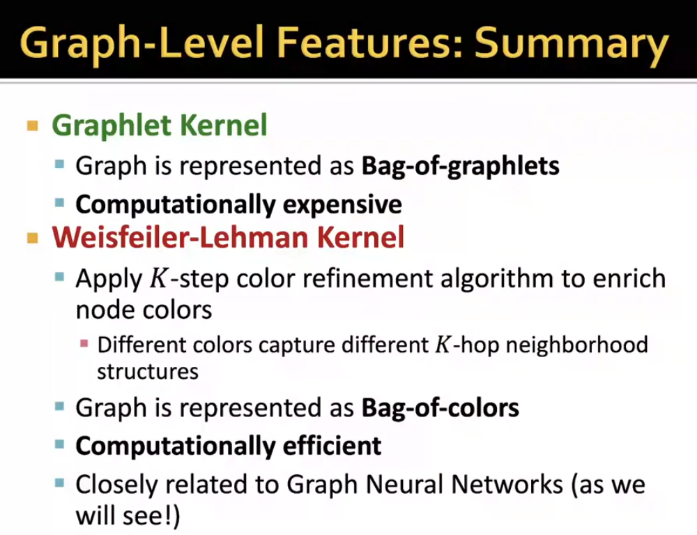

# L2-traditional methods

# Traditional Methods in Graph Learning

### node-level features

- degree
- Centrality measures: degree centrality, betweenness centrality, eigenvector centrality, closeness centrality, clustering coefficent
- 
  - 进一步引申GDV

### edge-level features

我觉得这个很像我们的vae encoder想法

距离表征容易理解......

邻接矩阵的幂（类似于归纳法 略）

### graph-level features

核方法（但是skip） **bag of sth**...

recall when you need 

