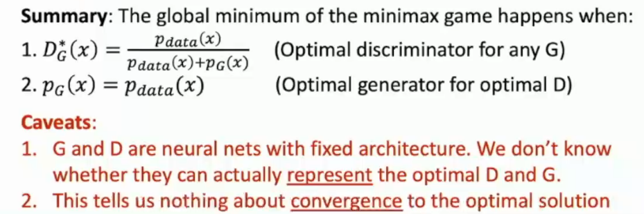

# L20-Generative Model II

# Generative Model II

for some reason, it seems like that we are backed :laughing:

## Generative Adversarial Networks (GANs)

setup: assume that we have data $x_i$ from a distribution $p_{data}(x)$, all we wanna do is to *sample* from $p_{data}(x)$

idea: introduce a latent variable $z$ with simple prior $p(z)$, those $z$ can be interpolated,

sample $z$ from $p(z)$, and pass into a Generator $x = G(z)$,  then we said that $x$ is a sample from the Generator distribution $p_{G}$,

all we need to do is let $p_G = p_{data}$ !

and then we include a Discriminator $D(x)$, which takes in $x$ and outputs a probability that $x$ is real (from $p_{data}$) or fake (from $p_{G}$).

*Hopefully*, this will converge to a point where $D(x)$ is not able to correctly classify real and fake data.

### Training objective
minmax game:

$$
\begin{aligned}
\mathcal{L}\_{GAN} &= \min_{G} \max_{D} E_{x \sim p_{data}}[log D(x)] + E_{z \sim p(z)}[log (1-D(G(z)))] \\\\
&= \min_{G} \max_{D} V(G,D) \\\\
\end{aligned}
$$

alternating gradient update:

For t in 1, ..., T:
- update $D$, $D = D + \alpha_D \frac{\partial V}{\partial D}$
- update $G$, $G = G - \alpha_G \frac{\partial V}{\partial G}$

In practice, we wanna the $G$ to minimize $-log D(G(z))$, in order to avoid the vanishing gradient problem at the begging.

## why GANs work?

$$
\min_{G} \max_{D} E_{x \sim p_{data}}[log D(x)] + E_{z \sim p(z)}[log (1-D(G(z)))] \\\\
= \min_G(2 \times JSD(p_{data}, p_G) - log4)
$$

**Proof:** (ready for the math? :wink:)

$$
\begin{aligned}
\mathcal{L}\_{GAN} &= \min_G \max_D E_{x \sim p_{data}}[log D(x)] + E_{z \sim p(z)}[log (1-D(G(z)))] \\\\
&= \min_G \max_D E_{x \sim p_{data}}[log D(x)] + E_{x \sim p_G}[log (1-D(x))] \\\\
&= \min_G \max_D \int_X(p_{data}(x)logD(x)+p_G(x)log(1-D(x)))dx \\\\
&= \min_G \int_X \max_D (p_{data}(x)logD(x)+p_G(x)log(1-D(x)))dx \\\\
\end{aligned}
$$

$$
f(y) = alogy+blog(1-y), let f'(y) = 0 \Rightarrow y = \frac{a}{a+b} \\\\ 
\Rightarrow D_G^{\*}(x) = \frac{p_{data}(x)}{p_{data}(x)+p_G(x)} \\\\
$$

$$
\begin{aligned}
\small
&= \min_G \int_X  (p_{data}(x)logD_{G}^{\*}(x)+p_G(x)log(1-D_{G}^{\*}(x)))dx \\\\
    &= \min_G \int_X  (p_{data}(x)log\frac{p_{data}(x)}{p_{data}(x)+p_G(x)}+p_G(x) log\frac{p_G(x)}{p_{data}(x)+p_G(x)})dx \\\\
&= \min_G (E_{x \sim p_{data}}[log\frac{p_{data}(x)}{p_{data}(x)+p_G(x))}] + E_{x \sim p_G}[log\frac{p_G(x)}{p_{data}(x)+p_G(x))}]) \\\\
&= \min_G (E_{x \sim p_{data}}[log\frac{2 \times p_{data}(x)}{p_{data}(x)+p_G(x))}] + E_{x \sim p_G}[log\frac{2 \times p_G(x)}{p_{data}(x)+p_G(x))}] - log4) \\\\
&= \min_G (KL(p_{data}, \frac{p_{data}+p_G}{2})+KL(p_G, \frac{p_{data}+p_G}{2}) - log4) \\\\
&= \min_G (2 \times JSD(p_{data}, p_G) - log4) \Rightarrow \min_G (JSD(p_{data}, p_G))
\end{aligned}
$$

## Conditional GANs (cGANs)

input $x$ and condition $y$ both $G$, $D$ 

**Conditional BatchNormalization**

some tasks
- GAN of Video
- Text to image synthesis
- Image to image translation
- Image to image super-resolution
- Label Map to Image synthesis / style transfer

even trajectory prediction!

