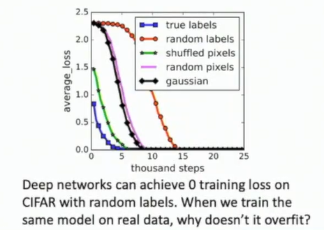
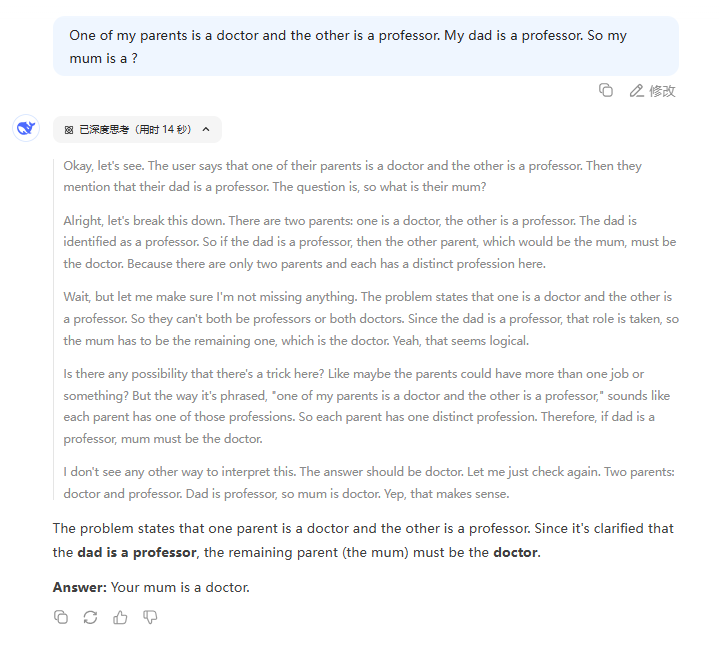
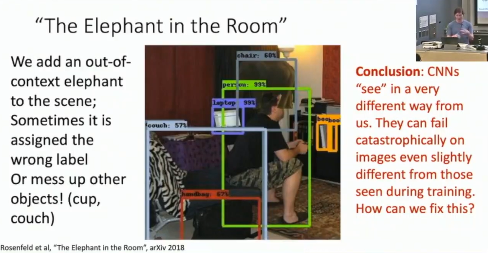

# L22-Recap and Conclusion

# Recap and Conclusion

## Recap
- What is Computer Vision?
building a system that can understand and process visual information

- Main approaches to Computer Vision

- semantic segmentation using Fully Convolutional Networks (FCN) :thinking:

## What's next?

1. we will discover interesting new types of deep models
Neural ODE NIPS 2018
$$
h_{t+1} = h_t + f(h_t, \theta_t) \Rightarrow \frac{dh}{dt} = f(h(t), t, \theta)
$$

2. Deep Learning will find new applications
- AI4S
- DL4CS, like using DL training a hash function to improve the hash table
- DL4Mathematics, auto theorem proving

3. Deep Learning will use more data and more computional power

## Problems and Challenges

### Models are biased
eg: Vector Arithmetic with Word Vectors, fit biased dataset to a model leads to poor performance; Economic Bias (usually train model on the wealthier western family?); Racial Bias

maybe making ML work for everyone is a big challenge

### New theory?

Empirical Mysteries
- Good Subnetwork :astonished:
- Generalization, traditional Ai STAT says that if a model can fit on random dataset, maybe the model is too large to generalize to new dataset :thinking: 

- Double Descent :scream:, seems like as we scale up, the overfitting curve does not behave as expected

### Need for more labeled data

- low-shot learning
- using self supervised learning to learn from unlabeled data?
  - jigzaw puzzles ECCV 2016
  - colorization
  - Inpainting

### Deep Learning does not "understand" the world
- LLM lack of common sense, at the age of GPT2 :laughing:, now we are at 2025...... Can we say that those LLMs are "smart" enough to understand the world?

- "The Elephant in the Room"

I really want to see those problems in 2025! :yum:

