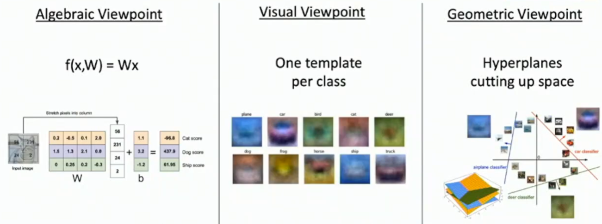
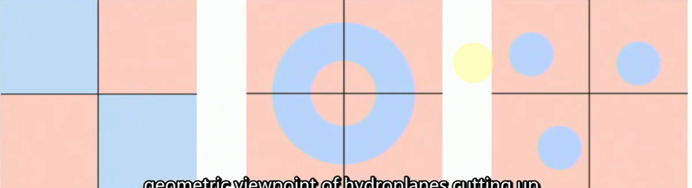

# L3-linear classifiers

# Linear Classifiers

## Viewpoints of Linear Classifiers

## hard cases of linear classifiers

## hinge loss
- hinge loss is a loss function, linear and zeros-in-margin
- 感觉是一个有意思的线性损失函数，但是目前作用不大
- SVM loss
- 对损失函数初始化估值可以初步验证是否由bug

## Regularization
- 从线性模型的角度看，添加常数因子效果不变，但是权重矩阵的范数会变化
- 由上可知不唯一，所以需要对权重矩阵进行约束，常用的约束方式是正则化
- 一种新的引入正则化项的思路 :thinking: ===> express our preference or 先验的知识点
- 余下两种观点：防止过拟合

### 重新理解L1 / L2正则化
- L1正则化 : 倾向于权重集中
- L2正则化 : 倾向于权重均匀

