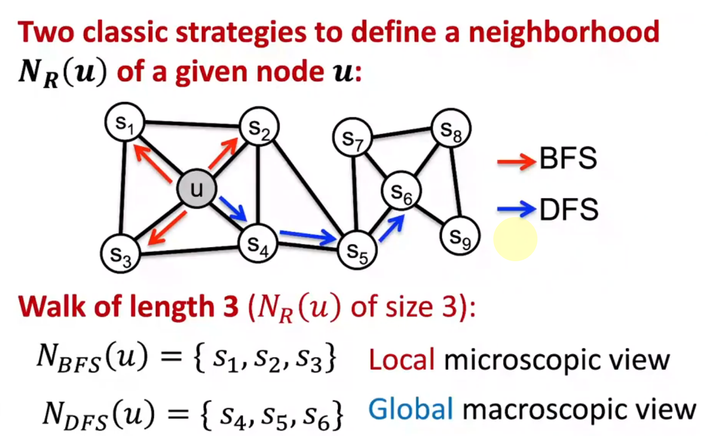

# L3-Node Embeddings

# Node Embeddings
https://web.stanford.edu/class/cs224w/slides/02-nodeemb.pdf

## encoder and decoder

### encoder: simple example

？？注意这里矩阵是one column per node， 这里似乎解释通了为什么glidar里面node在encode的过程中数量不变，换句话说就是 **not scalable**

呼之欲出啊啊啊啊啊 :scream:

***以下内容非常具有启发性***

## Random walks

怎么理解高效率？

对特征学习的考量

提出损失函数

用了一个近似来化简 （不约而同走到了noise-denoise）

k在5~20之间！又是glidar的论文！

### summary

### node2vec

## embedding the entire graph

SKIP

