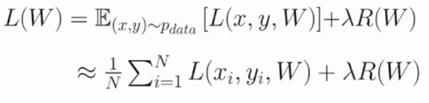
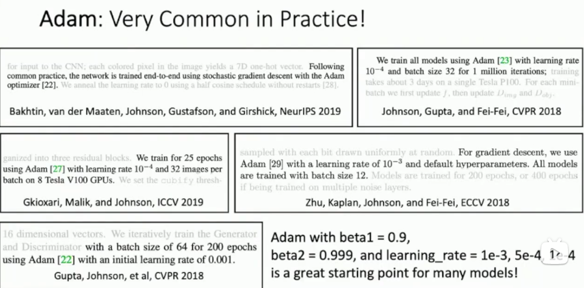
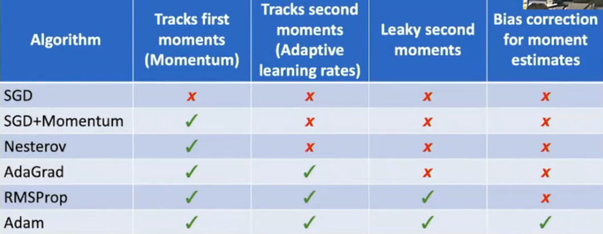
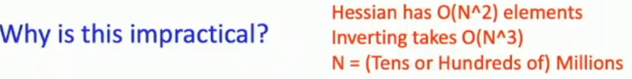

# L4-Optimization

# Optimization


## grad check
解析计算后数值计算梯度验证之

```python
import torch
torch.autograd.gradcheck(func, inputs, eps=1e-6, atol=1e-4, raise_exception=True)
torch.autograd.gradgradcheck(func, inputs, grad_outputs=None, eps=1e-6, atol=1e-4, raise_exception=True)
# numpy allclose
np.allclose(a, b, rtol=1e-5, atol=1e-8)
```
## 梯度下降法
略

## 蒙特卡洛


把期望转化为数值求解，上图的等式两边求导也可，从而得到梯度

## 混合优化方法

Adam = RMSprop + Momentum :open_mouth:





为什么只是一阶函数优化？




