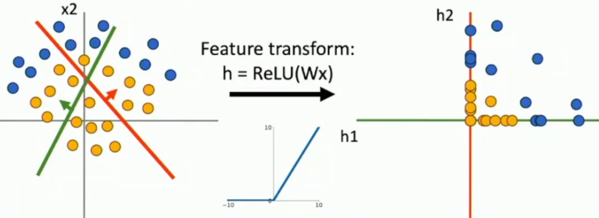

# L5-NN

# Neural Networks
## 线性不可分怎么处理？

怎么encode不同的信息？

王朝落幕

## Neural Networks Architecture

data -> input layer -> hidden layer -> output layer

data driven, non-linear :yum:

:smile: ?

## ReLU, 通用近似定理

详细证明看一看官方给出的课本

## 凸优化

牢NN当然是进行非凸优化 :grinning:

