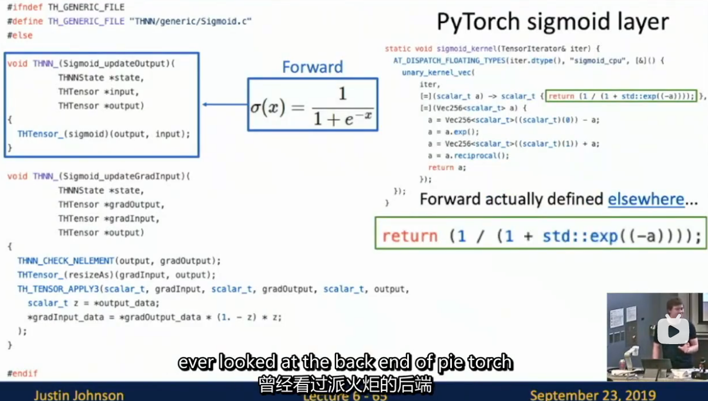
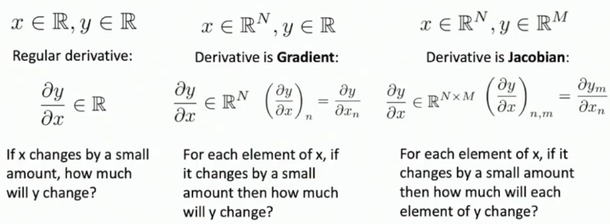

# L6-BP

# Backpropagation

参见cmu 10-414 :grinning:
## RNN 初见

## Computation Graph
:smirk:


A2要hardcode直接的反向传播了 555


真正的代码 :yum:


```python
class Multiply(torch.autograd.Function):
    @staticmethod
    def forward(ctx, x, y):
        ctx.save_for_backward(x, y)
        return x * y
    @staticmethod
    def backward(ctx, grad_output):
        x, y = ctx.saved_tensors
        return grad_output * y, grad_output * x # 解析计算
```

PyTorch operators in deep engine :thinking:



## BP rules
### BP with vector-valued functions



假装标量求导，然后匹配矩阵形状即可（典中典）

### element-wise functions in BP

不用使用矩阵求导，直接一一对应去想梯度的传递即可

此时雅各比矩阵十分稀疏（低效），不直接显式计算，而是通过shape / mask隐式来做

### matrix(or tensor)-valued functions in BP

a possible strategy
- 元素层面来看（这个思路比较简单，但效率不高）


科学计算AD

## BP for Higher Order Derivatives


PyTorch真正的实现，并非直接反向


