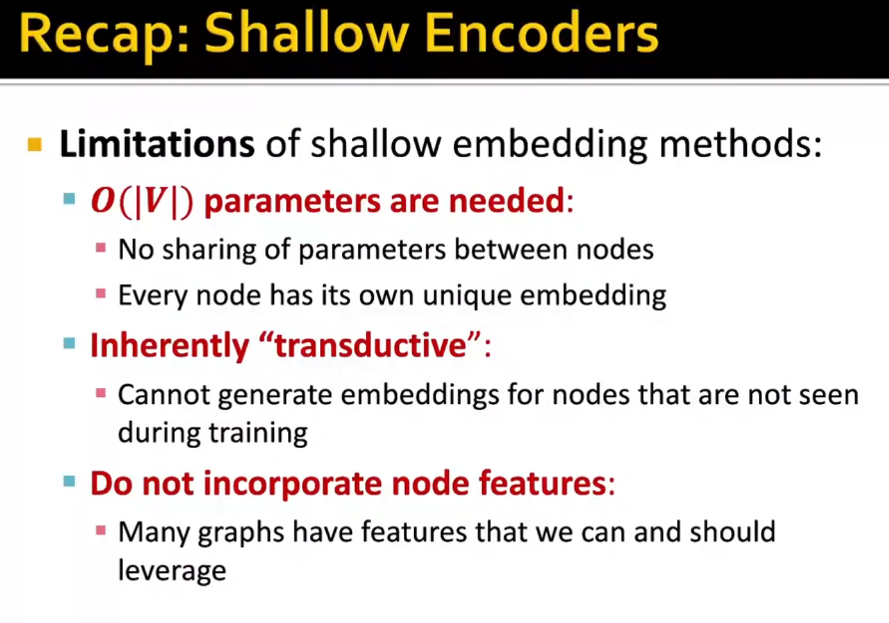
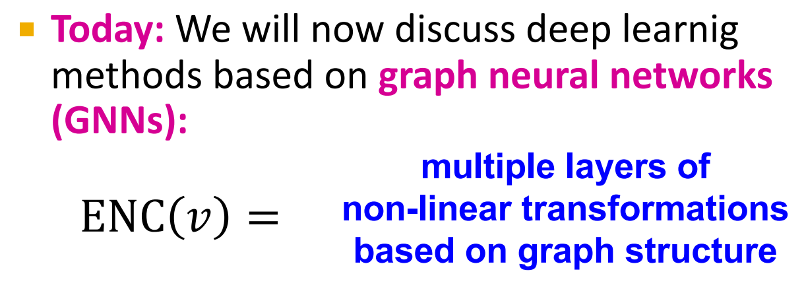
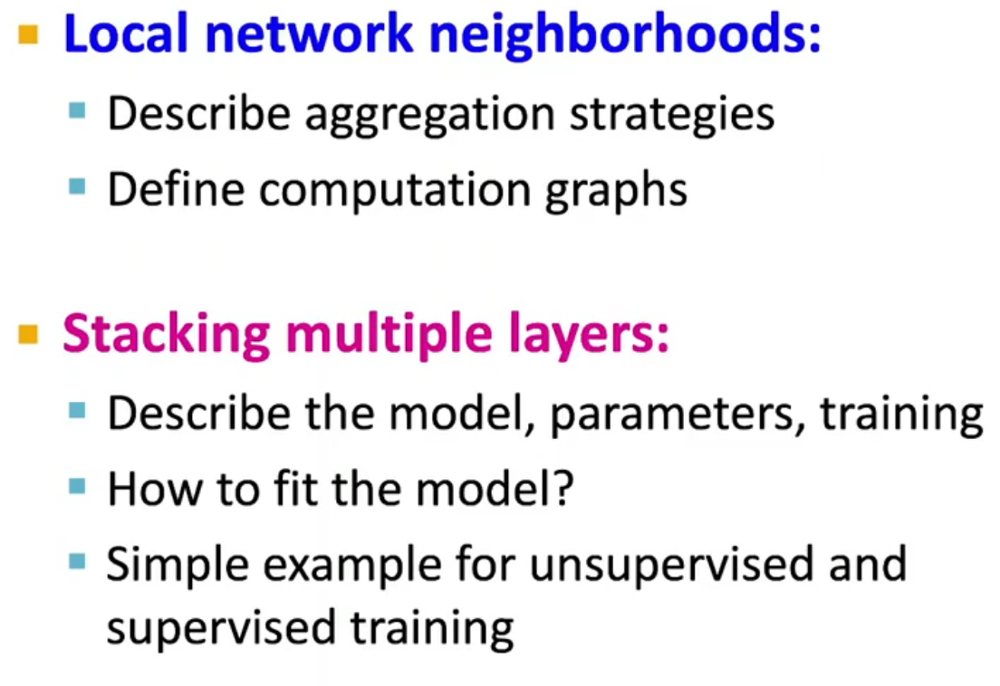
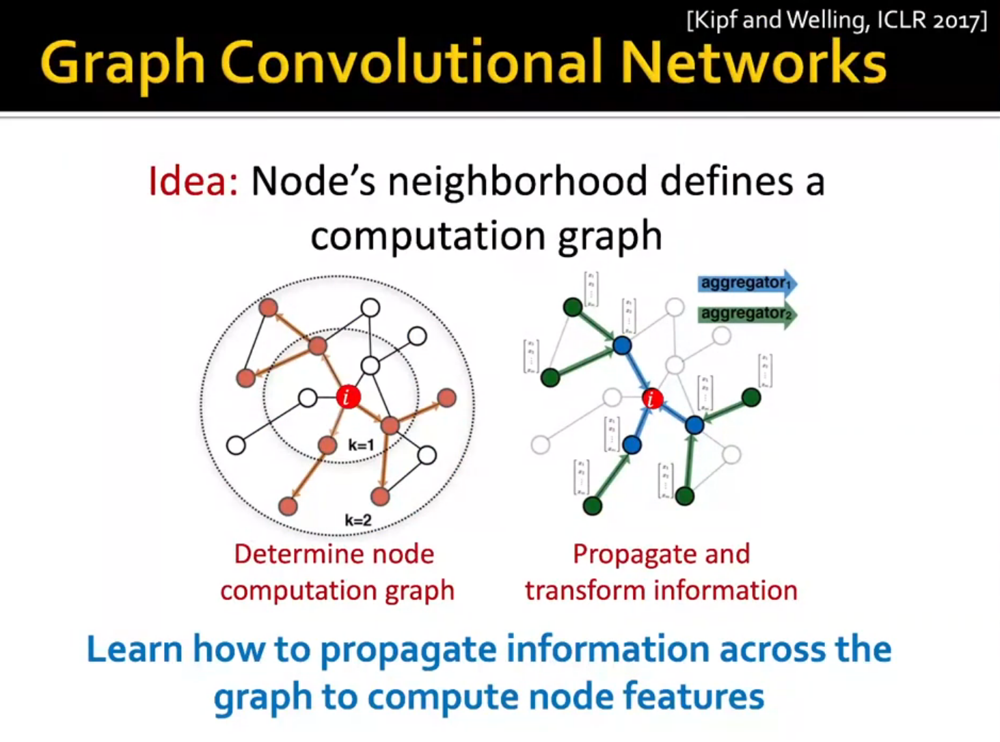
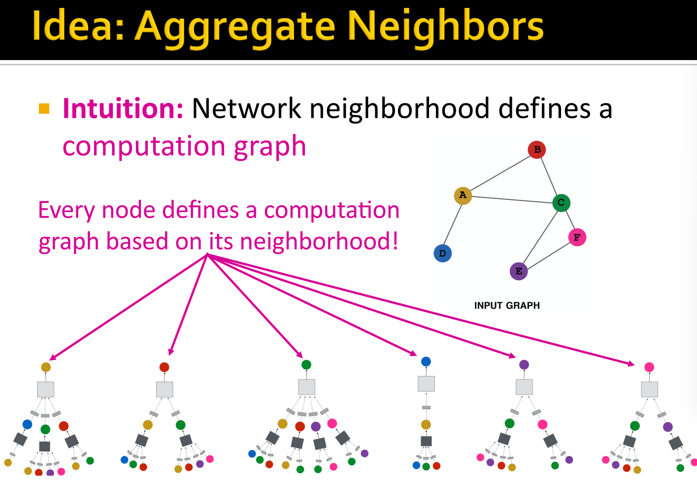

# L6-GNN intro

# GNN Intro

## shallow 

## deep graph encoder

tmd 终于来了
!!!

借鉴cnn，但是
- 没有fixed notion or sliding window
- permutation invariance！

### GCNN
直觉上的思考

其实就是3 + 1步走
- 1. 找到aggregate function
- 2. 找到loss function
- 3. train on a set of nodes
- 4. apply to new nodes

7
8.1
9

16.2
17  

